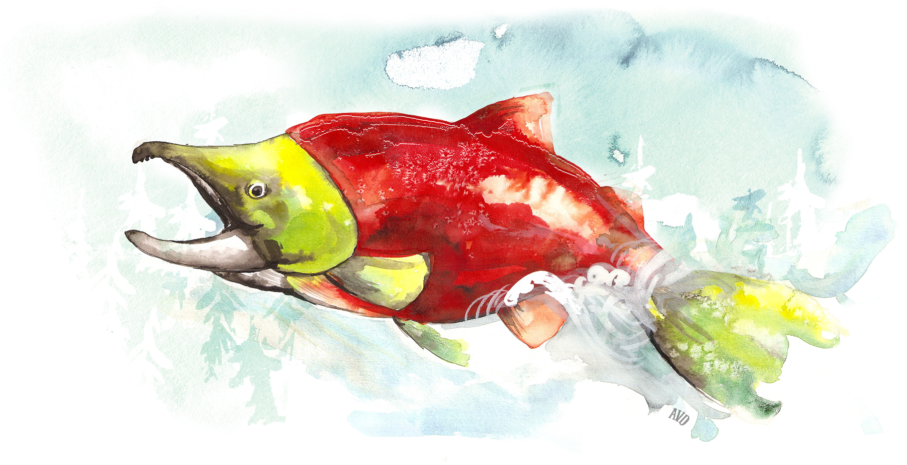

# Executive Summary

```{r include=TRUE, echo = FALSE, out.width='80%', fig.align='center', fig.alt='Illustration by Aimée van Drimmelen.'}

```

Throughout British Columbia (BC), Canada, Pacific salmon play a vital part in the province's culture, ecology, and economy. They provide food, social, and economic benefits to coastal communities and support significant commercial and recreational fisheries throughout the region. Canada’s wild Pacific salmon populations are comprised of 430 ecologically, geographically, and genetically distinct groups– defined as Conservation Units (CUs) under Canada’s Wild Salmon Policy – which represent unique spawning populations that occur throughout BC and the Yukon. This abundance of CUs represents an important piece of all salmon biodiversity within Canada. While some salmon populations in BC and the Yukon are doing well, others are degraded, declining, or of conservation concern. However, for many populations, we know very little about their current status or the state of their essential freshwater habitats. 

The ability to maintain salmon biodiversity depends, in part, on the ability to detect changes in salmon production over time. This type of information helps to diagnose the drivers of salmon population dynamics and identify when and where conservation and management measures are needed to reverse declines. In BC, however, our current ability to make salmon-focused and evidence-based decisions is hindered by the lack of timely and broadly available information on the status of salmon CUs.

To strengthen the baseline of information for salmon in BC, the Pacific Salmon Foundation (PSF) works with First Nations, Federal, Provincial, and Regional Governments, and local independent salmon experts and knowledge holders to evaluate the status of salmon populations. We work with these groups via regional technical committees and Science Advisory Committees to compile the best available data for describing the characteristics, dynamics, and status of salmon CUs as well as their freshwater habitats throughout BC. Using this information, we evaluate both ‘biological status’ (the degree of conservation concern) and ‘habitat status’ (the risk of degradation posed by multiple human and environmental pressures) for each salmon CU. These biological and habitat status assessments form the core of the [Pacific Salmon Explorer](https://www.salmonexplorer.ca) our online data visualization tool for open access, up-to-date, and centralized salmon information.

To assess biological status, we compile and synthesize information from several datasets that characterize key salmon population dynamics and temporal trends in fisheries data. These include spawner surveys, observed spawner counts, juvenile surveys, estimates of CU spawner abundance, estimates of total run size, U.S. and Canadian catch, exploitation rate, hatchery release data, and recruits-per-spawner datasets. We then apply a standardized approach to assessing the biological status of each CU, by comparing the current estimated CU spawner abundance, against upper and lower spawner-recruitment or percentiles benchmarks that we derive using a set of decision rules to determine that benchmark most appropriate given the data. A CU is then assigned a “red” status if the current spawner abundance is at or below the lower benchmark. An “amber” status is assigned if the current spawner abundance is above the lower benchmark and at or below the upper benchmark. A “green” status is assigned if current spawner abundance is above the upper benchmark. In all Regions, data limitations for some CUs mean that we are unable to assess the current biological status; therefore, we categorize these CUs as ‘data deficient.’ For the ~10% of CUs in BC that have status assessments completed by the Department of Fisheries and Oceans Canada (DFO), by the Committee on the Status of Endangered Wildlife in Canada (COSEWIC), and/or by the Province of BC. We also display the outcome of these status assessments in the Pacific Salmon Explorer.

Due to the release of hatchery-produced salmon in rivers and streams throughout BC, we apply standardized approaches based on DFO methods to assess the current Hatchery Releases (High, Moderate, Low, None, Not Assessed) for salmon CUs. Given that the quality of salmon data varies among Regions, species, CUs, and streams, we also apply a standardized approach to assess the quality of data used to estimate spawner abundance and catch for each CU based on a set of criteria outlined in this report. Data for a given CUs was then rated as Poor, Fair, or Good. Evaluations of Hatchery Releases and data quality are essential to determine the level of confidence a user should have when interpreting biological data and status assessments for salmon CUs.

To assess habitat status and evaluate individual and cumulative pressures on freshwater salmon habitat, we use 7 habitat pressure indicators (forest harvest, fire, insect damage, roads, urban & industrial development, agriculture, and mines). We quantify the extent and intensity of each indicator above in every salmon-bearing watershed in BC. 

To date, PSF and our collaborators have undertaken biological and habitat status assessments for salmon CUs within the Skeena, Nass, Central Coast, Fraser, East Vancouver Island & Mainland Inlets, West Vancouver Island, Columbia, Haida Gwaii, and Northern Transboundary Regions in BC. We assessed the biological status of 339 of the 370 salmon CUs within these nine Regions.

A key output of this work is the development of baseline information on the status of salmon populations and their habitats throughout BC. All of the data and assessments developed through this work are integrated into the [Pacific Salmon Explorer](https://www.salmonexplorer.ca), an online data visualization tool that displays information on salmon populations and their habitats in the Skeena, Nass, Central Coast, Fraser, East Vancouver Island & Mainland Inlets, West Vancouver Island, Columbia, Haida Gwaii, and Northern Transboundary Regions. The source datasets are also freely available to the public via our [Salmon Data Library](https://www.data.salmonwatersheds.ca). 