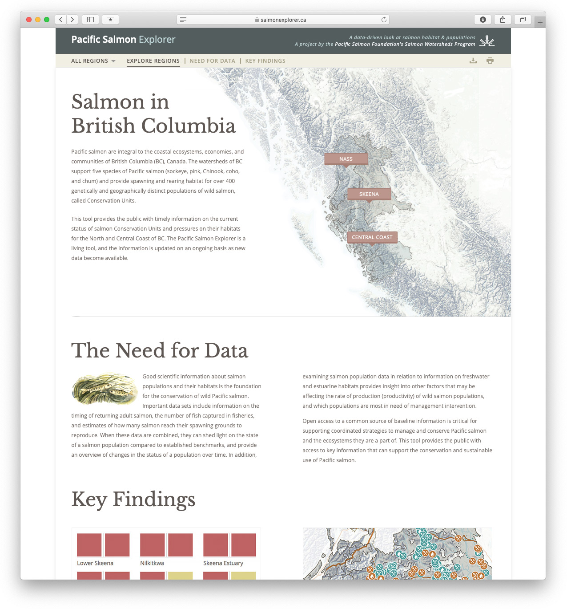
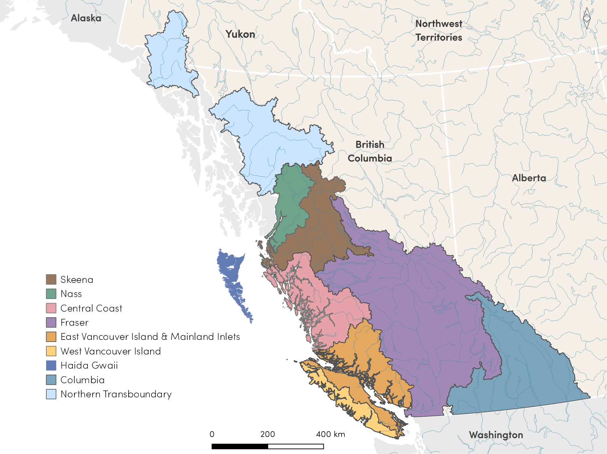

# General Approach

To democratize salmon data and inform decision-making for salmon conservation and management, we have developed two online tools: 1) the [Pacific Salmon Explorer](https://www.salmonexplorer.ca) and 2) the [Salmon Data Library](https://www.data.salmonwatersheds.ca). These tools provide access to baseline information on salmon CUs in BC and the Yukon, assessments of biological status of salmon CUs, and descriptions of pressures on freshwater habitats within CUs across broad spatial scales. Our aim is to establish a legacy of information to inform evidence-based decision-making for salmon conservation and management and help identify opportunities for supporting the recovery of at-risk CUs.

The [Pacific Salmon Explorer](https://www.salmonexplorer.ca) is a novel online data visualization tool where information about salmon CUs and their habitats is freely and publicly available. The [Pacific Salmon Explorer](https://www.salmonexplorer.ca) was built by Periscopic Inc. using HTML5 technologies and is driven by a PostgreSQL database developed and maintained by PSF staff. The [Pacific Salmon Explorer](https://www.salmonexplorer.ca) was initially launched in June 2016, including only the Skeena Region. Since the [Pacific Salmon Explorer](https://www.salmonexplorer.ca) was developed with extensibility in mind, we added additional Regions to the tool (see [Section 5. Regions: Specific Data, Methods, and Results](#regions). We will continue to add additional Regions to the tool until all salmon CUs in BC and the Yukon are included.

```{r include=TRUE, echo = FALSE, out.width='70%', fig.align='center', fig.alt=''}

```

The Salmon Data Library is a centralized database that hosts all data visualized in the [Pacific Salmon Explorer](https://www.salmonexplorer.ca), along with other relevant data on salmon and their habitats in BC. This database, which houses both spatial and non-spatial data, can be accessed via links from the [Pacific Salmon Explorer](https://www.salmonexplorer.ca) and directly via a URL (data.salmonwatersheds.ca). The interface allows the public to access and search the database online, explore the metadata records for each dataset, and download the datasets directly. In instances where we use an existing publicly available dataset, we provide links to the source data (e.g. to DataBC) so that users can access the most up-to-date authoritative dataset. All non-public datasets available on the Salmon Data Library were shared with PSF with permission and in accordance with relevant data sharing agreements. Using these two tools, we focus on the following five strategies to achieve our overarching objectives of strengthening and improving access to baseline scientific information for salmon CUs:

1.  Compile the best available existing data for Pacific salmon populations and their habitats;

2.  Provide data summaries for each CU, including information on abundance, harvest, run-timing, productivity, and trends;

3.  Use a suite of indicators to assess the biological status of CUs and the risk of degradation to freshwater salmon habitats from individual and cumulative pressures;

4.  Visualize all of the data and assessments on the [Pacific Salmon Explorer](https://www.salmonexplorer.ca); and

5.  Make all datasets broadly and freely available via our [Salmon Data Library](https://www.data.salmonwatersheds.ca).

Our approach includes both an analytical component and a social process. First, we invest time and effort to synthesize information on biological and habitat indicators using standardized methodologies. Second, we work with First Nations, Fisheries and Oceans Canada, and other salmon experts from non-profit organizations, the Province of BC, municipalities, and independent scientists to solicit feedback and input in order to improve and adapt our approach.

The collaborative nature of this approach involves technical committees within each Region whom we meet with through a series of technical review meetings and specific Advisory Committees who offer advice on our analytical approach. Technical committees are our primary forum for engaging technical review within each region and include fisheries, natural resource, and stewardship experts from First Nations, DFO, the Provincial government, communities, and non-government organizations. Technical committees play a critical role in grounding our analyses in local knowledge and expertise. By providing guidance on the project methodology and approach, technical committees also help ensure that results are relevant to local and regional decision-making needs. In addition to working with local project partners via technical meetings, we also engage with local community members and knowledge holders through introductory meetings, webinars, and community meetings to enable a review of spawning locations and provide additional feedback on our overall approach.

We also solicit feedback from salmon experts from DFO, the Province of BC, academia, and other organizations to develop our analytical approach and improve specific methodology. Since 2018, our **Population Science Advisory Committee (PSAC)** has helped guide our analytical approach for assessing biological status and developing biological indicators and the visualization of this information in the [Pacific Salmon Explorer](https://www.salmonexplorer.ca). We formed the PSAC during our work to add the Fraser Region and Vancouver Island & Mainland Inlets to the [Pacific Salmon Explorer](https://www.salmonexplorer.ca) (during 2018-2020), but their guidance applies broadly to all Regions. The Salmon Watersheds Program has also developed a **Habitat Science Advisory Committee (HSAC)**, which provides advice on the data sources, analytical approach, and visualization of the habitat pressure indicators and habitat assessments in the [Pacific Salmon Explorer](https://www.salmonexplorer.ca).

In some cases, we have also formed focused working groups to address case-specific issues that require further consideration. For example, we formed a Southern BC Chinook Technical Working Group in collaboration with DFO to help guide our approach to synthesizing data and assessing biological status of Southern BC Chinook [@korman2013; @brown2020]. During the integration of steelhead data into the Pacific Salmon Explorer (during 2021-2023), we formed a Steelhead Technical Working Group composed of steelhead experts from the Province of BC, First Nations, academia, and other organizations to review and inform our approach to presenting data and status assessments for steelhead at a CU scale.

## Regions in the [Pacific Salmon Explorer](https://www.salmonexplorer.ca)

Our intent is to complete and maintain assessments of biological status and pressures on freshwater habitats across all salmon CUs in British Columbia and the Yukon. As of 2023, we have applied our approach to three major salmon-bearing watersheds within BC (the Skeena, Nass, and Fraser Rivers), as well as a number of smaller watersheds that drain into the Pacific Ocean along the Central Coast, North Coast, Haida Gwaii, Vancouver Island and southern mainland inlets of BC, and the upper reaches of the Columbia River within Canada. In the near future, we aim to apply our approach to the last remaining Pacific Regions, which include the salmon-bearing watersheds along the transboundary region with Alaska (i.e. Unuk, Stikine, Whiting, Taku, Chilkat, Alsek) and those within the Yukon Territory.

For these assessments, we have delineated assessment **Regions** that are unique to our approach (Figure \@ref(fig:regions2)). Many salmon CUs span a diversity of watershed, social, political, and administrative borders; therefore, it is not generally possible to fit CUs within well-known regional boundaries. By identifying Regions with geographic boundaries primarily based on CU boundaries, we have prioritized the ecological and genetic similarities among salmon populations that make up CUs as our regional borders. In addition to CU boundaries, we also consider the adjacency of a Region to past and future study Regions to minimize regional overlap and consider major drainage patterns represented by the BC Freshwater Atlas 1:20,000 Watershed Groups.

```{r regions2, include=TRUE, fig.cap = "Salmon-bearing regions covered by the Pacific Salmon Explorer.", echo = FALSE, out.width='80%', fig.align='center', fig.alt=''}

```

### Conservation Units in the Pacific Region within the [Pacific Salmon Explorer](https://www.salmonexplorer.ca)

In the Pacific Region (British Columbia and the Yukon), CUs are defined by DFO according to the methodology developed by @holtby2007 to describe the genetic diversity of wild salmon. In total, 430 CUs were identified across BC and the Yukon [@holtby2007; Appendix 1]. Since developing the [Pacific Salmon Explorer](https://www.salmonexplorer.ca), we have based our lists of CUs on this original list [@holtby2007] and incorporated expert guidance from our technical committees to refine these lists (see [Section 5. Regions](#regions) for specific details). Given that new information has continued to become available since that initial list, in 2019, DFO released a structured framework for reviewing and approving revisions to the current list of CUs [@Wade2019]. This process recognizes the need for a formalized process for reviewing and updating CUs in a standardized and consistent manner.

Steelhead were not formally included in the Wild Salmon Policy or work led by DFO to define CUs for salmon. However, past work has been done to define 36 \*provisional\* CUs for steelhead in BC, which characterize the biodiversity of steelhead in BC using similar methods to those used to define salmon CUs [@Tautz2011; @Parkinson2005]. Future work is needed to review and potentially refine these steelhead CUs based on more recent research and data to ensure they fully capture the diversity of steelhead in BC and meet the Wild Salmon Policy's definition of a CU. We have used provisional steelhead CUs from @Tautz2011 for the Skeena Region and from @Parkinson2005 for all other Regions to summarize data and status for steelhead on the [Pacific Salmon Explorer](https://www.salmonexplorer.ca) and will update the tool to reflect improvements to steelhead CUs based on future work.
