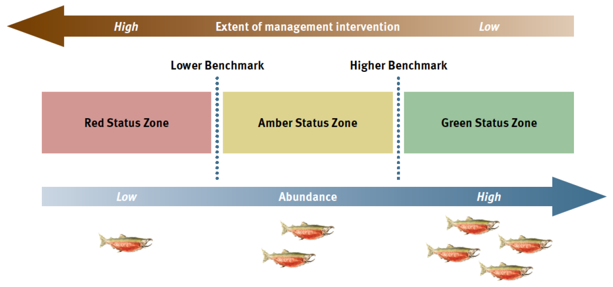
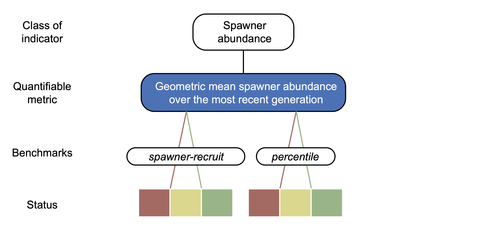
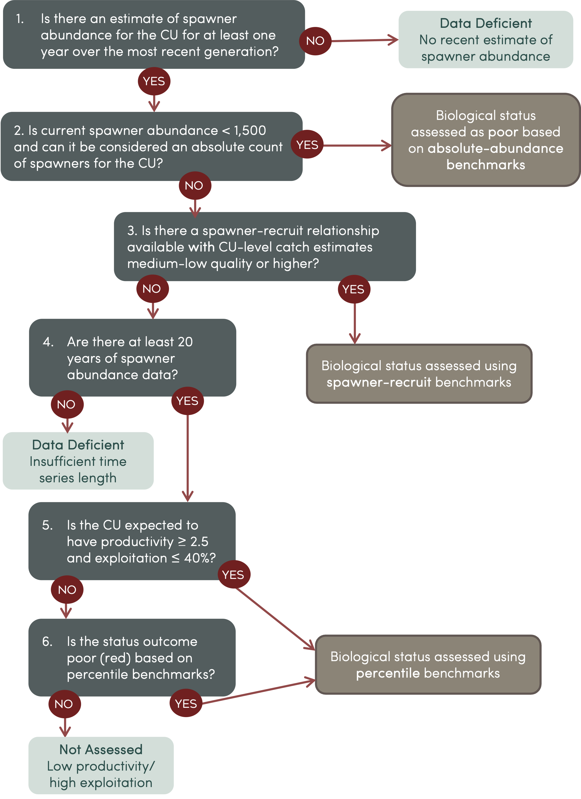
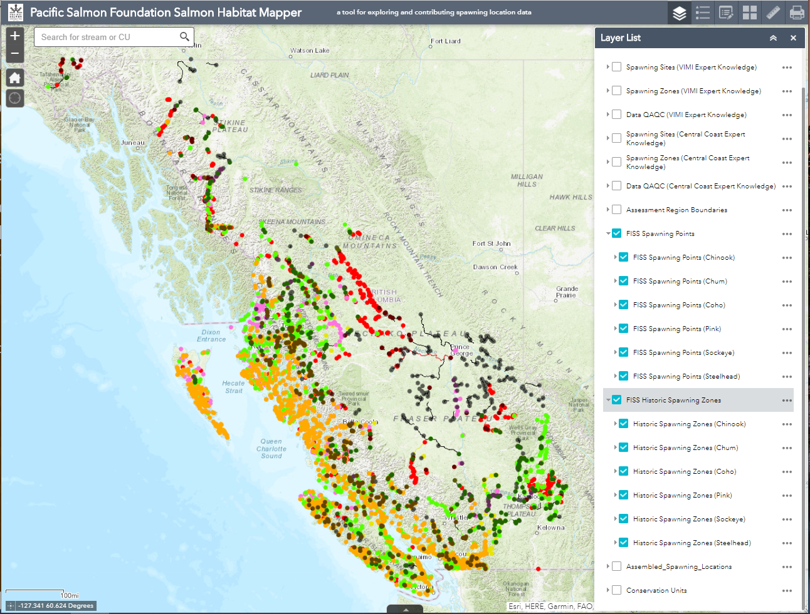

# Analytical Approach

## Using Indicators to Inform the Status of salmon Conservation Units and their Habitats {.unnumbered}

We apply a suite of indicators to assess both the biological and habitat status of salmon Conservation Units (CUs). Defined as "measures of pressures, states, and/or responses", indicators depict the condition of species, habitats, and/or systems to improve one's understanding of the linkages among drivers, stressors, conditions, and management actions [@NelitzEtAl2007RefiningHabitatIndicatorsa]. The indicators and approach that we use align with Strategies 1 and 2 of the Wild Salmon Policy [@DFO2005] that call for standardized assessment and monitoring of the salmon CUs and their freshwater habitats [@HoltEtAl2009IndicatorsStatusBenchmarks; @StalbergEtAl2009CanadaPolicyConservation].

Relevant salmon indicators for informing population and habitat status have several criteria:

-   They are measurable, relevant to the health and persistence of salmon as they characterize either key population dynamics or habitat conditions;
-   The data are available over broad spatial and temporal scales;
-   The data are updated consistently;
-   The data have consistent collection protocols;
-   The data are in a format that allows easy integration into PSF's data systems;
-   The indicators can be tracked over time;
-   They can be used to inform management decisions for threatened or at-risk salmon CUs.

To quantify the suite of population and habitat status indicators that we use, we have continued to lead a major effort to compile and synthesize salmon-related data in each of the Regions where we operate. While a large amount of salmon-related data already exists, they are often not readily available, not well documented, and not compiled in a single location. Our efforts focus on bringing existing information together in a standardized format into a single, centralized location (i.e. the Salmon Data Library) and summarizing the data in valuable ways for monitoring and assessing salmon CUs and their habitats (i.e. the Pacific Salmon Explorer).

We then calculate and apply benchmarks for each indicator to assess status using a 'stoplight' approach. The result is a qualitative assessment of each indicator as either red, amber, or green, depending on the current data relative to a lower or upper benchmark (Figure \@ref(fig:wspFramework)). The intent is that decision-makers can then apply management measures to improve the status of a CU and/or salmon-bearing watershed, for example, from Red to Amber or Amber to Green [@DFO2005].

```{r wspFramework, include=TRUE, echo = FALSE, out.width=600, fig.align='center', fig.alt='Wild Salmon Policy assessment framework.', fig.cap="Benchmarks and biological status zones under the Wild Salmon Policy (DFO, 2005)."}

```

## Population Status: Indicators & Benchmarks {#indicators-benchmarks-pop}

To characterize key salmon population dynamics, temporal trends in fisheries data, and assess the biological status of salmon CUs across the Pacific Region, we compile and synthesize the following information:

-   Spawner survey locations;
-   Observed spawner counts in indicator and non-indicator streams;
-   Juvenile surveys in streams;
-   Estimates of spawner abundance at the CU-level;
-   Estimates of total run size;
-   U.S. and Canadian catch;
-   Exploitation rate;
-   Hatchery release data; and
-   Recruits-per-spawner datasets.

The data sources and analyses differ among regions, with the main differences occurring between the North and Central Coast (Nass, Skeena, Central Coast Regions) and the South Coast (Fraser and Vancouver Island & Mainland Inlets Regions). Region-specific data nuances are included in [Regions](#regions).

We synthesize the types of data listed above to generate output datasets that are available for download in the [Salmon Data Library](https://www.data.salmonwatersheds.ca). These output datasets are visualized in the [Pacific Salmon Explorer](https://www.salmonexplorer.ca) through [nine population indicators](#overview-biological-indicators). These datasets also inform a CU-level [Hatchery Release Score](#hatchery-release-score) and [Data Quality Score](#data-quality-score). The data compilation exercise also highlights data gaps across and within Regions. We aim to update these key datasets annually or as new input data become available.

### Overview of Population Indicators {#overview-population-indicators}

```{=html}
<!-- SP: The previous version referenced "eight indicators" but they were never listed...and there are nine indicators in the PSE so I am unsure of what was being referred to. I tried to clarify how this section is organized by going through the indicators in order that they appear in the PSE: 
1. Spawner Surveys
2. Juvenile Surveys
3. Hatchery Releases & Hatchery Release Score
4. Spawner Abundance
5. Run Timing
6. Catch and Run Size
7. Recruits-per-Spawner
8. Trends in Spawner Abundance
9. Biological Status
The data quality score is then be a new section after the Overview of Biological Indicators.
-->
```
We use nine indicators to characterize the population status of each Conservation Unit in the [Pacific Salmon Explorer](https://www.salmonexplorer.ca).

1.  Spawner Surveys
2.  Juvenile Surveys
3.  Hatchery Releases
4.  Spawner Abundance
5.  Run Timing
6.  Catch and Run Size
7.  Recruits-per-Spawner
8.  Trends in Spawner Abundance
9.  Biological Status

These indicators provide information on the current state of salmon CUs and trends over time. The first three indicators involve displaying stream-level information organized by CU. The last seven indicators involve synthesizing data at the CU-level, with the Hatchery Release indicator involving both the stream-level release data and a CU-level Hatchery Release Score. Here, we describe the general approach to compile and synthesize data for each of these population indicators. Detailed methods that depend on the specifics of the available data vary by Region and are documented in the [Regions](#regions) section.

#### Spawner Surveys {#spawner-surveys}

**Spawner surveys** show the observed numbers of spawning salmon of each species returning to specific streams each year. Spawner surveys provide a fundamental piece of information needed to assess the status of salmon CUs over time. In the [Pacific Salmon Explorer](https://www.salmonexplorer.ca) we draw on spawner survey data from the [New Salmon Escapement Database (NuSEDS)](https://open.canada.ca/data/en/dataset/c48669a3-045b-400d-b730-48aafe8c5ee6) and other sources detailed in the region [Regions](#regions) section to visualize the spatial and temporal coverage of spawner surveys for each CU in the [Pacific Salmon Explorer](https://www.salmonexplorer.ca).

We distinguish spawner surveys in indicator streams and non-indicator streams for each species. **Indicator streams** are observed more consistently in recent decades, tend to have higher spawner abundance and to be monitored using more intensive methods that provide greater accuracy. <!-- SP: Updated this text; I ran a binomial glm to look at what factors influence indicator/non-indicator in NuSEDS and min year, max year, number of obs, and mean estimate classification type are all signficant, with positive effects of both min and max year (i.e. more recently monitored). --> Therefore, indicator streams are understood to provide more reliable indices of abundance and are assumed to be representative of returns to other streams nearby [@English2016ReviewEscapementIndicatorb]. **Non-indicator streams** tend to have less consistent survey coverage, more variable survey methods, and/or may be more difficult to survey. A number of both indicator and non-indicator streams within a CU may be surveyed in a given year. On the Pacific Salmon Explorer, we use the indicator stream designation from LGL Ltd [@EnglishEtAl2018NorthCentralCoast] for the North and Central Coast Regions (Skeena, Nass, and Central Coast), and the indicator stream designation provided by DFO in NuSEDS for all other Regions.

A variety of methods are used to survey spawners in both indicator and non-indicator streams, and methods vary by species, CU, and stream. Spawner counts can be produced from a single visual survey of a stream by foot, by counting fish through a complete counting fence, or by aerial (helicopter) surveys. Survey methodology can also change over time according to changes in capacity and funding. For instance, some streams that were historically monitored by visual surveys on foot are now enumerated via a counting fence or aerial surveys (see [Data Quality](#quality-data) section below).

For steelhead, we used spawner survey data from a variety of sources, depending on the Region. Steelhead monitoring data have not been maintained in a centralized database like NuSEDS, so we compiled and synthesized spawner survey data for steelhead from disparate sources, including from many monitoring projects led by the Province of BC. Streams with spawner survey data for steelhead have not been classified as indicator and non-indicator streams, so we have provisionally classified all streams with available spawner survey data as indicator streams for steelhead. More specific details on the specific sources of spawner survey data for steelhead are summarized by Region in the [Regions](#regions) section.

#### Juvenile Surveys {#juvenile-surveys}

Estimates of **juvenile abundance** indicate the number of out-migrating smolts that were counted in a given year for each stream within a CU (where available) or for some steelhead CUs, the estimated density of juvenile steelhead in a stream for a given year. We also calculate the geometric mean of juvenile abundance or density as it is less sensitive to infrequent high abundance years.

<!-- BSC: suggestion for this above sentence "We use the geometric mean to summarise the juvenile abundance and density across ???:  as it is less..."  SP: Agree the wording is unclear here. Ask Eric.-->

#### Hatchery Releases {#hatchery-releases}

While salmon hatcheries can play a role in the conservation and management of Pacific salmon, hatchery releases can also pose risks to wild salmon. Juvenile hatchery fish can out compete wild juveniles for limited food resources, and there is increasing evidence that high hatchery salmon abundance at sea is related to decreased wild salmon productivity due to limitations of ocean carrying capacity [@RuggeroneIrvine2018NumbersBiomassNatural; @ConnorsEtAl2020ClimateCompetitionInfluence]. Hatchery-produced spawners can also reproduce with wild salmon, with implications for genetic diversity and productivity of wild populations. Hatchery-produced fish can also exacerbate issues in mixed-stock fisheries, which can affect threatened or at-risk salmon populations.

<!-- SP: This information is slightly different from the More Information tab in the PSE, which I think is more informative. Can we use that text? -->

Given these concerns and other potential impacts of hatcheries on wild salmon abundance and productivity, we visualize the number of fry released from specific locations under the **hatchery releases** indicator. For each hatchery facility (i.e. the facility where eggs are hatched), we show the name, years in use, and facility type. Hatchery operations range in size and production from small to large-scale, with different purposes. There are four types of hatcheries shown on the Pacific Salmon Explorer, as defined by Fisheries and Oceans Canada's Salmon Enhancement Program (Table \@ref(tab:hatchTypes))

Hatchery facilities may release juvenile fish at one or more release sites. We show the locations and numbers of fish released through time at each of these release sites. Locations also include additional information: the name of the site, the years that site was in use, the type or life stage at which juvenile salmon were released, and the broodstock CU (CU from which the hatchery broodstock originates). Juvenile salmon are released at various life stages and under various hatchery practices (e.g. some juveniles are released in rivers as fed fry, while others are reared for longer in the hatchery and then transferred to a sea pen in the ocean, where they are eventually released) which can affect their survival [@James2023] . Pacific salmon data on hatchery locations, release sites, and release numbers were provided by DFO Salmon Enhancement Program staff. For steelhead, these data were accessed through the [BC Data Catalogue](https://www2.gov.bc.ca/gov/content/data/bc-data-catalogue). The information on hatchery releases in streams is also synthesized at the CU-level (see [Hatchery Releases Score](#hatchery-release-score), below).

```{r hatchTypes, include=TRUE, echo = FALSE}
hatch <- read.csv("tables/sec4_hatcherytypes.csv")
names(hatch) <- c("Type of Hatchery", "Description")
knitr::kable(
  hatch, booktabs = TRUE,
  caption = 'Types of hatcheries operated in BC and visualized on the Pacific Salmon Explorer.'
)
```

#### Spawner Abundance {#spawner-abundance}

We visualize both observed and estimated **spawner abundance** on the [Pacific Salmon Explorer](https://www.salmonexplorer.ca). This indicator provides estimates of the total numbers of spawners that return to spawn each year for each CU. **Observed** spawner abundance is the sum of all spawner survey data as documented in [NuSEDS](https://open.canada.ca/data/en/dataset/c48669a3-045b-400d-b730-48aafe8c5ee6), while **estimated** spawner abundance generally accounts for streams that are not surveyed in a given year by following expansion procedures. The approach for expanding from observed spawners to estimate the total spawners in a CU depends on the region and species, and are documented in the [Regions](#regions) section. Unless specified otherwise, estimated CU-level spawner abundance is used as input in the [Catch and Run Size](#catch-and-runsize), [Recruits-per-Spawner](#recruits-per-spawner), and [Trends in Spawner Abundance](#trends-spawner-abundance) indicators described below and when assessing biological status for each CU (see [Appendix 4](#appendix-4)).

#### Run Timing {#run-timing}

**Run timing** represents the average time window over which adult salmon enter freshwater on their return migrations to spawn. Run timing is estimated using a range of methods, including test fisheries, daily counting at weirs, and expert judgment. We adjust run timing estimates based on the sampling location so that the run timing shown in the Pacific Salmon Explorer represents river entry timing regardless of where the data were collected. Specifically, data that are from test fisheries operating more than 100 km from the mouth of the river (e.g., Area 20 test fisheries for some Fraser CUs) or from sampling more than 1-day migration upstream are adjusted for the time it takes salmon to migration to/from the river mouth based on published estimates of migration speed by species. The methods for estimating run timing and approaches to compiling these data for specific CUs are detailed in the [Regions](#regions) chapter and in [Wilson and Peacock (in prep.)](https://bookdown.org/salmonwatersheds/life-cycle-timing).

Where data are available, we show the estimated run timing for each CU as the relative proportion of the CU that is expected to enter freshwater on a given day averaged over all historical information for the CU. Often, daily counts are not available but there is information on the dates for start (2.5th percentile), peak (50th percentile), and end (2.5th percentile) run timing. In these cases, we assume a mixed normal distribution with different standard deviations for the left- and right-hand sides based on the start and end dates, respectively. If the end date or start date is missing, we assume equal tails. If only peak or start date is available, we assume a standard deviation equal to the average standard deviation among other CUs of the same region and species. If applied, these assumptions are reflected in the run timing data quality criteria (see [Data Quality](#data-quality)).

#### Catch & Run Size {#catch-and-runsize}

**Catch** estimates report the number of adult salmon caught in commercial (including both Canadian and U.S.), recreational, and First Nations' food, social, and ceremonial (FSC) fisheries. **Run size** refers to the number of adult salmon that return from the ocean in a given year, including both **escapement** (i.e. estimated spawner abundance) and those that are caught (i.e. catch) at a CU-level. The **exploitation rate** is calculated as the proportion of a given run caught in all fisheries. This indicator provides important information on the long-term harvest rate of each CU, which has implications for the number of salmon returning to spawning grounds over time.

#### Recruits-per-Spawner {#recruits-per-spawner}

**Recruits-per-spawner** estimates the number of adult salmon produced per spawner in the previous generation. This indicator provides valuable information on the recruitment of salmon within a CU when calculations are available over the long term. This can improve our understanding of survival within and among CUs. If the number of recruits-per-spawner is below one, the population will decline over time.

For species with variable age-at-return, estimating the number of recruits for a given brood year requires information on total run size (i.e. catch plus escapement) and the distribution of ages of returning fish over multiple years. <!-- Insert equation? --> Recruits-per-spawner is then calculated as the number of recruits divided by the number of spawners for each brood year, based on CU-level estimates of spawning abundance. This indicator is relatively data-intensive as it requires information on total run size, spawner abundance, and the ages of salmon returning to spawn.

#### Trends in Spawner Abundance {#trends-spawner-abundance}

**Trends in spawner abundance** is an estimate of the change in spawner abundance at the CU-level over the existing time series. This indicator highlights long-term directional changes in abundance that could otherwise be masked by high interannual variability in population abundance. When calculating trends, we take the natural logarithm of spawner abundance and smooth time series using a one-generation moving average, which minimizes the impact of outliers (i.e. anomalously high or low abundance years) on the overall trend [@DEon-EggertsonEtAl2015ReliableIdentificationDeclining]. On the Pacific Salmon Explorer, we show the linear trend in log-transformed spawner abundance over the entire time series of available data, as well as the trend over the most recent three generations, which aligns with the quantitative for status assessments by the [Committee on the Status of Endangered Wildlife in Canada (COSEWIC)](https://cosewic.ca/index.php/en-ca/assessment-process/wildlife-species-assessment-process-categories-guidelines/quantitative-criteria.html). Assuming the data are reliable, considering trends in population abundance over longer time periods may be more likely to detect true changes in abundance and trigger an appropriate management response [@DEon-EggertsonEtAl2015ReliableIdentificationDeclining; @PorsztEtAl2012ReliabilityIndicatorsDeclineb].

#### Biological Status

The **biological status** assessments that we complete and visualize on the Pacific Salmon Explorer are guided by the approaches recommended under Strategy 1 of the Wild Salmon Policy [@DFO2005] and by [@HoltEtAl2009IndicatorsStatusBenchmarks], as well as additional recommendations from our independent Population Science Advisory Committee. Candidate benchmarks for evaluating the status of CUs have been proposed for four classes of indicators [@HoltEtAl2009IndicatorsStatusBenchmarks], which include:

1.  Current spawner abundance;
2.  Trends in spawner abundance over time;
3.  Distribution of spawners within the CU; and
4.  Fishing mortality relative to stock productivity.

We assess biological status using a metric of current spawner abundance, while providing information on other indicators where available. The assessment of biological status is more involved, and our approach to quantifying metrics and benchmarks is detailed in section [Benchmarks for Assessing Biological Status](#benchmarks-biostatus).

### Hatchery Release Score {#hatchery-release-score}

Hatchery-produced salmon are released in streams throughout BC, resulting in salmon populations that are considered to be hatchery-produced to varying degrees. We assess and display the current Hatchery Releases Score for salmon CUs based on a standardized approach that draws on the best available data for all spawning streams within CUs across BC. The **Hatchery Release Score** is an assessment of the extent of hatchery activity within a CU over the last two generations. <!-- SP: The next sentence doesn't make sense to me. *Stream level* hatchery releases based on intensity within the CU? --> <!-- We developed hatchery releases classifications based on the intensity of recent hatchery activity within each CU (High, Moderate, Low, None, Not Assessed; Table @ref(tab:enhanceAsmt)).  --> <!-- SP: The following sentence is too vague and adds nothing above what is shown in the table. Remove.
Here, High and Moderate correspond with streams that have significant hatchery activity, while Low and None are streams with minimal hatchery activity.   --> <!-- SP: What definition under the WSP? Definition of hatchery release score? This is not mentioned anywhere above... -->

```{r enhanceAsmt, include=TRUE, echo = FALSE}
en <- read.csv("tables/sec4_enhance_lvl_asmt.csv")
names(en) <- c("Stream Enhancement Level",	"Definition")
knitr::kable(
  en, booktabs = TRUE,
  caption = 'Stream Hatchery Releases score categories for spawning streams.'
)
```

<!-- SP: I don't think hatchery release score is appropriate here, since the data include CWTs collected from spawners. I hate to re-open the can of worms, but we should discuss. -->

The determination of a CU's Hatchery Release Score begins with assessing the extent of hatchery influence among individual spawning streams (indicator and non-indicator) within that CU, based on methods developed by DFO [@BrownEtAl20202020SummaryAbundance; @BrownEtAl2019PreCOSEWICReviewSouthern]. Assessments of stream-level hatchery influence may draw on three types of information: 1) the number of coded wire tags (CWT) recovered from spawners; 2) the number of juveniles released from hatcheries within the CU; and 3) the number of fish collected for broodstock. If CWT-based estimates are available, then we use the proportion of returning spawners that have CWTs to quantify stream-level hatchery influence. Otherwise, we use the highest number from either the number of juvenile releases or the number of collected broodstock. This information is used to assign a categorical assessment of stream-level hatchery influence (high, moderate, low, none, not assessed; Table \@ref(tab:enhanceAsmt)). For example, if more than 25% of spawners have CWTs, or more than 25% of years have records of juvenile releases or broodstock collection, then the stream is ranked as having high hatchery influence (Table \@ref(tab:enhanceAsmt)). Data on hatchery activities for each spawning stream for southern BC Chinook were provided by DFO [@BrownEtAl20202020SummaryAbundance; @BrownEtAl2019PreCOSEWICReviewSouthern]. For other species and CUs, we assessed stream-level hatchery influence based on data provided by the DFO's Salmon Enhancement Program. In contrast to @BrownEtAl2019PreCOSEWICReviewSouthern, we assessed stream-level hatchery influence over the most recent two generations in alignment with the definition of wild salmon under Canada's Wild Salmon Policy.

To arrive at a CU-level Hatchery Release Score, we calculate the proportional contribution, $c$, of spawners from streams with moderate or high stream-level hatchery influence to the total spawners in each CU: <!-- SP: Completely re-wrote this equation. --> $$ c = \frac{\sum_{i \in  H}{\bar{S}_i}}{\sum_{j = 1}^n{\bar{S}_j}}$$

where $\bar{S_i}$ is the geometric mean number of spawners in stream $i$ over the most recent two generations, $H$ is the set of indices of streams that have moderate or high stream-level hatchery influence over the most recent two generations, and $n$ is the total number of streams in the CU. The CU-level Hatchery Release Score is then assigned as none, low, moderate, or high based on the value of $c$ (Table \@ref(tab:cuenhanceRank)). Note that the distinction between none and low is related to the timeframe of hatchery releases, with a score of low indicating that there has been no records of hatchery influence (either returns of CWT spawners or releases of hatchery fish) in the most recent two generations but there are prior recrods of hatchery influence. The CU is assigned a score of not assessed if there is insufficient information to assess stream-level hatchery releases.

<!-- SP: Table re-written - previous definitions were incorrect (not % of spawners necessarily because roll-up, and ranges were not complete.) -->

| Hatchery Release Score | Definition |
|:------------------------|:----------------------------------------------|
| None                   | There are no records of hatchery influence in the CU                                                              |
| Low                    | There are no records of hatchery influence in the CU **in the most recent two generations** ($c = 0$)             |
| Moderate               | Less than 25% of spawners within the CU are from streams with moderate or high hatchery influence ($0 < c <0.25$) |
| High                   | At least 25% of spawners within the CU are from streams with moderate or high hatchery influence ($c \geq 0.25$)  |
| Not Assessed           | There was insufficient information to assess stream-level hatchery influence for the CU                           |

: (#tab:cuenhanceRank) CU Hatchery Releases Scores, as generated based on the categories in Table \@ref(tab:enhanceAsmt) for individual spawning streams.

### Data Quality Scores {#data-quality}

The quality of data shown in the Pacific Salmon Explorer varies widely among Regions, species, CUs, and streams. For instance, spawner abundance obtained from a single aerial survey is less reliable than counts obtained from an unbroken counting fence. We combine spawner survey data with other datasets, such as catch, to determine total run size and to assess the biological status of CUs. The **data quality** for each of these data types is important to consider when interpreting the population indicators shown in the Pacific Salmon Explorer.

We developed a standardized approach to assess the quality of data used to estimate populations indicators for each CU based on one or more of seven data quality criteria (Table \@ref(tab:cudataQual)). We assign scores of 0-5 to each of these four criteria and present the average score across relevant criteria as the **Data Quality Score** ($Q$) for each population indicator and CU. Numeric scores are translated to categorical data quality outcomes of low ($0 < Q \leq 1$), low-medium ($1 < Q \leq 2$), medium ($2 < Q \leq 3$), medium-high ($3 < Q \leq 4$), and high ($4 < Q \leq 5$). A score of zero means that there were no data for that CU. 

| Data quality criteria | Definition | Relevant population indicator(s) |
|:------------------------|:----------------------------------------|:-----------------------------------------|
| Spawner survey method | The quality of spawner survey data, based on the survey methods used across all indicator streams within the CU over the most recent generation. | Spawner surveys, spawner abundance, recruits-per-spawner, trends in spawner abundance, biological status |
| Spawner survey coverage | How representative spawner surveys are of the CU, measured as the proportion of total spawners in the CU that spawn in indicator streams. | Spawner abundance, recruits-per-spawner, trends in spawner abundance, biological status |
| Spawner survey execution | How consistently indicator streams have been monitored, measured as the proportion of indicator streams that were surveyed in the most recent generation. | Spawner abundance, recruits-per-spawner, trends in spawner abundance, biological status | 
| Juvenile survey method | The quality of juvenile survey data, based on the survey methods used across all juvenile surveys in the CU. | Juvenile surveys | 
| Run timing quality | The quality of run timing data, based on the number of years of data, the currency of the data, and whether sampling captured the entirety of the run. | Run timing | 
| Catch estimation method | The quality of catch estimates for the CU in the most recent generation based on a qualitative assessment of the rigor of the catch estimation method. | Catch and run size, recruits-per-spawner, biological status | 
| Stock ID | The quality of recent stock identification data used in catch estimation for the CU. | Catch and run size, recruits-per-spawner, biological status |

: (#tab:cudataQual) Summary of the seven criteria used to score overall CU-level data quality for population indicators.


<!-- ```{r cudataQual, include = TRUE, echo = FALSE, warning = FALSE} -->
<!-- library(reactable) -->
<!-- # hatch <- read.csv("tables/sec4_cu_data_qual.csv") -->
<!-- # knitr::kable( -->
<!-- #  dq, booktabs = TRUE, -->
<!-- #  caption = 'Summary of the four criteria used to score overall CU-level data quality, based on the quality of data on spawner abundance and catch estimates.' -->
<!-- # ) -->

<!-- dq <- data.frame( -->
<!--   Category = c( -->
<!--     rep("Spawner Survey Data", 3),  -->
<!--     "Catch Data"), -->
<!--   Criteria = c( -->
<!--     "Spawner Survey Method",  -->
<!--     "Spawner Survey Coverage",  -->
<!--     "Spawner Survey Execution",  -->
<!--     "Catch Estimation Method"), -->
<!--   Description = c( -->
<!--     "The quality of spawner survey data, based on the survey methods and sampling effort across all indicator streams within this CU over the most recent generation",  -->
<!--     "How representative spawner surveys are of the CU, measured as the proportion of total spawners that spawn in indicator streams",  -->
<!--     "How consistently the indicator streams for the CU have been surveyed, measured as the proportion of indicator streams that were monitored over the most recent generation",  -->
<!--     "The quality of recent catch estimates for the CU, based on a qualitative assessment of the rigour of the catch estimation method in the most recent generation") -->
<!-- ) -->


<!-- knitr::kable( -->
<!--  dq, booktabs = TRUE, -->
<!--  caption = 'Summary of the four criteria used to assign a Data Quality Score to each CU, based on the quality of data on spawner abundance and catch estimates.' -->
<!--  ) -->
<!-- ``` -->

#### Spawner Survey Method {#spawner-survey-method}

This criterion indicates the quality of spawner survey data over the most recent generation, based on the survey methods and sampling effort across all indicator streams within the CU. The CU-level **Spawner survey method** data quality criteria is calculated as the average of stream-level data quality scores across all indicator streams (as defined by DFO) within the CU. We only quantify data quality for indicator streams because these are the streams that are typically used in expansion and infilling procedures to generate CU-level spawner abundances, while data for non-indicator streams are not directly used. <!-- SP: Add reference to run reconstruction section?? -->

The stream-level data quality scores that we use to calculate a CU-level Spawner Survey Method score are recorded by DFO in the [NuSEDS database](https://open.canada.ca/data/en/dataset/c48669a3-045b-400d-b730-48aafe8c5ee6) for each population and year. DFO measures stream-level survey quality on a six-point scale based on a standardized scoring rubric (Table \@ref(tab:strmQual)) based on survey methodology and effort. These stream-level data quality scores reflect the highly variable spawner abundance data within and across spawning streams, which arises largely from differences in spawner survey methodology. To improve the communication of the stream-level data quality scores, we translate the "Estimate Classification Type" provided by DFO in NuSEDS into categories labeled as Unknown, Low, Medium-Low, Medium, Medium-High, and High (Table \@ref(tab:strmQual)).

```{r strmQual, include=TRUE, echo = FALSE}
ssq <- read.csv("tables/sec4_strm_survey_qual.csv", check.names = F)
knitr::kable(
  ssq, booktabs = TRUE,
  caption = 'Stream Survey Quality Criteria for the Estimate Classification field in NuSEDS (provided by Bruce Baxter, DFO), showing our categories in the “Data Quality Score on the Pacific Salmon Explorer” column.'
)
```

<!-- BSC:I added "check.names = F" in read.csv() because the " ", "(" and ")" were replaced by "." in header -->
 <!-- SP: What is the weighting by?  -->
To determine CU-level spawner survey method criteria, we calculate a weighted average of the stream-level survey method data quality scores across all indicator streams over the most recent generation within the CU (Table \@ref(tab:cusurveyQual)). Where there are known issues with DFO's indicator stream list in NuSEDS, we manually override those data quality scores and substitute expert derived assessments of data quality based on expert knowledge of spawner survey methods. We do not include survey years where spawner survey methods are `Unknown`. Note that this score reflects the reliability of the estimates of current spawner abundance for a CU over the most recent generation and not the reliability of estimates across the entire time series.

```{r cusurveyQual, include=TRUE, echo = FALSE}
cusq <- read.csv("tables/sec4_cu_survey_qual.csv")
knitr::kable(
  cusq, booktabs = TRUE,
  caption = 'CU-level Survey Quality scores. Q = CU-level survey quality score (the weighted average of the stream-level survey method data quality values for all indicator streams over the most recent generation).'
)
```

#### Spawner Survey Coverage {#spawner-survey-coverage}
<!-- SP: Need to clarify this description -->
This criterion indicates how representative spawner surveys are of the entire CU, measured as the proportion of total spawners that spawn in indicator streams. If a CU has a higher proportion of spawners returning to indicator streams, we assume that the spawner abundance data within that CU is of higher quality since indicator streams are more consistently and reliably surveyed.

This score is calculated as the average number of spawners in indicator streams divided by the average number of spawners in all indicator and non-indicator streams within the CU. To derive this proportion, we first determine which decade has the greatest coverage of spawner surveys across the indicator and non-indicator streams. We assume that there is a constant proportion of spawners from indicator and non-indicator streams through time. We then calculate the average number of spawners in all indicator and non-indicator streams according to:

$$C= 5 \times \frac{\sum_{i - 1}^I E_{siady}}{\sum_{i - 1}^I E_{siady} + \sum_{j=1}^J E_{sjady}} $$ where $s$ = species, $i$ = indicator stream, $j$ = non-indicator stream, $a$ = CU, $d$ = decade, $y$ = year, $E_{siady}$ = indicator stream escapement (i.e. spawners), by stratum, and $E_{sjady}$ = non-indicator stream spawners, by stratum. This approach is used because it provides a weighted average of the actual number of spawners enumerated with higher quality methodology, rather than only counting the number of indicator and non-indicator streams. We then translate the **spawner survey coverage** score into a scale of 0-5 (labeled as Not Applicable, Low, Medium-Low, Medium, Medium-High, and High; Table \@ref(tab:spawncovScore)).

For CUs that do not use expansion procedures to generate CU-level estimates (e.g. Fraser sockeye, Chinook, and coho, and Vancouver Island & Mainland Inlets Chinook), spawner survey coverage scores were generated via expert opinion.

```{r spawncovScore, include=TRUE, echo = FALSE}
hatch <- read.csv("tables/sec4_spawn_coverscores.csv")
knitr::kable(
  hatch, booktabs = TRUE,
  caption = 'Spawner survey coverage scores.'
)
```

#### Spawner Survey Execution {#spawner-survey-excecution}

This criterion indicates how consistently indicator streams in the CU have been surveyed over the most recent generation, measured as the proportion of monitored indicator streams. To calculate **Spawner Survey Execution**, we calculate the proportion of indicator streams that are surveyed within the CU in each year of the most recent generation and the generational average of the proportions for each year, according to the following formula: <!-- SP: I updated this formula; it is wrong in V11 and was the right formula in a 2020 version I had on file but there were still errors. Discuss.  --> $$E=\left( \sum_{y=Y-g+1}^{Y}\frac{ h_y}{I} \right) \times \frac{1}{g} \times 100$$

where $h$ is the number of indicator streams surveyed in year $y$ of the most recent generation, $Y$ is the most recent year of spawner data, $g$ is the generation length, and $I$ is the total number of indicator streams. We then translate the Spawner Survey Execution score into a scale of 0-5 (labeled as Not Applicable, Low, Medium-Low, Medium, Medium-High, and High; Table \@ref(tab:spawnexecScore)).

```{r spawnexecScore, include=TRUE, echo = FALSE}
hatch <- read.csv("tables/sec4_spawn_execscores.csv")
knitr::kable(
  hatch, booktabs = TRUE,
  caption = 'Spawner survey execution scores.'
)
```

#### Juvenile Survey Method {#juvenile-survey-method}

**To be completed.**
<!-- SP: For Eric to do.  -->

#### Run Timing Quality {#run-timing-quality}

The CU-level **run timing quality** criterion is based on the number of years of data, the currency of the data, and whether sampling captured the entirety of the run (Table \@ref(tab:rtdataQual)). For some CUs, run timing is monitored at a single location either near the mouth of the river or (for lake-type sockeye) near the rearing lake. In geographically large and/or coastal CUs where component river populations may display a range in run timing, there may be run timing estimates available for different locations within the CU. When run timing was available for multiple locations within a CU, we combined estimates from different locations. Thus, when determining the run timing data quality, "5 years of direct counts" may correspond to five years of data from a single location or 1 year of data from each of 5 locations.  

| Score | Definition | R
|:------------------------|:----------------------------------------|
| NA - Not applicable | It was not possible to estimate run timing for the CU with available data. |
| 1 - Low | 1-2 years of direct counts but very low numbers **or** part of the run was missed **or** or estimates of the peak **and** range of run timing was not available for the specific CU and the distribution of run timing was based on other, similar CUs (e.g., same species and region). |
| 2 - Medium-Low | Fewer than 5 years of direct counts, with last monitoring prior to 2000
| 3 - Medium | Fewer than 5 years of direct counts, with monitoring more recent than 2000
| 4 - Medium-High | More than 5 years of direct counts, with last monitoring prior to 2000
| 5 - High | More than 5 years of direct counts, with monitoring more recent than 2000

: (#tab:rtdataQual) Run timing data quality criteria were scored on a scale of 1 to 5 based on the number of years of data, the currency of the data, and whether sampling captured the entirety of the run.


#### Catch Estimation Method {#catch-estimation-method}

Catch at the CU-level can be reconstructed using a variety of methods that result in catch estimates with different levels of uncertainty. The **catch estimation method** criterion indicates the quality of recent catch estimates for the CU in the most recent generation, based on a qualitative assessment of the rigor of the catch estimation method. We calculate this score at the CU-level for the most recent generation based on categories of the type of current catch datasets available on the Pacific Salmon Explorer (Table \@ref(tab:catchestScore)).

```{r catchestScore, include=TRUE, echo = FALSE}
ceS <- read.csv("tables/sec4_catch_estscores.csv")
knitr::kable(
  ceS,
  caption = 'Catch estimates scores.'
)
```

### Stock ID {#stock-id}

**To be completed.**
<!-- SP: For Eric to do.  -->

### Benchmarks for Assessing Biological Status {#benchmarks-biostatus}

In the Pacific Salmon Explorer, we use the current estimated spawner abundance indicator to assess biological status. In collaboration with our Population Science Advisory Committee, we have developed a set of decision rules to guide our approach to assessing biological status for salmon CUs in the Pacific Salmon Explorer (see [Decision Rules](#bs-decision-rules)). We apply one out of two types of biological benchmarks to quantify the current biological status of CUs, depending on the best available data: (1) spawner-recruit benchmarks and (2) percentile benchmarks (Figure \@ref(fig:wspBench)).

```{r wspBench, include=TRUE, fig.cap = "Illustration of the Wild Salmon Policy status assessment framework (adapted from Holt et al., 2009). In order to determine the biological status for a given CU, we focus on the geometric mean spawner abundance (metric, blue) under the spawner abundance indicator.", echo = FALSE, out.width=600, fig.align='center', fig.alt=''}

```

The status of each CU is then assessed by comparing the current spawner abundance, calculated as the geometric mean spawner abundance in the most recent generation, to the upper and lower benchmarks. The number of years in a generation is CU-specific based on information about the life-history of each CU. Where CU-specific data on age-at-return are unavailable, we assume generation lengths of 5 years for Chinook CUs, 4 years for coho CUs, 4 years for chum CUs, and 4 years for sockeye CUs. Pink salmon have a consistent 2-year age-at-return and because even- and odd-year lineages are considered separate CUs, the most recent spawner abundance is simply the most recent year's estimated spawner abundance for this species. A CU is assigned a red status if the current spawner abundance is at or below the lower benchmark, an amber status if the current spawner abundance is above the lower benchmark and at or below the upper benchmark, and a green status if it is above the upper benchmark.

As spawner-recruit benchmarks consider both productivity and carrying capacity of each CU, they are more biologically meaningful, and we aim to apply them whenever possible. However, spawner-recruit benchmarks require spawner abundance and additional data at the CU-level (e.g. age structure and exploitation rates) that may not be available for a given CU. When these data are not available, we calculate benchmarks based on percentiles of historical spawner abundance, referred to as percentile benchmarks. Percentile benchmarks have been shown to approximate spawner-recruit benchmarks [@HoltEtAl2018EvaluatingBenchmarksBiological]. Except for specific cases (detailed below), they can be a suitable alternative to spawner-recruit benchmarks when the necessary data to estimate spawner-recruit curves are unavailable.

#### Spawner-Recruit Benchmarks {#spawner-recruit-benchmarks}

<!-- Note from Steph (June 29, 2023): Need to update to reflect 100% Smsy and 75% S for upper benchmark, and add some text to justify change and provide history. LOTS OF UPDATES NEEDED FOR THIS SECTION-->

We use a Ricker model to describe the spawner-recruit relationship and define associated benchmarks:

$$R_{i,t} = S_{i,t} \exp(a_i - b_i S_{i,t}) $$ where $R_{i,t}$ is the number of recruits for CU $i$ and brood year $t$, $S_{i,t}$ is the total number of spawners for CU $i$ in year $t$, $a_i$ is the CU-level productivity parameter that describes the population growth at low spawner abundance, and $b_i$ is the density-dependence parameter.

<!-- BSC: you don't want to mention "intrinsic productivity" for $a_i$ in paragraph above?-->

A target reference point commonly applied in fisheries is the number of spawners that produces maximum sustainable yield, or $S_{MSY}$, where yield is $Y = R - S$. This can be calculated from the above Ricker equation given parameters $a$ and $b$:

$$ S_{MSY} = \frac{1-W(e^{1-a})}{b}$$ where $W$ is the Lambert W function [@Scheuerell2016ExplicitSolutionCalculating]. Following recommendations under Canada's Wild Salmon Policy, we apply an upper spawner-recruit benchmark equal to $S_{MSY}$ [@HoltEtAl2009IndicatorsStatusBenchmarks]. Subsequent work by DFO has recommended a less precautionary upper benchmark of 80% $S_{MSY}$ to have the Wild Salmon Policy biological status assessments be consistent with other fisheries management plans. Although PSF adopted this change to 80% $S_{MSY}$ for the period 2020-2023, we reverted to the more precautionary upper benchmark of $S_{MSY}$ in 2024. The lower spawner-recruit benchmark $S_{GEN}$ is the spawner abundance that leads to $S_{MSY}$ in one generation assuming consistent environmental conditions and no harvest.

<!-- Steph to rewrite -->

To estimate Ricker parameters $a_i$ and $b_i$ for each CU $i$, we apply a hierarchical Bayesian model to spawner-recruit data for all CUs within a species and region combination. The hierarchical model includes hyperparameters for productivity such that data-poor CUs can borrow information from data-rich CUs of the same species within the region to improve parameter estimates. Specifically, each $a_i$ parameter is drawn from a log-normal hyper distribution: $$a_i \sim \text{logNormal} \left( \log(\mu_a), \sigma_a \right) $$ where $\mu_a$ is the mean productivity among all CUs for the given region and species and $\sigma_a$ is the standard deviation in productivity parameters among CUs for the given region and species.

The density-dependence parameter is estimated independently for each CU using CU-specific prior information: $$ b_i \sim \text{logNormal} \left( \log \left( \frac{1}{S_{\text{max},i}} \right), \sigma_{b,i} \right) $$ where $S_{\text{max},i}$ is the maximum spawner abundance for CU $i$ and $\sigma_{b,i}$ is the standard deviation of $b_i$ for CU $i$. If habitat capacity data are available and its use is supported by published literature and expert opinion, we use this information to estimate $S_{\text{max},i}$ as an informative prior on $b_i$. To date, habitat capacity data has only been available for lake-type sockeye CUs. Estimates of $\sigma_{b,i}$ represent the degree of certainty in the prior on $S_{\text{max},i}$: for lake-type sockeye with estimates of habitat capacity we assumed $\sigma_{b,i} = 0.3$, except for the four Babine system CUs in the Skeena Region where the prior was minimally informative and $\sigma_{b,i} = 1$ [@KormanEnglish2013BenchmarkAnalysisPacific]. For other species, we assumed that the mean of the prior for $S_{\text{max},i}$ was equivalent to the average escapement, and used highly uninformative ($\sigma_{b,i} = 10$) or minimally informative ($\sigma_{b,i} = 1$) prior distributions following @KormanEnglish2013BenchmarkAnalysisPacific.

<!-- SP: Question: Do we use habitat capacity estimates for ALL SEL CUs?? Or only some? Also, note that prior on Smax should be max spawners not mean spawners. Or should it? Korman and English (2013) use mean...  If these data are unavailable, we use $S_{\text{max},i} = 1 / \hat{S}_{\text{max},i}$ where $\hat{S}_{\text{max},i}$ is the maximum observed spawner abundance for CU $i$. -->

We estimate parameters $a_i$ and $b_i$ for each CU $i$ by fitting the linearized Ricker model to spawner and recruit data:
$$ \log \left( \frac{R_{i,t}}{S_{i,t}} \right) = a_i - b_i S_{i,t}$$ where $a_i$ is drawn from a region/species hyperdistribution as described above, with priors $\log (\mu_a) \sim N(0.5, 1000)$, $\sigma_a = \sqrt(1/\tau_a)$ where $\tau_a \sim \text{Gamma}(0.5, 0.5)$. The above linearized Ricker model is fit to all CUs for a given region and species together using the R package `R2jags` [@SuYajima2021R2jagsUsingRun], with a total number of iterations of 100,000, removing 5000 iterations for burnin and applying a thinning interval of 10. The resulting posterior draws for $a_i$ and $b_i$ are used to calculate posteriors for $S_{MSY}$ and $S_{GEN}$. The posteriors for these upper and lower benchmarks are summarized by calculating the highest posterior density (HPD) and 95% highest posterior density interval (HPDI). We chose to use these summary statistics instead of the mean or median because the posteriors for $S_{MSY}$ and $S_{GEN}$ were, in some cases, quite skewed given the tendancy for spawner abundance to be log-normally distributed. For CUs with extremely low productivity, $S_{MSY}$ can be less than $S_{GEN}$, yielding benchmark values that do not make biological sense [@HoltEtAl2018EvaluatingBenchmarksBiological; @PeacockEtAl2020EvaluatingConsequencesCommon]. We do not use spawner-recruit benchmarks in these cases and instead apply percentile benchmarks. 

<!-- Need to add description of generation length. -->

Biological status of each CU is assessed by comparing the geometric mean spawner abundance over the most recent generation against upper and lower benchmarks. We compare the geometric mean spawner abundance against all posterior draws of $S_{MSY}$ and $S_{GEN}$ to yield a probability of a CU having each status outcome. The status colour shown on the Pacific Salmon Explorer is the most likely outcome (i.e. the one with the highest posterior probability). The HPD and 95% HPDI for the lower and upper spawner-recruit benchmarks are also shown. See @KormanEnglish2013BenchmarkAnalysisPacific for further details, including a discussion of uncertainty and possible biases in benchmarks and status assessments derived from spawner-recruit models.

#### Percentile Benchmarks {#percentile-benchmarks}

<!-- BSC: I rewrote the previous sentence: "To quantify biological status using percentile benchmarks, we define the lower benchmark as the 25th percentile of historical spawner abundance ($S_{25}$) and the upper benchmark as the 75th percentile of historical spawner abundance ($S_{75}$), which approximates the upper spawner-recruit benchmark of $S_{MSY}$ (Holt et al., 2018)." -->

To quantify biological status using percentile benchmarks, we define the lower and upper benchmarks as the 25th ($S_{25}$) and 75th ($S_{25}$) percentiles of historical spawner abundance, respectively. The upper benchmark ($S_{75}$) approximates the upper spawner-recruit benchmark of $S_{MSY}$ [@HoltEtAl2018EvaluatingBenchmarksBiological]. We then determine the biological status of each CU by comparing the geometric mean of spawner abundance over the most recent generation to these upper and lower benchmarks. For example, a CU is assessed as red status if the current estimate of spawner abundance is at or below the 25th percentile of historical spawner abundance, amber status if the current average spawner abundance is between the 25th and 75th percentiles of historical spawner abundance, and green status if the current average spawner abundance is at or over the 75th percentile.

We also generate and display 95% confidence intervals around the upper and lower percentile benchmarks using a model-based computational approach that accounts for autocorrelation in the spawner abundance time series. First, we fit a simple autoregressive (AR) model to the time series of log spawner abundances for each CU to estimate the temporal autocorrelation, using the R function `ar`. We calculate the temporal autocorrelation, $\phi_1$, for a lag of one year (further consideration may want to be given to including other lags). Next, we extract the residuals from the fitted series and sample from those residuals with replacement to generate $n$ time series of bootstrapped residuals, each with length equal to the length of the original spawner abundance time series. Finally, we simulate $n$ new time series using the estimated autocorrelation and bootstrapped residuals. The equation for simulated spawner abundance time series is: $$ \log(S_{i,t}) = \bar{S} + \phi_1 \left( \log (S_{i,t-1}) - \bar{S} \right) + \epsilon_{i,t} $$ where $S_{i,t}$ is the simulated spawner abundance at time $t$ for the $i$th simulation, $\bar{S}$ is the mean spawner abundance as estimated from the AR model, $\phi_1$ is the temporal autocorrelation estimated from the AR model, and $\epsilon_{i,t}$ is the bootstrapped residual for simulation $i$ and timestep $t$. <!-- bSC: I'm guessing \bar{S} is on the log scale? If that's the case, should that not be indicated, at least in the text below the equation? -->

For each of the $n$ simulated time series, we calculate the 25th and 75th percentiles of spawner abundance. We then take the 2.5th and 97.5th quantiles of the $n$ estimates of these lower and upper benchmarks to yield bootstrapped 95% confidence intervals on $S_{25}$ and $S_{75}$. <!-- BSC: "percentiles" instead of "quantiles"? You used "percentiles" earlier -->

#### Additional Status Assessments {#add-status-asmts}

In addition to the standardized assessments of biological status developed by the Pacific Salmon Foundation on the Pacific Salmon Explorer, we also display Wild Salmon Policy (WSP) status assessments completed by Fisheries and Oceans Canada (DFO), assessments conducted by the Committee on the Status of Endangered Wildlife in Canada (COSEWIC), and/or assessments conducted by the Province of BC where available ([Appendix 4](#appendix-4)). About 10% of salmon CUs in BC have status assessments completed by DFO for the WSP and/or by COSEWIC [e.g. @COSEWIC2017COSEWICAssessmentStatus; @COSEWIC2018COSEWICAssessmentStatus; @FisheriesandOceansCanadaDFO20182017FraserSockeyeb]. These assessments apply multiple metrics and expert judgment to assess status and focus primarily on economically significant Chinook, sockeye, and coho CUs in the Fraser and south coast of BC. Fisheries and Oceans Canada does not lead status assessments for steelhead under the WSP, but the Province of BC conducts biological status assessments for some steelhead populations following the @MinistryofForests2016ProvincialFrameworkSteelhead. For steelhead CUs, we visualize the outcomes of Province of BC status where these assessments are documented and conducted at comparable scales to steelhead CUs. When available, we display the WSP, COSEWIC and Province of BC status assessments alongside the standardized status assessments completed by PSF. In some cases, statuses may differ between the different assessments due to varying approaches to status evaluation and/or different years of data being used.

#### Decision Rules for Assessing Biological Status {#bs-decision-rules}

Deciding which benchmarks are most appropriate for assessing the biological status of a given CU depends on the available data. With input from the Population Science Advisory Committee, we have developed a set of decision rules to guide how we apply benchmarks to assess biological status for all CUs on the Pacific Salmon Explorer (Figure \@ref(fig:bsdecisionRules)).

```{r bsdecisionRules, include=TRUE, fig.cap = "Flowchart for documenting decision rules for quantifying biological status.", echo = FALSE, out.width=800, fig.align='center', fig.alt=''}

```

We use the following guiding questions to determine which benchmarks to apply given the available data for a CU.

**1. Does the CU have Spawner Abundance data?**

Data on the number of spawners returning to the whole CU within the most recent are required to assess current biological status. If there are not Spawner Abundance data (i.e. estimates of the number of spawners returning to the whole CU) available within the most recent generation, then the CU is assessed as data deficient for biological status.

**2. Is there a spawner-recruit relationship available?**

<!-- SP: Should this be revised to read, "Are both spawner and recruit data available at the CU-level? -->

A spawner-recruit relationship must be available to calculate spawner-recruit benchmarks. Most spawner-recruit relationships have over 10 data points (see [Appendix 4](#appendix-4)).

**3. Are the CU-level estimates of catch of medium-low quality or higher?**

Errors in estimating catch can lead to misclassification of status using spawner-recruit benchmarks [@PeacockEtAl2020EvaluatingConsequencesCommon]. As such, we do not apply spawner-recruit when CU-level catch estimates are highly uncertain (i.e. the data quality score for catch estimates is low or medium-low; see [Data Quality](#data-quality)).

**4. Is there published evidence of cyclic dominance for the CU?**

Some CUs have population dynamics characterized by cyclic dominance (e.g. a four-year generation length that involves a dominant brood year that is most abundant, a sub-dominant brood year, followed by two brood lines with lower abundance). For these cyclic dominant CUs we do not pool data across brood lines to generate estimates of current spawner abundance or to generate CU-level benchmarks because spawner abundance is so different from year to year [@GrantEtAl20202017FraserSockeyec]. For these CUs, we currently only visualize biological status assessments on the Pacific Salmon Explorer developed through integrated status assessments that incorporate expert judgment and quantitative modeling, where available [e.g. @FisheriesandOceansCanadaDFO20182017FraserSockeyeb].

**5. Does the CU-level spawner abundance time series span at least 20 years?**

Estimates of spawner abundance over a relatively long time series are required to assess the biological status of a CU. We require a minimum of 20 years of annual estimates of spawner abundance, although we do not require that these estimates are continuous. In some cases, we may use only a subset of the available time series. We do this if expert opinion suggests that using the entire time series is not appropriate.

**6. Is there a spawner abundance estimate at the CU-level for at least one year over the most recent generation?**

We require at least one annual estimate of spawner abundance over the most recent generation to quantify current spawner abundance. We then take the geometric mean of current spawner abundance over the most recent generation to compare to the estimated benchmarks for that CU to assess biological status.

**7. Is the productivity of the CU expected to be below 2.5 and exploitation above 40%?**

We do not apply percentile benchmarks if productivity is low (\< 2.5) and fisheries exploitation is high (\> 40%). In these cases, percentile benchmarks can result in biological status assessments that are overly optimistic and, therefore, risky from a long-term management perspective [@HoltEtAl2018EvaluatingBenchmarksBiological; @PeacockEtAl2020EvaluatingConsequencesCommon].

**8. Is the status outcome in the *Red* (Poor) category based on percentile benchmarks?**

For cases where there is information to suggest that a CU is experiencing productivity below 2.5 and/or exploitation above 40%, we will only report on status outcomes based on percentile benchmarks if the status is in the *red zone*. In these cases, the potential bias will not have resulted in an overly optimistic status outcome because the red status zone is the lowest status zone. If the application of percentile benchmarks in these situations results in an *amber* or *green* status outcome, we will report this CU as *Not Assessed* on the PSE.

For a number of CUs across all Regions, data limitations mean that we cannot assess the current biological status. In these cases, we categorize these CUs as data deficient. We consider three types of data deficiencies when assessing biological status for the Pacific Salmon Explorer. First, some CUs have no available run reconstruction and, therefore, no CU-level spawner abundance estimate. This could be caused by the absence of data for that CU in NuSEDS, indicating that no records of spawner surveys conducted for the CU have been recorder since 1954. Alternatively, it could be that the CU does not have an identified indicator stream, which means that CU-level estimates of spawner abundance cannot be estimated, <!-- SP: I think we can reconsider this given the unreliability of DFO's indicator classification. Could be a project for Bruno...maybe we can come up with some defensible criteria and classify indicators ourselves? --> and biological status cannot be assessed. Second, some CUs have no data on spawner abundance for the most recent generation, which prevent from generating an estimate of current abundance to compare against the benchmarks and assess biological status. Finally, in some cases, there is sufficient data (i.e. run reconstructions) to assess biological status using our methods, but our technical committees and Population Science Advisory Committee have advised to not assess status using our standardized approach due to the complexity of a species or CU life history (e.g. Fraser River cyclic sockeye CUs; see @GrantEtAl20202017FraserSockeyec [Fraser Region]), other data challenges, or assumptions that are currently a barrier to applying our standardized approach.

Given the iterative and incremental development approach that we take to visualizing salmon data and assessing biological status, the current set of decision rules outlined in this technical report are subject to change to ensure that our methods align with current best practices for quantifying biological status. As such, the methods and decision rules presented here diverge from previously published PSF technical reports documenting our approach to assessing biological status in specific Regions [@ConnorsEtAl2013SkeenaSalmonConservation; @ConnorsEtAl2019NassRegionSnapshots; @ConnorsEtAl2018BCCentralCoast].

### Extinct, De Novo, and Transplant CUs {#extinct}

Over time, DFO may re-classify CUs if: 1) CU-level spawner abundance declines to a point where the CU is lost ("extinct"), 2) a CU is extinct and then re-introduced with different genetic stock ("de novo"), 3) a CU is created by introducing populations to a location where they were not previously present ("transplant"). We visualize these categories on the Pacific Salmon Explorer, intending to maintain a historical record of Pacific salmon's changing genetic diversity and abundance (see [Appendix 1](#0) and [Appendix 4](#0)).

### Limitations: Biological Status Assessments

There are a number of limitations to the biological status assessments that we visualize on the Pacific Salmon Explorer. Some limitations, such as CU-level estimates of spawner abundance, developing benchmarks, and monitoring coverage, apply to all species and Regions. These caveats should be considered when interpreting the results of the biological status assessments and included in future research priorities.

#### CU-level Estimates of Spawner Abundance {#cu-est-spawner-abundance}

If a complete census or true count of spawners is not available for all streams within a CU, DFO applies expansion factors to generate CU-level estimates of spawner abundance. The number of indicator streams that are counted in a given year for each CU (spawner survey coverage) has been declining since the late 1990s in many Regions included in the Pacific Salmon Explorer [e.g. @EnglishEtAl2018NorthCentralCoast], leading to increasing uncertainty when extrapolating from spawner counts at monitored streams to CU-level estimates of spawner abundance. This is particularly problematic if the realtive contribution of streams within a CU changes through time. Nonetheless, the expansion factor approach applied by DFO is generally recognized as the best practice for generating CU-level estimates of spawner abundance in many cases [e.g. on the North and Central Coast; @English2012ExtendTimeSeries). Our work aims to derive biological status assessments of individual CUs relative to benchmarks and not, for example, to set management targets or catch allocation, so the assumptions that support these expansion procedures should not overly influence this work.

In addition, recent simulation analyses to determine the influence of these expansion factors on biological status assessments using our approach found that they were robust to a range of expansion procedures [@PeacockEtAl2020EvaluatingConsequencesCommon]. @PeacockEtAl2020EvaluatingConsequencesCommon suggest that, under certain conditions, declining monitoring coverage (to a point) has little impact on the accuracy of benchmarks or biological status assessments using our methods. We have also attempted to account for differing levels of monitoring coverage as part of our work to quantify data quality for visualization on the Pacific Salmon Explorer (see [Data Quality](#data-quality)).

#### Refining benchmarks {#redefine-pop-benchmarks}

We have developed the benchmarks to assess biological<!-- BSC: "status"? --> based on the latest and most comprehensive available literature and in consultation with our Population Science Advisory Committee. However, there are still alternative approaches that we could consider, and we will continue to apply best practices and our iterative approach to the application of benchmarks to deriving biological status.<!-- BSC: suggested writing of latter sentence: "However, we recognize the existence of alternative approaches, and we are committed to continuously assess and refine our iterative approach using best practices."--> For example, if available, habitat-based benchmarks [e.g. @ParkenEtAl2006HabitatbasedMethodsEstimate] could be applied to situations where other biological benchmarks cannot be used.

#### Other Limitations {#other-limts}

Other limitations are species- or Region-specific; the latter are included below in the [Regions](#regions) section.

## Habitat Status: Indicators & Benchmarks {#indicators-benchmark-hab}

Our assessments of habitat status that we complete and visualize on the Pacific Salmon Explorer follow the approaches developed for evaluating status under Strategy 2 of the Wild Salmon Policy [@DFO2005]. Following this guidance, monitoring should be informed by information on a suite of **habitat indicators**. These indicators represent different characteristics of the environment, such as the habitat condition, magnitude of stress, degree of exposure to a stressor, or ecological response to exposure. To evaluate the potential risk of degradation to freshwater salmon habitat, each indicator should pertain to salmon and reflect a clear scientific understanding of a direct or indirect relationship between itself and its impact on salmon. <!-- BSC: I find the sentence long and confusion from "... each indicator should...", here is my suggestion: "...each indicator should represent environmental conditions that have scientifically proven impacts on salmon.-->

Habitat indicators can be further described as either pressure indicators or state indicators following the two-tiered pressure and state indicator framework described by @StalbergEtAl2009CanadaPolicyConservation. **Pressure indicators** are natural processes or human activities that can directly or indirectly induce qualitative or quantitative changes in environmental conditions [@StalbergEtAl2009CanadaPolicyConservation]. **State indicators** are physical, chemical, or biological attributes measured to characterize environmental conditions on the ground [@StalbergEtAl2009CanadaPolicyConservation]. Distinguishing features between pressure and state indicators include the scale of assessment, the resolution of input data, and the cost of assessment and monitoring. Pressure indicators are often assessed for large geographic areas using remotely sensed information. Evaluation and quantification of pressure indicators are less resource intensive because data collection and monitoring are typically not based on on-the-ground field studies. On the other hand, state indicators are assessed for smaller geographic areas, typically necessitating higher-resolution data for assessment and quantification, and require more resources due to the need for on-the-ground fieldwork. Our work to date focuses on pressure indicators, serving as the first step towards gaining an understanding of habitat conditions over broad geographic extents. Our overarching objective is to use these habitat pressure indicators to identify priority areas where finer-scale state indicator assessments and monitoring will subsequently be conducted.

Through an expert-guided process as part of our work in the Skeena Region [@PorterEtAl2013SkeenaLakeSockeye; @PorterEtAl2014SkeenaSalmonConservation], we identified 12 habitat pressure indicators: forest disturbance, equivalent clearcut area, insect and disease defoliation, riparian disturbance, road development, water licenses, stream crossing density, total land cover alteration, impervious surfaces, linear development, mining development, and waste water discharges. We assess these 12 habitat indicators individually and cumulatively for every salmon-bearing watershed in BC.

### Scale of Habitat Assessments

The base reporting unit for our assessments of habitat pressure indicators is the 1:20,000 Freshwater Atlas (FWA) assessment watersheds dataset [@BCMinistryofEnvironmentMOE2017FreshwaterAtlasProvince]. The Freshwater Atlas is the most comprehensive, standardized source of hydrologic features in BC. The FWA assessment watersheds dataset is a commonly used provincial baseline dataset for resource managers, researchers, and others interested in evaluating and reporting at a watershed scale. The FWA assessment watersheds replace the legacy 1:50,000 BC Watershed Atlas Third-Order Watersheds dataset. Assessment watersheds are delineated at a scale where hillslope and channel processes are generally well linked, between 2,000 to 10,000 hectares [@CarverGray2009AssessmentWatershedsRegional].

### Identifying salmon Spawning Habitat

Our assessment methodology uses the concept of a **zone of influence (ZOI)** to identify the area of land considered to influence freshwater salmon habitat. Using ZOIs to assess salmon freshwater habitats aligns with Strategy 2 of the Wild Salmon Policy, in that 1) the identification of habitats that support or limit salmon production is necessary to inform assessment, monitoring, and protection priorities; and 2) habitat requirements vary by species, life history characteristics and phase, and geography [@DFO2005].

-   We define ZOIs for the spawning life stage for each salmon CU. A **spawning ZOI** represents the area of land that drains into the spawning habitat of a specific salmon CU.

We use the geographic extents of ZOIs to assess and quantify habitat pressures by CUs for the spawning life stage. The specific rules for defining ZOIs were developed in collaboration with PSF's Skeena Technical Advisory Committee [@PorterEtAl2013SkeenaLakeSockeye; @PorterEtAl2014SkeenaSalmonConservation] and are defined in [Appendix 5](#appendix-5) with species and Region-specific nuances, where relevant.

### Mapping salmon Spawning Locations

We need to know where salmon spawn to identify ZOIs and assess pressures on salmon spawning habitats. We use spawning location data to identify and delineate salmon spawning habitats, identify upland areas that may impact spawning habitats, and use this information to determine the relevant spatial extent for habitat assessments. We identify salmon spawning locations using several key data sources: The Fisheries Information Summary System (FISS) database, technical reports, maps, additional databases when available, and local knowledge derived through expert elicitation.

#### Fisheries Information Summary System

The FISS database is a legacy project which was a jointly funded initiative between BC Fisheries and DFO, intending to provide fish habitat data for water bodies throughout BC and the Yukon [@BCMinistryofEnvironmentMOE2017FisheriesInformationSummary]. FISS data is distributed under two datasets via [DataBC](https://www2.gov.bc.ca/gov/content/data/about-data-management/databc) on the [BC Data Catalogue](https://www2.gov.bc.ca/gov/content/data/bc-data-catalogue). The two datasets, specifically, are "BC Historical Fish Distribution Zones (50,000)" and "Known BC Fish Observations and BC Fish Distributions." The latter dataset is described as "the most current and comprehensive information source on fish presence for the province" in the DataBC.

As of 2001, the Province of BC no longer maintains the spawning zones or linear distribution dataset ("BC Historical Fish Distribution - Zones (50,000)"), but the Known BC Fish Observations and BC Fish Distributions dataset is actively maintained. This dataset houses the legacy FISS data as well as data from other provincially maintained sources. However, efforts to maintain fish location data are not standardized province-wide, and thus both data coverage and accuracy vary across BC. The province continues to document ongoing data submissions from organizations or individuals required to report fisheries data and sampling information as part of the reporting requirements for a Scientific Fish Collection Permit (a permit to capture or collect fish specimens for scientific or other non-recreational or commercial purposes). The province also documents submissions of non-permitted fish and fish habitat information on a voluntary basis. While presenting some challenges, these datasets are the most comprehensive source of spawning data available province-wide, so we use them as a base representation of spawning locations. We filtered these datasets to Pacific salmon species and spawning activity types to identify spawning locations.

#### Additional Technical Reports, Maps, and Databases

In some Regions, we have worked with technical committees and local salmon experts to identify additional spawning or habitat information available within technical reports, previously published maps, and other databases (see [Regions](#regions)).

#### Expert-elicited Spawning Location Information and Data Review

Given the limitations of the provincially available datasets, we work with local expert knowledge holders in each Region to review and supplement the existing spawning location information using hard copy paper maps and our ESRI-based mapping platform, the salmon Habitat Mapper (Figure \@ref(fig:habMapper)). We use a structured process whereby we 1) compile large-format paper maps of each study area that include spawning location data, and 2) use the salmon Habitat Mapper, a private online tool that we developed for exploring and contributing spawning data. Using these two tools, we work with project partners having local knowledge of where salmon spawn in each Region to review and update spawning location data. These review sessions typically include both fisheries staff and community members who work with us over a day-long workshop in their local area within a Region. Any additional data documented via the large-format paper maps are then digitized and integrated, along with data collected via the salmon Habitat Mapper, into our spawning locations dataset.

```{r habMapper, include=TRUE, fig.cap = "salmon Habitat Mapper: A Collaborative Tool for Mapping salmon Spawning Habitats.", echo = FALSE, out.width=800, fig.align='center', fig.alt=''}

```

#### Assigning Spawning Locations to Conservation Units

For most species, we assign spawning locations to individual CUs based on the CU boundaries. For pink salmon spawning location, if even-year or odd-year populations were not specified, we attributed that spawning location to both even-year and odd-year pink CUs. For lake-type sockeye, CU boundaries tend to be constrained to a rearing lake. We use the rearing lake zone of influence to capture the side channels where salmon spawn. Sockeye spawning locations situated outside the lake-type sockeye spawning zone of influence are assigned to the river-type sockeye CUs that encompass them.

### Overview of Habitat Pressure Indicators

Once we have identified salmon habitat and ZOIs, we use a set of habitat pressure indicators to derive coarse-scale assessments of pressures on salmon freshwater habitats. The 12 individual habitat pressure indicators that we use allow us to quantify the potential risks to salmon spawning habitat within each Region and CU (Table \@ref(tab:habInddefs)).

```{r habInddefs, include=TRUE, echo = FALSE}
hatch <- read.csv("tables/sec4_hab_inddefs.csv")
knitr::kable(
  hatch, booktabs = TRUE,
  caption = 'Habitat indicator definitions and their relevance to salmon habitat. (Note that watershed refers to the Province of British Columbia’s 1:20,000 Freshwater Atlas (FWA) Assessment Watersheds.)'
)
```

We developed this set of habitat pressure indicators during our initial methodology development with the Skeena Technical Advisory Committee [@PorterEtAl2013SkeenaLakeSockeye; @PorterEtAl2014SkeenaSalmonConservation], building off the recommendations for monitoring and evaluation of salmon habitats under the Wild Salmon Policy [@StalbergEtAl2009CanadaPolicyConservation], and incorporating additional pressure indicators proposed by @NelitzEtAl2007RefiningHabitatIndicators. Some of these same indicators have been used in other habitat assessment work in the Fraser River watershed [@NelitzEtAl2011EvaluatingStatusFraser] and on the west coast of Vancouver Island [e.g. @SmithWright2016WildSalmonPolicy; @WrightEtAl2011WildSalmonPolicy]. We apply specific inclusion criteria to select the datasets we use to inform these habitat pressure indicators, ensuring the standardization of methodologies across Regions. The data that we include must be:

-   Publicly available and readily accessible;
-   Created with consistent and documented data collection protocols;
-   Formatted to allow easy integration into our existing data systems;
-   Cost-effective for long-term data collection;
-   Reflective of both short- and long-term responses and trends in a given indicator;
-   Appropriate to the geographic scale of analysis;
-   Supported by quality assurance/quality control protocols and an established data update process.

All of the data we use to inform the 12 habitat pressure indicators are sourced from publicly available provincial or federal agency databases. Most indicator data are sourced from DataBC. Additional datasets are sourced from the BC Ministry of Environment and Climate Change Strategy, BC Ministry of Forests, Lands, Natural Resource Operations and Rural Development (FLNRORD), BC Ministry of Energy, Mines and Low Carbon Innovation, as well as Natural Resources Canada. The publication year for indicator datasets is between 1992 and 2021 (see [Appendix 6](#appendix-6) for detailed descriptions and limitations, [Appendix 7](#appendix-7) for a complete listing of datasets, publication years, and data sources).

We quantify each indicator at the scale of the 1:20,000 FWA assessment watersheds based on the specific units of each indicator using ArcGIS Desktop 10.8.1 and a python-scripted ArcGIS Model Builder toolbox. Data processing generally follows a process of selecting features of interest from each indicator dataset and intersecting those with FWA watersheds to quantify habitat pressures by watershed (see [Appendix 8](#appendix-8) for a complete description of processing methods for each indicator).

### Habitat Pressure Indicator Benchmarks {#hab-press-benchmarks}

Similar to the biological status assessments, we assess biological status by quantifying benchmarks for each indicator. Using benchmarks allows us to categorize the risk of habitat degradation as low, moderate, or high (green, amber, or red status zones, respectively). When available, we use empirical benchmarks for habitat pressure indicators based on published literature [e.g. @StalbergEtAl2009CanadaPolicyConservation]. When empirical benchmarks are not available, we develop benchmarks based on relative distribution curves for each indicator across the full spatial extent of individual Regions on the Pacific Salmon Explorer (i.e. Fraser Region, Skeena Region, etc.; Table \@ref(tab:habIndbench)). While this approach is consistent with @StalbergEtAl2009CanadaPolicyConservation recommendations, it is considered an interim approach until empirical or expert-based benchmarks become available.

```{r habIndbench, include=TRUE, echo = FALSE}
habInd <- read.csv("tables/sec4_hab_indbench.csv")
knitr::kable(
  habInd, booktabs = TRUE,
  caption = 'Benchmark types for individual habitat pressure indicators.'
)
```

We use two approaches for developing relative benchmarks, depending on the distribution of the indicator data. These approaches were developed during our initial work on habitat pressure indicators with the Skeena Technical Advisory Committee [@PorterEtAl2013SkeenaLakeSockeye; @PorterEtAl2014SkeenaSalmonConservation] and were later refined to address indicators with highly skewed distributions [@PorterEtAl2016NassAreaCumulative].

*Type 1: Indicator values have symmetric or moderately skewed distributions*

We take this approach if habitat indicators have a symmetric or moderately skewed distribution. Using the distribution of indicator values across all Freshwater Atlas (FWA) assessment watersheds, we set the lower benchmark at the 50th percentile and the upper benchmark at the 75th percentile. This means that the "best" 50% of watersheds are considered low risk (green), the "worst" 25% of watersheds are considered high risk (red), and all other watersheds are considered at moderate risk (amber) for that pressure indicator.

*Type 2: Indicator values have a highly skewed distribution*

If habitat indicators have a highly skewed distribution, we set the lower benchmark at 0 and the upper benchmark at the statistical threshold for outlier values. Using this approach, watersheds with a 0 value are considered low risk (green), watersheds with outlier values are considered high risk (red), and all other watersheds are considered moderate risk (amber) for that pressure indicator.

In some cases, the indicator values may be so highly skewed that the outlier threshold is zero. In these cases, we apply a binary approach where watersheds with a 0 value are considered low risk (green, absence), and watersheds with a value above zero are considered high risk (red, presence). This binary approach applies to the Mining Development, Water Licenses, and Waste Water Discharges indicators (Table \@ref(tab:habIndbench)). See [Limitations](#hab-method-limits) section for further discussion of relative benchmark rankings.

### Approach to Assessing Cumulative Habitat Pressures {#assess-cumulative-pressure}

Pressures on salmon freshwater habitats have both an individual and potential cumulative impact. We develop cumulative pressure scores for each FWA assessment watershed across CUs and Regions in the Pacific Salmon Explorer to reflect these interactions and understand the risk of habitat degradation posed by cumulative pressures. This approach allows us to visualize which CUs face the greatest potential cumulative risks to habitat conditions based on the set of pressure indicators that we assess. Cumulative scores are useful for providing a baseline to consider future risks and identify priority areas to avoid further impacts. A cumulative pressure score also provides a summary index to consider pressures on salmon habitat in relation to the biological status of CUs. This information can help in prioritizing conservation efforts, mitigation strategies, and identifying areas for monitoring state indicators at a higher resolution.

Aggregating indicators into a single, composite risk or condition score is an approach taken by a variety of programs that currently monitor watersheds in Canada and the U.S. Pacific Northwest (e.g. FLNRORD's Forest and Range Evaluation Program, USEPA's Environmental Monitoring and Assessment Program, USDA Forest Service's Aquatic and Riparian Effectiveness Monitoring Program). These programs use a variety of methods to aggregate their habitat data, and each approach has strengths and weaknesses [@PickardEtAl2008WorkPlanPilot]. Habitat indicator analyses for BC salmon CUs [e.g. Cohen Commission analyses of Fraser sockeye CUs; @NelitzEtAl2011EvaluatingStatusFraser] and an indicator-mapping project for the Lower Thompson coho CU [@Beauchamp2008LowerThompsonCoho] generated cumulative habitat stressor or impact scores based on a simple summation of all the individually scored indicators (i.e. a higher total score equates to higher risk). Habitat assessments for southern BC Chinook CUs [@PorterEtAl2013SkeenaLakeSockeye] employed an alternative approach for rating relative risk in watersheds whereby cumulative risk scoring was based on an indicator 'roll-up' rule set based on the proportion of the indicators that were rated low, moderate, or high risk.

For the habitat pressure assessments included in the Pacific Salmon Explorer, we apply a set of roll-up rules to assign cumulative pressure scores (see [Appendix 11](#appendix-11)). We calculate this cumulative pressure score for individual 1:20,000 FWA assessment watersheds within the zones of influence of all CUs. Any Region-specific idiosyncrasies are documented within the [Regions](#regions) section.

### Future Resource Development Pressures

In addition to assessing risks to freshwater salmon habitats based on 12 pressure indicators, we also compile data and map information on proposed resource development projects that represent potential additional risks to salmon and their freshwater habitats. These 'future pressures' are not quantitatively integrated into the habitat pressure assessments. Nevertheless, we map data on proposed resource development projects alongside current development projects, acknowledging the potential impacts these activities might impose on freshwater salmon habitats. This approach also enables the inclusion of habitat status in the siting and planning of proposed development projects.

Specifically, activities related to the construction and operation of industrial infrastructure can affect the physical and chemical nature of streams, rivers, and upland habitat and potentially lead to degradation, fragmentation, and loss of spawning, rearing, and migration habitats [@NationalResearchCouncil1996UpstreamSalmonSociety]. Salmon are sensitive to changes in stream temperature, flow, turbidity, dissolved oxygen levels, and water contamination. As well, salmon are dependent on the habitat complexity (for cover and temperature moderation) provided by naturally vegetated banks and, therefore, may be affected by degradation or alteration of shorelines and stream banks.

For each Region, we compile data on seven categories of proposed (and current) resource development pressures:

-   Oil and gas pipelines
-   Mining development
-   Water licenses
-   Hydroelectric power tenures
-   Hydroelectric power lines
-   Wind power tenures
-   Timber harvesting land base

For additional processing details, see [Appendix 9](#appendix-9). In some Regions, we are also able to document additional infrastructure; this is detailed in [Regions](#regions).

### Limitations: Habitat pressure indicators & analysis methods {#hab-method-limits}

While the current suite of indicators has been developed according to Wild Salmon Policy guidelines [@StalbergEtAl2009CanadaPolicyConservation], they do not reflect all of the pressures on wild salmon. Understanding the full range of pressures on salmon requires documenting marine habitat pressures, climate change indicators, and a deeper understanding of fisheries pressure, to name a few. Given the set of habitat pressure indicators that we currently include on the Pacific Salmon Explorer, specific limitations of our approach relate to outdated and incomplete datasets, benchmark methodologies, and methods for calculating cumulative pressure scores. These limitations apply to all Regions, species, and CUs that we include in the Pacific Salmon Explorer and should be considered as both caveats to the current habitat assessment results as well as future research priorities.

#### Data Needs {#data-needs}

Incomplete and outdated datasets are a continued challenge for completing coarse-scale assessments of risks to freshwater habitats. For example, the Total Land Cover Alteration indicator uses land cover classification data between 1996-2005 and the National Topographic system dataset from 1998. This is an example of where more current datasets certainly exist but are either not yet publicly available or may not conform to our data selection criteria.

Throughout the Regions in BC, some areas contain privately managed forest land. As such, forest disturbance data sourced from DataBC in these areas is either incomplete or not up to date. We defined a 'Data Deficient' status for the forest disturbance indicator to overcome this challenge. The data deficient status was assigned for any watershed that was $\geq$ 50% privately owned forest. However, high-risk status was exceptionally maintained and reported if a watershed was high risk for forest disturbance based on the publicly available forest disturbance data.

Overall, temporal and spatial data gaps limit our ability to quantify and assess current freshwater salmon habitat risks accurately. Better and more currently maintained spatial data are needed to support a more accurate and up-to-date assessment of pressures on freshwater salmon habitats across all Regions (see [Appendix 6](#appendix-6) for dataset limitations).

#### Refining Benchmarks {#refine-hab-benchmarks}

Additional research is needed to define science-based benchmarks for some pressure indicators. In the interim, we use benchmarks based on relative rankings within each Region (Table \@ref(tab:habIndbench); see [Appendix 12](#appendix-12) for specific benchmark values for each Region). While temporarily acceptable [@StalbergEtAl2009CanadaPolicyConservation], this approach presents data interpretation challenges and limits our ability to compare habitat assessments across Regions for those indicators. Until empirical or science-based benchmarks are available, it is important to consider the relative nature of the habitat assessments for these indicators when interpreting the results.

#### Cumulative Pressure Scores {#cp-scores}

The approach we use to calculate overall cumulative pressure scores for freshwater salmon habitats is a roll-up rule set described in [Appendix 11](#appendix-11). This approach implies that each indicator is weighted equally in terms of the overall cumulative pressure score. We do not weight certain indicators as having more or less impact on salmon habitat over others. Determining how best to aggregate indicators to calculate overall cumulative pressure scores is a challenge, and while this approach is transparent and easily understood by a range of audiences, it is certainly not the only way to aggregate indicators, nor necessarily the best way.

## Reporting Status Across Spatial Scales

In addition to providing biological and habitat information for individual salmon CUs, we also provide information on the status and trends of salmon populations and their habitats at the **Stock Management Unit (SMU)**, regional, and **provincial scales** to improve understanding of the current state of salmon at different geographic scales. While finer-scale data such as CUs are important for supporting the implementation of Canada's Wild Salmon Policy, coarser-scale synoptic overviews of salmon population status and trends across species and regions are also important for salmon conservation and management. These multi-scale overviews help to improve understanding of patterns in trends and status of salmon CUs across or within Regions and offer insights into potential habitat pressures that could be driving changes in salmon populations. They can also inform regional, provincial, and federal planning and decision-making.

### Stock Management Units {#smu}

In order to increase the utility of the Pacific Salmon Explorer as a reporting tool for DFO and others under the new Fisheries Act, CUs can be grouped and sorted by **Stock Management Unit (SMU)**, based on the provisional list provided by DFO. We are also currently working with DFO to incorporate SMUs into the Pacific Salmon Explorer in additional ways.

### Regional Summaries {#regional-sum}

Biological information is summarized at the **regional scale** to provide a measure of how the total number of returning adult salmon has changed over time for each species within each Region on the Pacific Salmon Explorer. We determine (1) the total run size (catch + spawner abundance) for each individual CU and; (2) the total salmon run size for all CUs combined within a given species. In the Pacific Salmon Explorer, we display the total run size for each CU within each species in a single Region, along with the same total run size data standardized so that larger CUs do not dominate the summaries. In both cases, we also display the overall trend for each species.

Habitat information is also summarized at the **regional scale** for each Region in the Pacific Salmon Explorer by providing a comparison of the 12 habitat pressure indicators. For each indicator, we display the percentage of FWA watersheds within the combined ZOI for all CUs within a species that are rated low, moderate, and high risk. The indicators are then ranked from high to low relative to the percentage of high-risk FWA watersheds assessed for a given indicator. This summary provides a snapshot of how the pressure indicators rank compared to one another and which pressures included in the Pacific Salmon Explorer pose the greatest risk to freshwater salmon habitats within a Region.

#### Provincial Summaries {#provincial-sum}

On the Pacific Salmon Explorer, we provide an overview of the status and trends of salmon CUs at the **BC scale** based on two indicators: run size and biological status. Trends in run size provide a measure of how the total number of returning adult salmon has changed over time for each species. We display (1) the total run size (catch + spawner abundance) over time by species in each Region, (2) the standardized run size over time by species in each Region, and (3) the percent change between the most recent decade relative to the long-term average. We also summarize the current biological status for each salmon species across BC and provide a visual comparison of biological status across regions with maps. This summary provides a snapshot of the current biological status per species by quantifying the proportion of CUs in the green, amber, and red status zones. It also shows *where* these CUs are located.

We do not currently visualize habitat summary statistics at the BC scale. Differences in the way habitat benchmarks are quantified (e.g. relative vs. science-based benchmarks; see [Habitat Pressure Indicator Benchmarks](#habitat-pressure-indicator-benchmarks) present challenges in making provincial comparisons of habitat status. Through future work with the Habitat Science Advisory Committee, we hope to develop BC-scale habitat summaries.