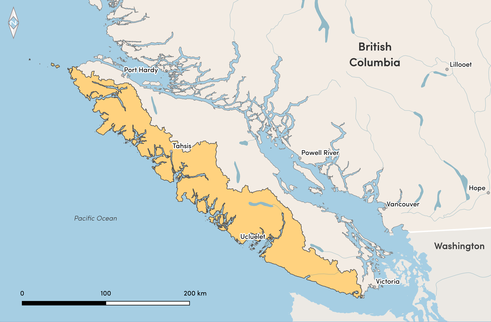

# Regions {#regions}

```{r echo = FALSE, include = FALSE}
library(kableExtra)
library(dplyr)

cu_list <- read.csv("tables/appendix1.csv")
```

Each **Region** within the Pacific Salmon Explorer has specific attributes related to management regimes, data collection, documentation protocols, and most importantly, salmon populations and habitats (Figure \@ref(fig:regions)). Here, we document Region-specific data sources, methodological considerations, and social processes used in each of the initial biological status, habitat pressure assessments, and any other unique information for each region currently within the Pacific Salmon Explorer.

```{r regions, fig.cap = "Map of the PSE Regions.", include=TRUE, echo = FALSE, out.width='100%', fig.align='center', fig.alt=''}
knitr::include_graphics("figures/regions.png")
```

## Yukon Region {#yukon-region}

[intro text]

### Population Data and Analytical Methods {#transboundary-pop-data}

[placeholder]

### Habitat Data and Analytical Methods {#yukon-hab-data}

[placeholder]

## Northern Transboundary Region {#transboundary-region}

At the northwestern edge of BC lie some of the most remote and rugged salmon-bearing river basins in the province, including the Alsek, Chilkat, Taku, Whiting, Stikine, and Unuk. These river basins span Territories of the Champagne and Aishihik First Nations, Taku River Tlingit, and Tahltan First Nations and the international border between Canada and the United States (US). Salmon spawn in the headwaters of Canadian rivers and lakes and migrate out to the ocean in southeast Alaska. This northern Transboundary Region hosts five species of Pacific salmon and steelhead, including `r length(which(cu_list$Region == "Northern Transboundary"))` CUs: `r length(which(cu_list$Region == "Northern Transboundary" & cu_list$Species.Qualified == "CK"))` Chinook, `r length(which(cu_list$Region == "Northern Transboundary" & cu_list$Species.Qualified == "CM"))` chum, `r length(which(cu_list$Region == "Northern Transboundary" & cu_list$Species.Qualified == "CO"))` coho, `r length(which(cu_list$Region == "Northern Transboundary" & cu_list$Species == "Pink"))` pink, `r length(which(cu_list$Region == "Northern Transboundary" & cu_list$Species.Qualified == "SER"))` river-type sockeye, `r length(which(cu_list$Region == "Northern Transboundary" & cu_list$Species.Qualified == "SEL"))` lake-type sockeye, and `r length(which(cu_list$Region == "Northern Transboundary" & cu_list$Species.Qualified == "SH"))` steelhead CUs ([Appendix 1](#appendix-1)).

The first round of data compilation and local consultation in the Transboundary Region took place from 2021-2024 in collaboration with a Transboundary Technical Working Group, made up of fisheries staff from the Tahltan Central Government, Taku River Tlingit First Nation, the Champagne and Aishihik First Nations, and DFO Regional Biologists, as well as independent salmon experts. This work was funded by the BC Salmon Restoration and Innovation Fund. We also retained Gottfried Pestal (Solv Consulting) to assist in compiling Transboundary population data and providing technical advice on the feasibility of estimating certain indicators.

### Population Data and Analytical Methods {#transboundary-pop-data}

Because of the Transboundary life-cycles of salmon in this region, most monitoring data are focused on mandatory reporting under the Pacific Salmon Treaty between Canada and the US. Specifically, we relied heavily on data in the Transboundary Technical Committee (TTC) reports and associated appendices [@TTC2022FinalEstimatesTransboundary]. Data in published reports often lag behind data collection by 2-3 years, and we were able to obtain up-to-date version of report appendices from DFO on request (Aaron Foos, pers. comm.). The TTC reports are focused on "Treaty stocks", equivalent to Stock Management Units, for Chinook, coho, and sockeye in the major river basins (Alsek, Stikine, Taku). Information on CUs outside of these Treaty stocks was sparse.

#### Spawner Surveys {#transboundary-spawner-surveys}

Annual spawner survey data were mostly acquired from [NuSEDS](https://open.canada.ca/data/en/dataset/c48669a3-045b-400d-b730-48aafe8c5ee6) and the TTC annual reports. There are over 20 appendices in the annual TTC reports [e.g. @TTC2022FinalEstimatesTransboundary] that include escapement estimates from assessment projects including fishwheels, weirs, video weirs, sonars, snorkel surveys and aerial surveys. Where spawner estimates were reported in both datasets, they were most often identical. For some streams and years, the TTC estimates were lower. For example, the Klukshu River Chinook, coho, and sockeye estimates from 2000-2020 were often lower in the TTC reports than in NuSEDS. There were fewer cases where TTC estimates were higher than NuSEDS and these differences tended to be smaller in magnitude. 

Based on guidance from the TWG, who advised that data in TTC reports were more reliable and current than in NuSEDS, we preferentially relied on TTC data when spawner surveys were reported in both sources. In some cases (e.g. Klukshu River coho), the NuSEDS time series extended further back in time than the TTC data, but estimates differed between the two sources in more recent years. In these cases, we used only the TTC data, even though that meant losing some historical data that were in NuSEDS, to avoid misrepresenting changes in abundance through time that are due to different data processing steps between data sources.

We report the published estimates directly from the TTC or NuSEDS for all spawner surveys except the Taku River survey of the Northern Transboundary Fjords river-type sockeye CU. In this case, the Taku River sockeye reconstruction from TTC includes the river-type sockeye CU and four lake-type sockeye CUs. Since 2004, all four lake-type sockeye CUs have weirs and thus their contribution to can be accounted for to estimate the river-type component of the overall Taku River sockeye. We do not report spawner survey data for Taku River prior to 2004, when the estimates could not be attributed to CUs. 

There were two additional spawner surveys that we extracted from sources other than the TTC reports and NuSEDS. A sonar project on the Nahlin River, funded by the Pacific Salmon Commission’s Northern Fund, provided Chinook estimates from 2016 – 202336. The sonar project targets large Chinook (>659 mm mid-eye to fork length) and the estimates are separate from the Nahlin River Chinook estimates in the TTC report. In addition, the Lynn Canal Chinook CU was monitored from 1981-1991 at Stonehouse Creek [@Pahlke1992EscapementsChinookSalmon].

Along with spawner survey counts, we compiled additional information including species, site, year, quality, and method and synthesized these data by CU. Spawner survey method and data quality are consistently reported in NuSEDS, but often had to be extracted from footnotes or within the text for TTC-reported data.

```{r transSpawnerSurveySource, include=TRUE, echo = FALSE}
sss <- read.csv("tables/sec5_transSpawnerSurveySources.csv")

knitr::kable(
  sss,
  col.names = c("Species", "Conservation Unit", "Stream Name", "Indicator", "Source", "TTC Appendix & Series"), booktabs = TRUE,
  caption = "Data sources for 65 spawner surveys in the Transboundary region. In some cases, data were available both from NuSEDS and from the TTC, in which case we preferentially source data from the TTC appendices. The TTC Series refers to the specific Appendix and variable name from the TTC reports (note appendix numbers reflect reports from 2024 onward)."
)
```

#### Juvenile Surveys {#transboundary-juvenile-surveys}

Juvenile survey data were available from the TTC report [@TTC2022FinalEstimatesTransboundary] for Tahltan lake-type sockeye in the Stikine watershed and Tatsamenie lake-type sockeye in the Taku watershed. Both of these CUs report natural-origin and hatchery-origin juveniles. 

#### Hatchery Releases {#transboundary-hatchery-releases}

Data on hatchery locations, release sites, and release numbers are provided by DFO Salmon Enhancement Program staff. We compiled information on hatchery releases at 10 different locations throughout the Transboundary Region, representing 13 different location and CU combinations. 

#### Spawner Abundance {#transboundary-spawner-abundance}

The available data from the TTC [@TTC2022FinalEstimatesTransboundary] provide CU-level estimated spawner abundance for eight of the 44 CUs in the Transboundary Region. These CUs are located in the Alsek, Stikine, and Taku River basins. Seven of these CUs are lake-type sockeye with a weir at the downstream extent of the CU (i.e. outlet of the lake) such that this spawner survey can also provide the CU-level estimated spawner abundance. One Chinook CU (Alsek Chinook) has reliable spawner survey data at the Klukshu River that is expanded to represent the entire CU. There are no CU-level spawner abundances for CUs in the Chilkat, Unuk, or Whiting watersheds, or for the coho, chum, pink and steelhead CUs of the Region. 

#### Run Timing {#transboundary-run-timing}

Run timing for Transboundary CUs was compiled from several sources. Start, peak, and end migration dates for Taku River lake-type sockeye CUs were based on migration past the Canyon Island fish wheel reported by @PestalEtAl2020TakuRiverSockeye. Tahltan lake-type sockeye daily passage through the Tahltan fence is reported in the TTC reports [@TTC2022FinalEstimatesTransboundary]. Data compilation and treatment are detailed in @WilsonPeacock2025FreshwaterLifecycleTiming See [Overview of Population Indicators: Run Timing](#run-timing) for a description of the run timing indicator and methods.

#### Catch & Run Size {#transboundary-catch-run-size}

The TTC reports on weekly harvest and effort, annual harvest, and annual estimates of catch (based on coded-wire tags – CWT – or genetic stock identification – GSI) in US and Canadian commercial, recreational, and First Nations fisheries for specific Stock Management Units (SMUs) and indicator populations covered by the Treaty. From TTC report [@TTC2022FinalEstimatesTransboundary], estimates of spawners, Canadian catch, US catch, and run size are available for the following SMUs: Alsek Chinook, Alsek sockeye, Stikine Chinook, Stikine sockeye, Taku Chinook, Taku coho, and Taku sockeye. In the Stikine, the catch and run size information is further split into the mainstem and Tahltan River components. Based on these data, we provide CU-level estimates of catch and run size for the Alsek Chinook CU and the Tahltan lake-type sockeye CU.

#### Recruits-per-Spawner {#transboundary-recruits-per-spawner}

There were no recruits-per-spawner data available at the CU-level for the Transboundary Region.

#### Biological Status {#transboundary-biological-status}

Given that no spawner-recruit data were available for Transboundary CUs, we could only apply percentile benchmarks to assess biological status to eight CUs that had estimated spawner abundance. Given a lack of CU-scale information on spawner abundance, the other 36 CUs could not be assessed. These included all coho, pink, chum, and steelhead CUs in the Transboundary Region. 

### Habitat Data and Analytical Methods {#transboundary-hab-data}

<!-- Katy to populate -->

## Haida Gwaii Region {#haida-gwaii-region}

The archipelago of Haida Gwaii is located off the North Central Coast of BC (Figure \@ref(fig:hgMap)), composed of two main islands; Graham Island (northern) and Moresby Island (southern), with hundreds of other smaller islands in total composing nearly 10,000 square kilometers. The Hecate Strait separates Haida Gwaii from mainland British Columbia by about 100 kilometers. Salmon-bearing waters on Haida Gwaii range from an abundance of small streams along the many kilometers of coastline to larger well-known salmon rivers such as the Yakoun and Tlell Rivers. All five species of Pacific salmon spawn and rear on Haida Gwaii within `r length(which(cu_list$Region == "Haida Gwaii"))` CUs. These CUs include: `r length(which(cu_list$Region == "Haida Gwaii" & cu_list$Species.Qualified == "CK"))` Chinook, `r length(which(cu_list$Region == "Haida Gwaii" & cu_list$Species.Qualified == "CM"))` chum, `r length(which(cu_list$Region == "Haida Gwaii" & cu_list$Species.Qualified == "CO"))` coho, `r length(which(cu_list$Region == "Haida Gwaii" & cu_list$Species == "Pink (even)"))` pink (even-year), `r length(which(cu_list$Region == "Haida Gwaii" & cu_list$Species == "Pink (odd)"))` pink (odd-year), `r length(which(cu_list$Region == "Haida Gwaii" & cu_list$Species.Qualified == "SEL"))` sockeye (lake-type), `r length(which(cu_list$Region == "Haida Gwaii" & cu_list$Species.Qualified == "SER"))` sockeye (river-type), and `r length(which(cu_list$Region == "Haida Gwaii" & cu_list$Species.Qualified == "SH"))` steelhead CU. The process of data gathering and synthesis to complete the initial assessments within the Haida Gwaii Region was completed over one year (2021).

In order to develop the Pacific Salmon Explorer for Haida Gwaii, we engaged with the Haida Nation, DFO, the Gowgaia Institute, Parks Canada, and other salmon experts in Haida Gwaii. We received input and feedback throughout the engagement processes, which included an in-person meeting in September 2021, meeting follow-up, and extended outreach.

Based on feedback and local knowledge, we received contextual knowledge on salmon populations within the region, described within [Population Data and Analytical Methods](#hg-population-data), and were able to improve upon forestry data with contributions from the Gowgaia Institute (described in [Habitat Data and Analytical Methods](#hg-habitat-data)).

### Conservation Unit Changes {#haida-gwaii-cu-changes}

Based on feedback from the Haida Gwaii Technical Working Group, the name of the Marian Lake sockeye conservation unit was renamed to "Marian/Eden." The original name developed by DFO [@HoltbyCiruna2007ConservationUnitsPacific] and in DFO's New Salmon Escapement Database was "Marian" however, TWG members indicated that most of the salmon and surveys are in Eden Lake, and a recent DFO IFMP for Northern Salmon listed "Marian/Eden" rather than "Marian" [@DFO2019]. Additionally, while defined by @HoltbyCiruna2007ConservationUnitsPacific as a Conservation Unit, DFO did not have a CU boundary defined for this CU. We defined the CU boundary as the same spatial extent as the spawning habitat for Marian Lake (which encompasses the watersheds that contain Marian Lake, Eden Lake, and Roy Lake).

```{r hgMap, fig.cap = "Map of the Haida Gwaii Region.", include=TRUE, echo = FALSE, out.width='70%', fig.align='center', fig.alt=''}

```

### Population Data and Analytical Methods {#haida-gwaii-pop-data}

As with the Skeena and Nass regions, in the Haida Gwaii Region many of the datasets necessary to understand the dynamics of salmon CUs have been compiled and stored through the North and Central Coast (NCC) Database [@EnglishEtAl2018NorthCentralCoast; see Skeena Region]. Details on specific data sources, analytical methods, and nuances specific to the Haida Gwaii Region are described below.

#### Spawner Surveys {#haida-gwaii-spawner-surveys}

**Spawner survey** data for streams in the Haida Gwaii Region were sourced from [NuSEDS](https://open.canada.ca/data/en/dataset/c48669a3-045b-400d-b730-48aafe8c5ee6). For a description of the spawner survey indicator, see [Overview of Population Indicators: Spawner Surveys](#spawner-surveys).

#### Juvenile Surveys {#haida-gwaii-juvenile-surveys}

**Juvenile abundance** data for CUs in the Haida Gwaii were available from Haida Fisheries for a coho juvenile outmigration program at Deena River in the East Haida Gwaii coho CU. We will update this information as other juvenile data becomes available. For a description of the juvenile survey indicator, see [Overview of Population Indicators: Juvenile Surveys](#juvenile-surveys).

#### Hatchery Releases {#haida-gwaii-hatchery-releases}

**Hatchery releases** in the Haida Gwaii Region for all salmon species were provided by DFO (Brock Ramshaw, Salmonid Enhancement Program). Data on hatchery locations, release sites, and release numbers from the Freshwater Fisheries Society of BC are available through the Province of British Columbia's [BC Data Catalogue](https://catalogue.data.gov.bc.ca/). Refer to [Overview of Population Indicators: Hatchery Releases](#hatchery-releases) for details on data and analytical methods.

#### Spawner Abundance {#haida-gwaii-spawner-abundance}

Observed spawner abundance for CUs on the in the Haida Gwaii Region is the sum of all spawner survey data as documented in [NuSEDS](https://open.canada.ca/data/en/dataset/c48669a3-045b-400d-b730-48aafe8c5ee6), as described in [Overview of Population Indicators: Spawner Abundance](#spawner-abundance).

Haida Gwaii CU-level **estimates of spawner abundance** (run reconstructions) were sourced from the North and Central Coast (NCC) database, updated by PSF for the years 2018-2021. Haida Gwaii CU-level estimated spawner abundance time series were developed for the NCC database according to the expansion factors described in the Skeena Region section above. On Haida Gwaii, the decline in monitoring coverage over the last 10-20 years was mentioned as an area of concern, and a decline in assessments may affect the relationships used to develop total estimates of spawner abundance (run reconstructions), as described in [Data Quality](#data-quality).

#### Run Timing {#haida-gwaii-run-timing}

Run timing data were compiled from a variety of sources detailed in @WilsonPeacock2025FreshwaterLifecycleTiming See [Overview of Population Indicators: Run Timing](#run-timing) for a description of the run timing indicator and methods.

#### Catch & Run Size {#haida-gwaii-catch-run-size}

**Catch and run size** and subsequent exploitation rates for CUs on the Haida Gwaii Region were calculated by LGL and PSF from data in the [Fisheries Operating System (FOS)](https://open.canada.ca/data/en/dataset/7ac5fe02-308d-4fff-b805-80194f8ddeb4) and other DFO databases. Similar to our work in other adjacent regions (Central Coast, Skeena, Nass), we accessed most of these datasets via the North and Central Coast (NCC) database, maintained by LGL Ltd. and updated by PSF for the period 2018-2021 [@EnglishEtAl2018NorthCentralCoast]. The data is current to *2021*. For a description of catch and run size methods, see [Overview of Population Indicators: Catch & Run Size](#catch-run-size).

On Haida Gwaii, there are some specific nuances to catch data that are important to be aware of when considering the role of catch in estimates of total annual salmon run size. For sockeye salmon, the catch is calculated from a fixed estimate of an annual exploitation rate of 20%. Local knowledge suggests this value may be high, but the representativeness of a fixed rate is less likely to capture annual differences. There is only one Coded Wire Tag indicator stock for coho salmon, so these values are applied to all other coho when used in catch calculations. These considerations in estimates of catch are discussed in [Data Quality](#data-quality).

#### Recruits-per-Spawner {#haida-gwaii-recruits-per-spawner}

**Recruits-per-spawner** data for CUs in the Haida Gwaii Region were derived from the DFO age database and CU-level estimates of spawner abundance and catch and run size accessed from the North and Central Coast (NCC) database [@EnglishEtAl2018NorthCentralCoast]. For a description of recruits-per-spawner methods, see [Overview of Population Indicators: Recruits-per-Spawner](#recruits-per-spawner).

#### Biological Status {#haida-gwaii-biological-status}

The **biological status** assessments for CUs in the Haida Gwaii Region currently reflect data sourced from the North and Central Coast (NCC) database that are current to **2021**. As new data become available, we will update the analyses and results in this report as well as on the Pacific Salmon Explorer. See [Sections 4.1.4. Benchmarks for Assessing Biological Status](#benchmarks-biostatus) and [4.1.5. Decision Rules for Assessing Biological Status](#bs-decision-rules) for more details on biological status assessment methods.

### Habitat Data and Analytical Methods {#haida-gwaii-hab-data}

Nuances regarding habitat pressure indicator data and analytical methods for the Haida Gwaii Region are listed below. Refer to [Habitat Status: Indicators & Benchmarks](#indicators-benchmarks-hab) for information on habitat pressure indicators, benchmarks, and the analytical methods used to assess habitat status. <!--Additional details on habitat pressure indicators, data sources, data currency, and benchmarks specific to the Haida Gwaii Region are available in [Appendix 6 (Description of Habitat Pressure Indicators & Relevance to Salmon)](#appendix-6), [Appendix 7 (Habitat Pressure Datasets & Data Sources)](#appendix-7), [Appendix 8 (Spatial Data Processing for Habitat Pressure Indicators)](#appendix-8), [Appendix 9 (Spatial Data Processing for Future Pressures)](#appendix-9), and [Appendix 12 (Habitat Pressure Benchmark Values by Region)](#appendix-12).-->

#### Spawning Zones of Influence {#haida-gwaii-zoi}

Methods for delineating Chinook CU spawning zones of influence (ZOIs) vary by region in accordance with the CU delineation approach used by DFO. In the Skeena, Nass, Central Coast, and Haida Gwaii regions, Chinook CUs are defined using a more restrictive geographic representation, which resulted in fewer (or no) spawning locations occurring within the CU boundaries. As such, spawning ZOIs for each Chinook CU were delineated using the extent of all 1:20K FWA Assessment Watersheds that directly intersected with Haida Gwaii Chinook CU boundaries.

#### Spatial Data Processing for Habitat Pressure Indicators {#haida-gwaii-spatial-data}

##### Forest Harvest on Haida Gwaii {#haida-gwaii-forest-disturbance}

Working with John Broadhead and Dave Leversee of the Gowgaia Institute, we accessed the best available logging history (harvested areas) dataset compiled for Haida Gwaii. The Gowgaia Institute produced this logging history dataset as part of the Riparian Fish Forest on Haida Gwaii project [@Broadhead2009RiparianFishForest], and they updated this dataset to 2021 ([Appendix 6](#appendix-6)). The Gowgaia dataset provided a more complete representation of forest harvest on Haida Gwaii than was available in the VRI and Consolidated Cutblocks datasets that we used to assess forest harvest in other regions to date.

With their expert knowledge of logging history on Haida Gwaii, the Gowgaia Institute also identified areas where assessing risk at the assessment watershed scale may over or underrepresent more localized risk. Categorizing risk at the assessment watershed-scale generalizes risk across watersheds. As such, at this scale, it is not possible to identify whether risk is evenly distributed across a watershed or is more concentrated in certain parts of a watershed. Areas that the Gowgaia Institute identified as suffering from this limitation were around Haines Creek, NE Graham Island, and watersheds near Tasu Sound. The Harvested Cutblocks layer is provided along-side the Forest Harvest Habitat Assessment layer to faciliate more localized examination of forest harvest impacts in relation the Assessment Watershed boundaries (which can be optionally added to the map from the Layers Catalogue).

#### Spawning Habitat Information from Expert Knowledge Holders {#haida-gwaii-expert-knowledge} 

In addition to the spawning habitat information we acquired from DataBC (primarily from the Fisheries Information Summary System (FISS) database), we collaborated with representatives from Haida Fisheries, Fisheries and Oceans Canada's Salmon Enhancement Program, Parks Canada, the Gowgaia Institute, the Hecate Strait Streamkeepers, and independent salmon experts to identify local salmon spawning locations. The collective identified 16 new salmon-bearing watersheds that had not been previously documented, further enhancing the baseline of available information for Haida Gwaii salmon.


## Nass Region {#nass-region}

In northern BC, the Nass River watershed is the third-largest watershed in the province and includes several major tributaries, including the Bell-Irving, Cranberry, Meziadin, Kwinageese, and Damdochax Rivers. The Nass Region (Figure \@ref(fig:nassMap)), which consists of the watersheds draining into Portland Canal and Observatory Inlet, contains extensive spawning and rearing habitat for all five species of Pacific salmon. These salmon populations comprise `r length(which(cu_list$Region == "Nass"))` CUs: `r length(which(cu_list$Region == "Nass" & cu_list$Species.Qualified == "CK"))` Chinook, `r length(which(cu_list$Region == "Nass" & cu_list$Species.Qualified == "CM"))` chum, `r length(which(cu_list$Region == "Nass" & cu_list$Species.Qualified == "CO"))` coho, `r length(which(cu_list$Region == "Nass" & cu_list$Species == "Pink"))` pink, `r length(which(cu_list$Region == "Nass" & cu_list$Species.Qualified == "SER"))` river-type sockeye, `r length(which(cu_list$Region == "Nass" & cu_list$Species.Qualified == "SEL"))` lake-type sockeye, and `r length(which(cu_list$Region == "Nass" & cu_list$Species.Qualified == "SH"))` steelhead CUs ([Appendix 1](#appendix-1)). The initial process of data gathering, synthesis, outreach, and engagement to complete the initial assessments within the Nass Region was conducted from 2015 to 2019.

We worked with First Nations in the Nass Region to garner feedback on the Pacific Salmon Explorer approach and analyses through the Nisga'a-Canada-BC Nass Joint Technical Committee and the Gitanyow Fisheries Authority. In addition, in 2015 - 2016, we formed a Nass Technical Advisory Committee to engage with First Nations, DFO regional biologists and managers, and other salmon experts throughout the watershed.

```{r nassMap, fig.cap = "Map of the Nass Region.", include=TRUE, echo = FALSE, out.width='70%', fig.align='center', fig.alt=''}
knitr::include_graphics("figures/nass_map.png")
```

### Population Data and Analytical Methods {#nass-pop-data}

As with the Skeena Region, many of the datasets necessary to understand the dynamics of salmon CUs in the Nass Region were historically compiled and stored through the North and Central Coast (NCC) Database [@EnglishEtAl2018NorthCentralCoast; see Skeena Region]. However, in recent years, we have worked directly with the Nisga'a Lisims Government and LGL Limited staff to compile and synthesize CU-level information [@EnglishEtAl2023PreliminaryAreaSalmon]. For steelhead, data were sourced from @EnglishEtAl2023PreliminaryAreaSalmon (see our [steelhead-specific Github repository](https://github.com/salmonwatersheds/steelhead-status) for all raw steelhead population data compiled). Details regarding nuances to the data and analytical methods that are specific to the Nass Region are described below.

#### Spawner Surveys {#nass-spawner-surveys}

Spawner survey data for streams in the Nass Region were sourced from [NuSEDS](https://open.canada.ca/data/en/dataset/c48669a3-045b-400d-b730-48aafe8c5ee6). For a description of the spawner survey indicator, see [Overview of Population Indicators: Spawner Surveys](#spawner-surveys). For steelhead, spawner survey data were provided directly from the Nisga'a Lisims Goverment Fish and Wildlife and LGL Limited [@EnglishEtAl2023PreliminaryAreaSalmon].

#### Juvenile Surveys {#nass-juvenile-surveys}

**Juvenile surveys** for the Lower Nass coho CU was provided by Nisga'a Fish and Wildlife. For a description of the juvenile surveys indicator, see [Overview of Population Indicators: Juvenile Surveys](#juvenile-surveys).

#### Hatchery Releases {#nass-hatchery-releases} 

Hatchery releases in the Nass Region for all species were provided by DFO (Brock Ramshaw, Salmonid Enhancement Program). Data on hatchery locations, release sites, and release numbers from the Freshwater Fisheries Society of BC are available through the Province of British Columbia's [BC Data Catalogue](https://catalogue.data.gov.bc.ca/). Refer to [Overview of Population Indicators: Hatchery Releases](#hatchery-releases) for details on data and analytical methods.

#### Spawner Abundance {#nass-spawner-abundance}

Observed spawner abundance for CUs in the Nass Region is the sum of all spawner survey data as documented in [NuSEDS](https://open.canada.ca/data/en/dataset/c48669a3-045b-400d-b730-48aafe8c5ee6), as described in [Overview of Population Indicators: Spawner Abundance](#spawner-abundance). Nass Region CU-level estimates of spawner abundance (run reconstructions) were sourced from @EnglishEtAl2023PreliminaryAreaSalmon. Some CU-level estimated spawner abundance time series were developed according to the expansion factors described in the Skeena Region section.

In addition, CU-level estimates of spawner abundance for five Nass CUs are derived from additional spawner enumeration methods. Specifically, three salmon CUs (plus one steelhead CU) have mark-recapture programs operated by Nisga'a Fisheries and Wildlife [@EnglishEtAl2023PreliminaryAreaSalmon].

#### Run Timing {#nass-run-timing}

Run timing data were compiled from a variety of sources detailed in @WilsonPeacock2025FreshwaterLifecycleTiming, including the Gitwinksihlkw fish wheel and Coded-wire Tag recovery projects at Zolzap Creek and Kincolith River.
<!-- Add more details when time to insert references from Wilson and Peacocj into zotero!-->

#### Catch & Run Size {#nass-catch-run-size}

Catch and run size, and subsequent exploitation rates for CUs in the Nass Region were calculated by LGL, Nisga'a Fish and Wildlife, and DFO from the [Fisheries Operations System](https://open.canada.ca/data/en/dataset/7ac5fe02-308d-4fff-b805-80194f8ddeb4) and other DFO databases. These data were reported in @EnglishEtAl2023PreliminaryAreaSalmon. For a description of catch and run size methods, see [Overview of Population Indicators: Catch & Run Size](#catch-run-size).

#### Recruits-per-Spawner {#nass-recruits-per-spawner}

Recruits-per-spawner data for CUs in the Nass Region were derived from the DFO age database and CU-level estimates of spawner abundance and catch and run size accessed from [@EnglishEtAl2023PreliminaryAreaSalmon]. For a description of recruits-per-spawner methods, see [Overview of Population Indicators: Recruits-per-Spawner](#recruits-per-spawner).

#### Biological Status {#nass-biological-status}

The biological status assessments for salmon CUs in the Nass Region currently reflect data that are current to *2022*. For steelhead, spawner abundance data were provided by the Nisga'a Lisims Goverment Fish and Wildlife and LGL Limited and are current up to 2022 [@EnglishEtAl2023PreliminaryAreaSalmon]. As new data become available, we will update the analyses and results in this report and the Pacific Salmon Explorer. See [Benchmarks for Assessing Biological Status](#benchmarks-biostatus) and [Decision Rules for Assessing Biological Status](#bs-decision-rules) for more details on biological status assessment methods.

### Habitat Data and Analytical Methods {#nass-hab-data}

Nuances regarding habitat pressure indicator data and analytical methods for the Nass Region are listed below. Refer to [Population Status: Indicators & Benchmarks](#indicators-benchmarks-pop) for information on habitat pressure indicators, benchmarks, and the analytical methods used to assess habitat status. <!-- ** Katy **  Additional details on habitat pressure indicators, data sources, data currency, and benchmarks specific to the Nass Region are available in [Appendix 6 (Description of Habitat Pressure Indicators & Relevance to Salmon)](#appendix-6), [Appendix 7 (Habitat Pressure Datasets & Data Sources)](#appendix-7), [Appendix 8 (Spatial Data Processing for Habitat Pressure Indicators)](#appendix-8), [Appendix 9 (Spatial Data Processing for Future Pressures)](#appendix-9), and [Appendix 12 (Habitat Pressure Benchmark Values by Region)](#appendix-12).-->

#### Spawning Zones of Influence {#nass-zoi} 

Methods for delineating Chinook CU spawning zones of influence (ZOIs) vary by region in accordance with the CU delineation approach used by DFO. In the Skeena, Nass, and Central Coast regions, Chinook CUs are defined using a more restrictive geographic representation, which resulted in fewer (or no) spawning locations occurring within the CU boundaries. As such, spawning ZOIs for each Chinook CU were delineated using the extent of all 1:20K FWA Assessment Watersheds that directly intersected with Nass Chinook CU boundaries.

## Skeena Region {#skeena-region}

The Skeena River watershed, located along the north coast of BC, is the second-largest in the province, contains important tributaries, including the Babine, Kispiox, and Bulkley Rivers, and is one of the most productive river systems in BC. All five species of Pacific salmon spawn and rear in the lower and upper portions of the Skeena River Basin (Figure \@ref(fig:skeenaMap)) within `r length(which(cu_list$Region == "Skeena"))` CUs: `r length(which(cu_list$Region == "Skeena" & cu_list$Species.Qualified == "CK"))` Chinook, `r length(which(cu_list$Region == "Skeena" & cu_list$Species.Qualified == "CM"))` chum, , `r length(which(cu_list$Region == "Skeena" & cu_list$Species.Qualified == "CO"))` coho, `r length(which(cu_list$Region == "Skeena" & cu_list$Species %in% c("Pink (odd)", "Pink (even)")))` pink, `r length(which(cu_list$Region == "Skeena" & cu_list$Species.Qualified == "SER"))` river-type sockeye, `r length(which(cu_list$Region == "Skeena" & cu_list$Species.Qualified == "SEL"))` lake-type sockeye, and `r length(which(cu_list$Region == "Skeena" & cu_list$Species.Qualified == "SH"))` steelhead ([Appendix 1](#appendix-1)). The initial process of data gathering, synthesis, outreach, and engagement to complete the initial assessments for five salmon species within the Skeena Region was conducted over five years, from 2010 to 2014. Subsequent updates to those data have occurred regularly, and steelhead were added in 2023.

```{r skeenaMap, fig.cap = "Map of the Skeena Region.", include=TRUE, echo = FALSE, out.width='70%', fig.align='center', fig.alt=''}
knitr::include_graphics("figures/skeena_map.png")
```

During the initial development of the Pacific Salmon Explorer for the Skeena, we formed a Skeena Technical Advisory Committee and engaged with First Nations, DFO, and other salmon experts throughout the watershed. Through the Technical Advisory Committee process, we received input and feedback from the Gitanyow Fisheries Authority, DFO, Office of the Wet'suwet'en, Lake Babine Nation, Gitxsan Watershed Authorities, Gitxaala First Nation, North Coast-Skeena First Nations Stewardship Society, SkeenaWild Conservation Trust, Bulkley Valley Research Centre, Suskwa Research, BC Ministry of Environment, and DFO.

### Conservation Unit Changes {#skeena-cu-changes}

Based on feedback from the Skeena Technical Advisory Committee, we made several changes to the CU list, such that the CUs listed in the Pacific Salmon Explorer may differ from those provided by DFO. Specifically, we combined the Mcdonnell, Aldrich, and Dennis lake-type sockeye CUs into a single CU (Mcdonnell/Aldrich/Dennis) since the contribution of each of these lakes cannot be currently assessed from the estimated spawner abundance data. For the same reason, we combined the Morice and Atna lake-type sockeye CUs (Morice/Atna), and the Bulkley and Maxan (Bulkley/Maxan) lake-type sockeye CUs. Following updates by DFO, the Swan/Club CU was removed from the PSE in August 2024 and its spawner surveys and spawning location data was assigned to the Stephens CU. Similarly, the former Sicintine Chinook CU was removed with component populations assigned to the Upper Skeena Chinook CU [@WintherEtAl2024AssessmentSkeenaRiver].

We split the Babine lake-type sockeye CU into four CUs based on run-timing and enhancement. The wild portions of the CU are split into Babine/Onerka (early timing), Tahlo/Morrison (mid timing), and Nilkitkwa (late timing). The enhanced portion of the CU (originating from the Pinkut and Fulton spawning channels) is considered as the Babine (enhanced) CU.

For steelhead, we used CUs defined by @TautzEtAl2011SkeenaSteelheadConservation for steelhead in the Skeena watershed. No changes were made to the CUs defined in this publication.

### Population Data and Analytical Methods {#skeena-pop-data}

In the Skeena Region, PSF accessed data through three different sources, depending on species. For pink, chum. and coho, data was accessed via the North and Central Coast (NCC) Database [@EnglishEtAl2018NorthCentralCoast]. The NCC Database is a database originally produced by [LGL Ltd.](https://lgl.com/), who synthesize datasets on spawner surveys, catch, exploitation rate, and age structure. LGL also includes generated datasets for CU-level estimates of spawner abundance, run size, and exploitation rate. For the most part, data in the NCC Database have been sourced by LGL from DFO's [New Salmon Escapement Database (NuSEDS)](https://open.canada.ca/data/en/dataset/c48669a3-045b-400d-b730-48aafe8c5ee6), the [Fisheries Operating System (FOS)](https://open.canada.ca/data/en/dataset/7ac5fe02-308d-4fff-b805-80194f8ddeb4), and other DFO databases. For Chinook, data was sourced from @WintherEtAl2024AssessmentSkeenaRiver. For sockeye, data was sourced from DFO (Charmaine Carr-Harris, personal communication). For steelhead, there is no centralized public database for population data so these data were compiled from disparate sources, including from online databases, individual reports, and data custodians (see our [steelhead-specific Github repository](https://github.com/salmonwatersheds/steelhead-status) for all raw steelhead population data compiled). Details regarding nuances to the data and analytical methods specific to the Skeena Region are described below.

#### Spawner Surveys {#skeena-spawner-surveys}

Spawner survey data for streams in the Skeena Region were sourced from DFO's [New Salmon Escapement Database (NuSEDS)](https://open.canada.ca/data/en/dataset/c48669a3-045b-400d-b730-48aafe8c5ee6). For a description of the spawner survey indicator, see the [Overview of Biological Indicators: Spawner Surveys](#spawner-surveys). For steelhead, spawner survey data for streams in the Skeena Region were compiled from regional data custodians at the Skeena Region Office of the Province of BC's Fish and Wildlife Branch and from published reports, including from @BaxterUpperSustutLower, @Mitchell2000, @SaimotoSaimoto2011WetSuwetFisheries, and @SkeenaFisheriesBranch2019UpperSustutRiver.

#### Juvenile Surveys {#skeena-juvenile-surveys}

Juvenile abundance data for the Babine (enhanced), Babine/Onerka, Tahlo/Morrison, and Nilkitkwa lake-type sockeye CUs were available in @Cox-Rogers2012FisheriesOceansCanada. Juvenile abundance estimates for the Gitanyow lake-type sockeye CU were available from @BeblowEtAl2018KitwangaRiverSalmon. Juvenile abundance of the Slamgeesh lake-type sockeye CU was available from @Fernando20182017SlamgeeshSalmon and previous reports. For steelhead, data were sourced for the Kispoix, Middle Skeena, Morice, and Skeena Coastal Summers CUs from @DavidBustard1993 and @WilliamsonCJ2002UpperSkeena. For a description of the juvenile survey's indicator, see [Overview of Population Indicators: Juvenile Surveys](#juvenile-surveys).

#### Hatchery Releases {#skeena-hatchery-releases}

Hatchery releases in the Skeena Region for all species were provided by DFO (Brock Ramhsaw, DFO Salmonid Enhancement Program). For steelhead, Data on hatchery locations, release sites, and release numbers from the Freshwater Fisheries Society of BC are available through the Province of British Columbia's [BC Data Catalogue](https://catalogue.data.gov.bc.ca/). Refer to [Overview of Population Indicators: Hatchery Releases](#hatchery-releases) for details on data and analytical methods.

#### Spawner Abundance {#skeena-spawner-abundance}

Observed spawner abundance for CUs in the Skeena Region is the sum of all spawner survey data documented in NuSEDS, as described in [Overview of Population Indicators: Spawner Abundance](#spawner-abundance).

Skeena CU-level estimates of spawner abundance (run reconstructions) were sourced from the North and Central Coast (NCC) database for pink, chum and coho salmon. The quantity and quality of the estimated spawner abundance in NuSEDS varies by time period, region, and stream. Meanwhile, the observed spawner abundance data are not always representative of actual changes in abundance through time for a CU. As such, an "expansion procedure" is needed so that any changes in abundance through time are not confounded with changes in monitoring effort. Since 2008, PSF has worked with LGL Limited to generate Skeena (and Nass and Central Coast) CU-level estimated spawner abundance or run reconstructions in collaboration with DFO North Coast stock assessment staff [@EnglishEtAl2006NorthCentralCoast; @English2012ExtendTimeSeries; @EnglishEtAl2018NorthCentralCoast]. Three expansion factors are used to generate estimated spawner abundance. The first expansion factor uses historical proportional contribution data to infill indicator streams not monitored in a given year. The second expansion factor expands the data from the monitored indicator streams so that the estimated spawner abundance is representative of the entire CU. The final expansion factor expands this number again for observer efficiency. 

The expansion procedures, by necessity, make a number of simplifying assumptions. The first expansion factor assumes that the proportion of the overall CU that each indicator stream represents is constant through time. The second expansion factor assumes that indicator and non-indicator streams make up a constant contribution to the overall abundance of a CU. The final expansion factor assumes that observer efficiency is constant between years, CUs, methodologies (except for fences), and hydrological systems. For CUs in the Skeena Region (and for CUs in the Nass, Central Coast and Haida Gwaii Regions), we attempted to account for potential data quality issues associated with the final observer efficiency expansion factor (see [Data Quality](#data-quality)). However, these assumptions may potentially still incorporate uncertainty into our assessments of biological status in these Region's CUs. These uncertainties result from spawner surveys being conducted using various methodologies and/or by different observers throughout time, which is not currently accounted for.

<!-- EH: This seems like a weird place for this information, maybe should go in Chapter 4? 
SP: Agree; we can examine post-launch. :-S -->

For Skeena Chinook, we used the estimated spawner abundance data reported in @WintherEtAl2024AssessmentSkeenaRiver. Estimated spawner abundance was available for six CUs, and was derived by expanding the proportion of Kitsumkalum River Chinook identified at the Tyee test fishery. 

In contrast to Chinook, there has been more consistent distribution and quantity of monitoring effort for Skeena sockeye CUs dating back to 1960. Skeena sockeye data underwent a significant review and update in 2022 [@BiologicalBenchmarksBuilding]. We were provided an update of the estimated spawner abundance data file by DFO (Charmain Carr-Harris, personal communication). 

For steelhead, we did not apply expansion procedures to observed spawner abundance data to produce estimated spawner abundance. Instead, where spawner survey data approximate the CU-scale (i.e. counts or estimates are produced that are inclusive of all steelhead populations in the CU), we present these data as estimated spawner abundance. Data sources for these data include custodians at the Skeena Region Office of the Province of BC's Fish and Wildlife Branch, @SkeenaFisheriesBranch2019UpperSustutRiver, and @SaimotoSaimoto2011WetSuwetFisheries. For the case of the Bulkley and Morice CUs, estimates from @SaimotoSaimoto2011WetSuwetFisheries represent the total number of spawners returning to these two CUs combined and there is not precedence for estimating the proportion of spawners returning to each individual CU. We visualize these estimates as the estimated spawner abundance for both the Bulkley and Morice CUs (i.e. the same estimated spawner abundance data are visualized for the spawner abundance indicator for both CUs).The Tyee Test Fishery has operated at the mouth of the Skeena River since 1955 providing an aggregate-level index of spawner abundance for steelhead returning to the 10 summer-run CUs in the Skeena watershed. There are, however, currently no available data for escapement to specific CUs or populations based on Tyee Test Fishery monitoring. 

#### Run Timing {#skeena-run-timing}

Estimates of peak timing of river entry for the different sockeye CUs were estimated from DNA sampled from fish caught in the Tyee test fishery near the mouth of the Skeena River between 2000-2010 [@Cox-Rogers2012FisheriesOceansCanada]. The duration of the timing of river entry is assumed to have a bell-shaped curve (i.e. normal distribution), so the shape of the curves is defined by the mean and standard deviation of the available run timing data. However, in most instances, there is insufficient data to determine if a different distribution would better describe the shape of the curve. A normal distribution curve is likely a reasonable approximation for run timing in most cases if the run timing is unimodal (i.e. if there is a single peak in run timing). If the run timing is bi-modal (i.e. if there are two run timing groups), the assumption of spread is likely reasonable, but the peak may be misleading.

Note that these run timing curves were only used to estimate exploitation rates for Skeena sockeye CUs. A conservative assumption of relatively broad run timing (80-110 days) for each sockeye CU was used so that exploitation rates would not be sensitive to small shifts in fishery timing. For some CUs, run timing information is not available, and for some species, run timing is assumed to be the same for all CUs. 

For six Chinook CUs, timing was estimated from Tyee test fishery data from 2009-2016, taken from @WintherEtAl2024AssessmentSkeenaRiver. Test fishery data were available for other years between 2000 and 2022, but often missed the start of the run and so we opted to use the period when the test fishery began operation in late-May, better capturing the start of Chinook migrations. For steelhead, run timing from the Tyee test fishery was taken from @BeachamEtAl2012PopulationStructureRun.

For other CUs, run timing data were estimated by DFO North Coast Staff. See [Overview of Population Indicators: Run Timing](#run-timing) for a description of the run timing indicator and methods.

#### Catch & Run Size {#skeena-catch-run-size}

Catch and run size, and subsequent exploitation rates for CUs in the Skeena region were calculated by LGL and DFO from the [Fisheries Operating System (FOS)](https://open.canada.ca/data/en/dataset/7ac5fe02-308d-4fff-b805-80194f8ddeb4) and other DFO databases. We accessed these datasets for pink, chum and coho salmon via the North and Central Coast (NCC) Database, maintained by LGL Ltd. [@EnglishEtAl2018NorthCentralCoast] and for sockeye following @BiologicalBenchmarksBuilding. For a description of catch and run size methods, see [Overview of Population Indicators: Catch & Run Size](#catch-run-size).

#### Recruits-per-Spawner {#skeena-recruits-per-spawner}

Recruits-per-spawner data for CUs in the Skeena Region were derived from the DFO age database and CU-level estimates of spawner abundance and catch and run size, accessed from the NCC Database [@EnglishEtAl2018NorthCentralCoast] for pink, chum, and coho salmon. Sockeye salmon data was from @BiologicalBenchmarksBuilding and Chinook salmon data was from @WintherEtAl2024AssessmentSkeenaRiver. For a description of recruits-per-spawner methods, see [Overview of Population Indicators: Recruits-per-Spawner](#recruits-per-spawner).

#### Biological Status {#skeena-biological-status}

The biological status assessments for CUs in the Skeena Region reflect data sourced from the NCC database and are current up to 2022 for sockeye, 2020 for Chinook and 2019 for other salmon species. For steelhead, data was sourced from data custodians at the Skeena Region Office of the Province of BC's Fish and Wildlife Branch and from @SkeenaFisheriesBranch2019UpperSustutRiver and are current up to 2022. The original approach and results for Skeena biological status assessments are described in @KormanEnglish2013BenchmarkAnalysisPacific. As new data become available, we will update the analyses and results in this report and the Pacific Salmon Explorer. See [Benchmarks for Assessing Biological Status](#benchmarks-biostatus) and [Decision Rules for Assessing Biological Status](#bs-decision-rules) for more details on biological status assessment methods

### Habitat Data and Analytical Methods {#skeena-hab-data}

Nuances regarding habitat pressure indicator data and analytical methods for the Skeena Region are listed below. Refer to [Indicators and Benchmarks for Assessing Habitat Status](#indicators-benchmark-hab) for information on habitat pressure indicators, benchmarks, and the analytical methods used to assess habitat status. <!--Additional details on habitat pressure indicators, data sources, data currency, and benchmarks specific to the Skeena Region are available in [Appendix 6 (Description of Habitat Pressure Indicators & Relevance to Salmon)](#appendix-6), [Appendix 7 (Habitat Pressure Datasets & Data Sources)](#appendix-7), [Appendix 8 (Spatial Data Processing for Habitat Pressure Indicators)](#appendix-8), [Appendix 9 (Spatial Data Processing for Future Pressures)](#appendix-9), [Appendix 12 (Habitat Pressure Benchmark Values by Region)](#appendix-12).-->

<!-- Katy: Commenting this out as it seems no longer relevant with the empirical benchmarks, right?
#### Trans-regional Conservation Units {#skeena-trans-cus}

The pink (even-year) Nass-Skeena Estuary CU spans the boundary between the Skeena and Nass regions. For habitat indicators that used relative benchmarks, habitat status for this trans-regional CU was assessed based on benchmarks derived from the Skeena Region because a significant portion of this CU's spawning habitat fell inside the Skeena Region.
-->

#### Spawning Zones of Influence {#skeena-zoi}

Methods for delineating Chinook CU spawning zones of influence (ZOIs) vary by region in accordance with the CU delineation approach used by DFO. In the Skeena, Nass, and Central Coast regions, Chinook CUs are defined using a more restrictive geographic representation, which resulted in fewer (or no) spawning locations occurring within the CU boundaries. As such, spawning ZOIs for each Chinook CU were delineated using the extent of all 1:20K FWA Assessment Watersheds that directly intersected with Skeena Chinook CU boundaries.

## Central Coast Region {#central-coast-region}

The Central Coast Region supports diverse populations of all five Pacific salmon species and steelhead (Figure \@ref(fig:CentralMap)). These salmon populations comprise `r length(which(cu_list$Region == "Central Coast"))` CUs: `r length(which(cu_list$Region == "Central Coast" & cu_list$Species.Qualified == "CK"))` Chinook, `r length(which(cu_list$Region == "Central Coast" & cu_list$Species.Qualified == "CM"))` chum, `r length(which(cu_list$Region == "Central Coast" & cu_list$Species.Qualified == "CO"))` coho, `r length(which(cu_list$Region == "Central Coast" & cu_list$Species == "Pink"))` pink, `r length(which(cu_list$Region == "Central Coast" & cu_list$Species.Qualified == "SER"))` river-type sockeye, `r length(which(cu_list$Region == "Central Coast" & cu_list$Species.Qualified == "SEL"))` lake-type sockeye, and `r length(which(cu_list$Region == "Central Coast" & cu_list$Species.Qualified == "SH"))` steelhead CUs ([Appendix 1](#appendix-1)).

While this area is less easily defined than an extensive river system such as the Skeena or Fraser Regions, we could determine the Central Coast study area using three criteria. First, the intent was to include the full geographic extent of most CUs on the Central Coast [Appendix 1](#appendix-1). Second, we considered the adjacency of other Regions within the Pacific Salmon Explorer to minimize overlap between study areas. Third, we considered major drainage patterns as represented in BC's Freshwater Atlas (FWA) 1:20K Watershed Groups (MOE, 2017a). According to these criteria, the resulting Central Coast Region on the Pacific Salmon Explorer encompasses 54,813 km$^2$ from Smith and Rivers Inlets in the south, and Douglas Channel and Banks, McCauley, and Pitt Islands in the north (Figure \@ref(fig:CentralMap)). The process of data gathering, synthesis, outreach, and engagement to complete the initial assessments within the Central Coast Region was conducted over two years, from 2016 to 2018.

For the Central Coast Region, we worked with two technical committees (one for the north portion and one for the south portion of the region) to garner feedback on the Pacific Salmon Explorer approach and analyses. These Technical committees were comprised of First Nations, DFO regional biologists, managers, and other salmon experts to garner feedback on the Pacific Salmon Explorer approach and analyses. We received feedback from the Central Coast Indigenous Resource Alliance and the Nuxalk, Kitasoo/Xai'Xais, Heiltsuk, Wuikinuxv Gitxaala, and Haisla First Nations.

### Conservation Unit Changes {#central-coast-cu-changes}

As part of the Technical Committee review process, we removed two CUs (Whalen Lake and Owikeno-Late sockeye (lake-type) CUs). The Whalen Lake sockeye CU is included in [@HoltbyCiruna2007ConservationUnitsPacific], but long-time Charter Patrolman and Technical Committee member, Stan Hutchings, recommended removing it from the list of CUs. An impassable waterfall prevents sockeye from accessing Whalen Lake, which is the spawning and rearing lake for this CU. As such, we removed this CU from the project. The Owikeno-Late sockeye CU is not listed in [@HoltbyCiruna2007ConservationUnitsPacific] but was provisionally designated as a CU by Blair Holtby in 2008. However, a Technical Committee member from Wuikinuxv advised us that this CU is not distinguishable from other sockeye CUs in the lake. Furthermore, this CU was not included on the most recent list of CUs published on the Government of Canada's Open Data portal. Given that it was not in the most current list of CUs, it lacks baseline data, and we could not find any documentation about its creation. Therefore, we removed this CU from the project.

For steelhead in the Central Coast Region, we used CUs defined in @ParkinsonEtAl2005PopulationDatabaseDefining. Through our work and conversations with the Steelhead Technical Working Group, we identified a key issue with the spatial boundaries for some coastal steelhead CUs for groups of winter-run populations, including the North Coast Winter CU in the Central Coast Region. One of the key distinguishing features among steelhead CUs is run timing. The CU boundaries for this winter-run CU did not include watersheds that contain both winter-run and coastal summer-run populations of steelhead. These watersheds were only included in the corresponding coastal summer-run CU (in this case, the North Coast Summer CU). To address this issue in a standardized way for all CUs with this issue, we expanded the CU boundaries for the winter-run CUs to include the entirety of watersheds in the corresponding summer-run CU. In this case, resulting in an overlapping region between the North Coast Winter and North Coast Summer CUs where steelhead from multiple CUs spawn. This approach did not capture watershed-specific nuances in the distribution of winter- and summer-run steelhead populations, which are often not documented. However, these changes to the North Coast Winter CU ensure the CU is not missing key watersheds.

```{r CentralMap, fig.cap = "Map of the Central Coast Region.", include=TRUE, echo = FALSE, out.width='70%', fig.align='center', fig.alt=''}

```

### Population Data and Analytical Methods {#central-coast-pop-data}

There are several nuances to the data sources and analytical methods specific to the Central Coast Region. These nuances are listed below. For steelhead in general, there is no centralized public database for population data so these data were compiled from disparate sources, including from online databases, individual reports, and data custodians (see our [steelhead-specific Github repository](https://github.com/salmonwatersheds/steelhead-status) for all raw steelhead population data compiled).

#### Spawner Surveys {#central-coast-spawner-surveys}

**Spawner survey** data for streams in the Central Coast were sourced from DFO's New Salmon Escapement Database (NuSEDS). For a description of the spawner survey indicator, see [Overview of Population Indicators: Spawner Surveys](#spawner-surveys). For steelhead, spawner survey data were sourced from @EnglishEtAl1999AssessmentDistributionTiming, @Peard2017ResultsKloiyaRiver, and @PtolemyEtAl2006ResultsSteelheadStock.

#### Juvenile Surveys {#central-coast-juvenile-surveys}

**Juvenile survey** data for the Hecate Lowlands (even) pink, Hecate Strait-Lowlands (odd) pink, Hecate Strait Mainland coho, Hecate Lowlands chum, Roderick sockeye, and Mary Cove Creek sockeye CUs within Kitasoo/Xai'xais territory were provided by Larry Greba (Kitasoo/Xai'xais Development Corporation). For a description of the juvenile survey's indicator, see [Overview of Population Indicators: Juvenile Surveys](#juvenile-surveys).

#### Hatchery Releases {#central-coast-hatchery-releases}

Hatchery releases in the Central Coast Region for all species were provided by DFO (Brock Ramshaw, Salmonid Enhancement Program). Data on hatchery locations, release sites, and release numbers from the Freshwater Fisheries Society of BC are available through the Province of British Columbia's [BC Data Catalogue](https://catalogue.data.gov.bc.ca/). Refer to [Overview of Population Indicators: Hatchery Releases](#hatchery-releases) for details on data and analytical methods.

#### Spawner Abundance {#central-coast-spawner-abundance}

**Observed spawner abundance** for CUs in the Central Coast Region is the sum of all spawner survey data documented in NuSEDS, as described in [Overview of Population Indicators: Spawner Abundance](#spawner-abundance). For steelhead, observed spawner data are summed spawner survey data sourced from @EnglishEtAl1999AssessmentDistributionTiming, @Peard2017ResultsKloiyaRiver, and @PtolemyEtAl2006ResultsSteelheadStock.

Central Coast CU-level **estimates of spawner abundance** (run reconstructions) were updated by PSF via the North and Central Coast (NCC) database. Central Coast CU-level estimated spawner abundance time series were developed for the NCC database according to the expansion factors described in the Skeena Region section above.

#### Run Timing {#central-coast-run-timing}

Run timing information for many Central Coast salmon CUs was sourced from @GorukWinther1992SalmonEscapementTiming. We relied on a several reports describing the life-history of steelhead in the region [e.g., @EnglishEtAl1999AssessmentDistributionTiming, @NelsonEtAl1998CompilationStockAssessment]. Further details on the compilation of run timing data are provided by @WilsonPeacock2025FreshwaterLifecycleTiming See [Overview of Population Indicators: Run Timing](#run-timing) for a description of the run timing indicator and methods.

#### Catch & Run Size {#central-coast-catch-run-size}

**Catch and run size**, and subsequent exploitation rates for CUs on the Central Coast were calculated by DFO and LGL from data in the [Fisheries Operating System (FOS)](https://open.canada.ca/data/en/dataset/7ac5fe02-308d-4fff-b805-80194f8ddeb4) and other DFO databases. Similar to our work in the Skeena and Nass, we accessed most of these datasets via the North and Central Coast (NCC) Database, maintained by LGL Ltd, and updated by PSF for 2018-202. [@EnglishEtAl2018NorthCentralCoast]. For a description of catch and run size methods, see [Overview of Population Indicators: Catch & Run Size](#bs-indicators).

#### Recruits-per-Spawner {#central-coast-recruits-per-spawner}

**Recruits-per-spawner** data for CUs on the Central Coast were derived from the DFO age database and CU-level estimates of spawner abundance and catch and run size accessed from the NCC Database [@EnglishEtAl2018NorthCentralCoast]. These data were updated by PSF to cover the years 2018-2021 For a description of recruits-per-spawner methods, see [Overview of Population Indicators: Recruits-per-Spawner](#recruits-per-spawner).

#### Biological Status

The biological status assessments for CUs in the Central Coast Region reflect data updated by PSF via the NCC database and are current up to **2021**. As new data become available, we will update the analyses and results in this report and the Pacific Salmon Explorer. See [Benchmarks for Assessing Biological Status](#benchmarks-biostatus) and [Decision Rules for Assessing Biological Status](#bs-decision-rules) for more details on biological status assessment methods.

### Habitat Data and Analytical Methods {#central-coast-hab-data}

Nuances regarding habitat pressure indicator data and analytical methods for the Central Coast Region are listed below. Refer to [Habitat Status: Indicators & Benchmarks](#indicators-benchmarks-hab) for information on habitat pressure indicators, benchmarks, and the analytical methods used to assess habitat status. <!--Additional details on habitat pressure indicators, data sources, data currency, and benchmarks specific to the Central Coast Region are available in [Appendix 6 (Description of Habitat Pressure Indicators & Relevance to Salmon)](#appendix-6), [Appendix 7 (Habitat Pressure Datasets & Data Sources)](#appendix-7), [Appendix 8 (Spatial Data Processing for Habitat Pressure Indicators)](#appendix-8), [Appendix 9 (Spatial Data Processing for Future Pressures)](#appendix-9), [Appendix 12 (Habitat Pressure Benchmark Values by Region)](#appendix-12). -->

#### Trans-regional Conservation Units {#central-coast-trans-cu}

The pink (odd-year) Homathko-Klinaklini-Smith-Rivers-Bella Coola-Dean CU spans the boundary between the Central Coast and the East Vancouver Island & Mainland Inlets Regions.

#### Spawning Zones of Influence {#central-coast-zoi}

Methods for delineating Chinook CU **spawning zones of influence (ZOIs)** vary by region in accordance with the CU delineation approach used by DFO. In the Skeena, Nass, and Central Coast regions, Chinook CUs are defined using a more restrictive geographic representation, which resulted in fewer (or no) spawning locations occurring within the CU boundaries. As such, spawning ZOIs for each Chinook CU were delineated using the extent of all 1:20K FWA Assessment Watersheds that directly intersected with Central Chinook CU boundaries.

#### Additional Spawning Habitat Information Sources {#central-coast-expert-knowledge}

In addition to the spawning habitat information we acquired from the Fisheries Information Summary System (FISS) database and local knowledge derived through expert elicitation, we received additional spawning habitat information from a technical report provided by Diana Chan and Mike Reid (Fisheries, Heiltsuk First Nation) [@Temple2007SmallStreamSurveysb].

## Fraser Region {#fraser-region}

The Fraser River watershed and adjacent coastal watersheds (collectively, the "Fraser Region"; (Figure \@ref(fig:fraserMap))) support an incredible diversity of salmon with `r length(which(cu_list$Region == "Fraser"))` CUs. There are five CUs in the Fraser Region designated as extinct by DFO, two of which have been reintroduced and are new de novo CUs [Appendix 1](#appendix-1). By species, the Fraser Region supports `r length(which(cu_list$Region == "Fraser" & cu_list$Species.Qualified == "CK"))` Chinook, `r length(which(cu_list$Region == "Fraser" & cu_list$Species.Qualified == "CM"))` chum, `r length(which(cu_list$Region == "Fraser" & cu_list$Species.Qualified == "CO"))` coho, `r length(which(cu_list$Region == "Fraser" & cu_list$Species == "Pink"))` pink, `r length(which(cu_list$Region == "Fraser" & cu_list$Species.Qualified == "SER"))` river-type sockeye, `r length(which(cu_list$Region == "Fraser" & cu_list$Species.Qualified == "SEL"))` lake-type sockeye, and `r length(which(cu_list$Region == "Fraser" & cu_list$Species.Qualified == "SH"))` steelhead CUs ([Appendix 1](#appendix-1)).

DFO officially uses the European designation to indicate age class for CUs within the Fraser Region. <!-- Eric - what is this? Add reference of description.  --> However, in the Pacific Salmon Explorer and this report, we use the Gilbert-Rich designation, which is more familiar to most users. We made this decision based on feedback from the Population Science Advisory Committee and other local users in the Region. The process of data gathering, synthesis, outreach, and engagement to complete the initial assessments within the Fraser Region was conducted over two years, from the spring of 2018 to 2020.

```{r fraserMap, fig.cap = "Map of the Fraser Region.", include=TRUE, echo = FALSE, out.width='70%', fig.align='center', fig.alt=''}
knitr::include_graphics("figures/fraser_map.png")
```

Within the Fraser Region, we worked with First Nations, DFO regional biologists and managers, and other salmon experts to garner feedback on the Pacific Salmon Explorer approach and analyses through four sub-regions according to geographic and social groupings: Lower Fraser, Middle Fraser - Mainstem, Middle Fraser - Thompson, and Upper Fraser. Through a series of introductory and Technical Meetings, we received feedback from First Nation aggregate organizations and individual First Nations across those areas, including the Lower Fraser Fisheries Alliance (LFFA) and Lower Fraser First Nations, Secwepemc Fisheries Commission (SFC), and SFC First Nations, Scw'exmx Tribal Council (STC), St'at'imc Chiefs Council (SCC) and member Nations, Nlaka'pamux Nation Tribal Council (NNTC) and NNTC First Nations, Okanagan Nation Alliance (ONA), and the Upper Fraser Fisheries Conservation Alliance including members of the Tsilhqot'in National Government, Carrier-Sekani Tribal Council (CSTC), North Shuswap Tribal Council (NSTC), and Carrier-Chilcotin Tribal Council (CCTC).

### Conservation Unit Changes {#fraser-cu-changes}

For sockeye, we made minor revisions to the CU list for the Fraser region. The Adams and Momich Lakes - Early Summer CU was removed from the CU list and replaced by two separate CUs for Adams - Early Summer and Momich - Early Summer. This is consistent with the separate assessments of these two CUs by @COSEWIC2021SockeyeSalmonOncorhynchus.

For steelhead in the Fraser Region, we used CUs defined in @ParkinsonEtAl2005PopulationDatabaseDefining. Through our work and conversations with the Steelhead Technical Working Group, we identified a key issue with the spatial boundaries for some coastal steelhead CUs for groups of winter-run populations, including the Lower Fraser Winter CU in the Fraser Region. One of the key distinguishing features among steelhead CUs is run timing. The CU boundaries for this winter-run CU did not include watersheds that contain both winter-run and coastal summer-run populations of steelhead. These watersheds were only included in the corresponding coastal summer-run CU (in this case, the Lower Fraser Summer CU). To address this issue in a standardized way for all CUs with this issue, we expanded the CU boundaries for the winter-run CUs to include the entirety of watersheds in the corresponding summer-run CU. In this case, resulting in an overlapping region between the Lower Fraser Winter and Lower Fraser Summer CUs where steelhead from multiple CUs spawn. This approach did not capture watershed-specific nuances in the distribution of winter- and summer-run steelhead populations, which are often not documented. However, these changes to the Lower Fraser Winter CU ensure the CU is not missing key watersheds.

### Population Data and Analytical Methods {#fraser-pop-data}

In the Fraser Region, we accessed datasets for biological status and indicators directly from DFO and PSC staff. Additional data was sourced from NuSEDS and [Fisheries Operating System (FOS)](https://open.canada.ca/data/en/dataset/7ac5fe02-308d-4fff-b805-80194f8ddeb4). For steelhead, there is no centralized public database for population data so these data were compiled from disparate sources, including from online databases, individual reports, and data custodians (see our [steelhead-specific Github repository](https://github.com/salmonwatersheds/steelhead-status) for all raw steelhead population data compiled). Details on specific data sources and analytical methods for the Fraser Region are described below.

#### Spawner Surveys {#fraser-spawner-surveys}

**Spawner survey** data for streams in the Fraser Region were sourced from DFO's New Salmon Escapement Database (NuSEDS). For a description of the spawner survey indicator, see [Overview of Population Indicators: Spawner Surveys](#spawner-surveys). For steelhead, spawner survey data were sourced from data custodians at the Thompson Regional Office of the Province of BC's Fish and Wildlife Branch (Rob Bison, Fisheries Stock Assessment Biologist) as well as from @Beere2016SlidesSteelheadStock, @Buchananetal2020BridgeRiver, @Hagen2001PopulationSizeBridge, and @Whiteetal2021BridgeRiver.

#### Juvenile Surveys {#fraser-juvenile-surveys}

In the Fraser Region, we accessed **juvenile survey** data for two sockeye CUs: Cultus Lake (provided by Mike Bradford, DFO Ecosystem Sciences Division, Freshwater Ecosystems) and Chilko-Summer (provided by Mike Hawkshaw, DFO Stock Assessment, Sockeye & Pink Analytical Program). juvenile abundance data are collected at Cultus Lake, within the Lower Fraser River, at a counting fence on Sweltzer Creek, the downstream outlet of the lake. DFO has been monitoring juvenile outmigration at Sweltzer Creek since 1926. Similarly, juvenile abundance at Chilko Lake has also been monitored by DFO in collaboration with local First Nations fisheries technicians at a juvenile counting fence each spring since 1949. For steelhead, juvenile survey data were sourced from @Buchananetal2020BridgeRiver and @DeckerEtAl2015StockProductivityCarrying. For a description of the juvenile survey indicator, see [Overview of Population Indicators: Juvenile Surveys](#juvenile-surveys).

#### Hatchery Releases {#fraser-hatchery-releases}

**Hatchery releases** in the Fraser Region for all species were provided by DFO (Brock Ramshaw, Salmonid Enhancement Program). Data on hatchery locations, release sites, and release numbers from the Freshwater Fisheries Society of BC are available through the Province of British Columbia's [BC Data Catalogue](https://catalogue.data.gov.bc.ca/). Refer to [Overview of Population Indicators: Hatchery Releases](#hatchery-releases) for details on data and analytical methods.

#### Spawner Abundance {#fraser-spawner-abundance}

In the Fraser Region, **observed spawner abundance** is the sum of all spawner survey data documented in NuSEDS, as described in [Overview of Population Indicators: Spawner Abundance](#spawner-abundance). For steelhead spawner abundance data were sourced from data custodians at the Thompson Regional Office of the Province of BC's Fish and Wildlife Branch as well as from @Beere2016SlidesSteelheadStock, @Buchananetal2020BridgeRiver, @Hagen2001PopulationSizeBridge, and @Whiteetal2021BridgeRiver.

**Estimated spawner abundance** in Fraser Region is not available from a centralized database. Estimates of spawner abundance were acquired from specific DFO and PSC biologists with the following species-specific nuances. For sockeye, we visualize Effective Total Spawners, which reflects an estimate provided by DFO of successfully spawned female and male sockeye, accounting for pre-spawn mortality (during migration; provided by Fiona Martens, Pacific Salmon Commission). For pink salmon, we visualize a dataset acquired from the Pacific Salmon Commission (Fiona Martens, Pacific Salmon Commission). This dataset has some uncertainty as the enumeration program for pink salmon escapement in the Fraser River has varied over time. Specifically, DFO stopped conducting spawner survey programs for pink salmon in 2001; therefore, estimates from 2003-2007 are based on test fishing programs in the marine approach area before river entry and within the lower Fraser River. Estimates from 2009 onward are based on the hydroacoustics program run by the Pacific Salmon Commission at Mission. For Chinook, estimated spawner abundance was generated through the Southern BC Chinook Technical Working Group [@BrownEtAl20202020SummaryAbundance].

In contrast to estimated spawner abundance values for other species and areas, values for Fraser Chinook are only a subset of those available for the entire CU. These values are based on the most intensively monitored streams (i.e. there is no expansion made so that the estimated value represents CU as the whole). The year at which each estimate spawner abundance time series for Chinook also varies based on the availability and quality of data, with the start year of the time series determined by expert opinion [@BrownEtAl20202020SummaryAbundance]. For coho, estimated spawner abundance was sourced from[@KormanEtAl2019EvaluationFrameworkAssessing]. There are no CU-level estimates of spawner abundance for chum salmon in the Fraser River.

For steelhead, estimates for the total number of steelhead returning to the Thompson River watershed are estimated by the Thompson Regional Office of the Province of BC's Fish and Wildlife Branch. The scale of these estimates aligns with the Thompson Summer CU, so these data are presented as the estimated spawner abundance for this CU. Estimates of the total number of steelhead returning to the Chilcotin River watershed are also estimated by the Thompson Regional Office of the Province of BC's Fish and Wildlife Branch. The scale of these estimates approximate the scale of the Mid Fraser Summer CU, so these data are presented as the estimated spawner abundance for this CU. Both these datasets were provided directly from the Province of BC's Thompson Regional Office (Rob Bison, Fisheries Stock Assessment Biologist), but PSF has not identified a publication that describes how these estimate are generated from spawner survey data.

#### Run Timing {#fraser-run-timing}

**Run timing** estimates were compiled by @WilsonPeacock2025FreshwaterLifecycleTiming Data were provided for some Fraser sockeye CUs (Fiona Martens and Merran Hague, Pacific Salmon Commission). The median estimate date and spread represent the run timing date through DFO Area 20 for each management unit from 1980 to 2017. Each CU within a management unit was assumed to have the same run timing. For Fraser pink salmon, timing information from the hydroacoustic monitoring at Mission was provided by the Pacific Salmon Commission on request.

Other CU run timing information came from @ParkenEtAl2008GeneticCodedWire for Chinook and @IrvineEtAl2001StockStatus for coho. Brittany Jenewin (DFO, pers. comm) shared raw data on chum salmon catch in the Albion test fishery. 

For steelhead, life-history information was compiled from older reports including @Withler1966VariabilityLifeHistory and @Caverly1978LifeHistoryWinter. Data compilation and sources are detailed in @WilsonPeacock2025FreshwaterLifecycleTiming See [Overview of Population Indicators: Run Timing](#run-timing) for a description of the run timing indicator and methods.

#### Catch & Run Size {#fraser-catch-run-size}

**Catch and run size** data were provided for pink and sockeye (Fiona Martens, Pacific Salmon Commission) in the Fraser Region. For pink, catch data was separated between US and Canadian fisheries from 2011-2023. Prior to 2011, we show the combined US and Canadian catch data. For Fraser sockeye catch and run size data, we worked with the Pacific Salmon Commission to institute a number of region-specific visualization exceptions. Specifically, we have introduced two Fraser sockeye-specific parameters: Run Size Adjustment (RSA) and In Season Run Size. For Fraser sockeye CUs, RSA accounts for in-river mortality, and/or positive or negative adjustment to available spawner and catch estimates; it is based on a post-season evaluation of risk factors influencing the probability of successful migration and an evaluation of biases for estimates of spawning escapements and catch (and other 'miscellaneous' biases). The RSA data begins in 2003 (see further details below). Prior to 2009, the RSA estimates have been based on differences between estimates (DBEs), i.e. differences between the number of salmon observed at Mission minus upstream catches and the spawning ground estimates. The process to determine the RSA is expert-led and conducted annually in the post-season to evaluate estimates of en-route mortality and to estimate biases in spawning escapement and catch. The RSA process requires various assessments and detailed discussions among participants. While efforts are being made to execute this process more promptly, the RSA process will delay the availability of run size estimates by at least one or potentially more years. In addition to the RSA process, there may be other reasons why the derivation of run size estimates for Fraser River sockeye salmon are delayed e.g. delay in receiving catch reports.

The *in-season run size* is a preliminary estimate based on in-season data until post-season spawner, catch, and run size adjustment estimates are available. These preliminary estimates of run size are based on hydroacoustic estimates of fish passage collected at Mission plus seaward catches.

For Fraser River sockeye, exploitation rates are also provided by Management Group, as CU-specific exploitation rates are not considered reliable, especially when abundances are low. For a general description of catch and run size methods, see [Overview of Population Indicators: Catch & Run Size](#catch-run-size).

#### Recruits-per-Spawner {#fraser-recruits-per-spawner}

**Recruits-per-spawner** data were derived by DFO and PSC and provided for pink (Fiona Martens, Pacific Salmon Commission) and sockeye (Fiona Martens, Pacific Salmon Commission) in the Fraser Region. For steelhead, recruits-per-spawner data for the Thompson Summer and Mid Fraser Summer CUs were sourced from @CommitteeontheStatusofEndangeredWildlifeinCanada2020COSEWICAssessmentStatus. For a description of recruits-per-spawner methods, see [Overview of Population Indicators: Recruits-per-Spawner](#recruits-per-spawner).

<!-- Steph is removing because there is no region-specific details for this indicator/assessment
#### Trends in Spawner Abundance 

**Trends in spawner abundance** were derived for pink and sockeye from the estimated spawner abundance data provided by the Pacific Salmon Commission (Fiona Martens), while the Chinook data is from @BrownEtAl20202020SummaryAbundance. For steelhead, trends in spawner abundance were derived from estimates of spawner abundance for the Thompson Summer and Mid Fraser Summer CUs provided directly from the Thompson Regional Office of the Province of BC's Fish and Wildlife Branch (Rob Bison, Fisheries Stock Assessment Biologist). For a description of trends in spawner abundance methods, see [Overview of Population Indicators: Trends in Spawner Abundance](#spawner-abundance).
-->


#### Biological Status {#fraser-biological-status}

Nuances regarding **biological status** assessments for Fraser CUs are listed below. See [Benchmarks for Assessing Biological Status](#benchmarks-biostatus) and [Decision Rules for Assessing Biological Status](#bs-decision-rules) for more details on biological status assessment methods.

#### Fraser sockeye with cyclic dominance

For some sockeye CUs, annual cycle lines over time fluctuate in abundance by many orders of magnitude in relatively predictable patterns over a 4-year cycle. These patterns termed "cyclic dominance," are characterized by one dominant cycle line that is very abundant, one that is sub-dominant and of moderate abundance, and two that have very low abundance. Delayed density-dependent mortality (i.e. interactions between cycle lines, which cause the survival of year-classes that follow the most abundant year to be reduced) is believed to be an important contributing factor to these large variations in abundance among brood lines. However, the exact operating mechanism remains unclear. For some CUs, brood line dominance has shifted over time, i.e. the same brood year is not consistently the dominant brood line over the entire modern time series. While cyclic dominance may be a factor in many sockeye CUs, it has only been explicitly documented for six sockeye CUs within the Fraser Region. Consequently, this phenomenon is only a consideration for our work on the Pacific Salmon Explorer for the Fraser Region. For these six cyclic CUs, we only visualize biological status as assessed by DFO and reported in the most recent Wild Salmon Policy report (DFO, 2018; see [Decision Rules for Assessing Biological Status](#bs-decision-rules)). The reason for this is due to the complexity of their life history and the resulting challenges with applying our standardized approach to assessing biological status using either spawner-recruitment or percentile benchmarks. The WSP and COSEWIC approaches apply these CUs because they apply multiple metrics and expert judgment to assess status.

### Habitat Data and Analytical Methods {#fraser-hab-data}

Nuances regarding habitat pressure indicator data and analytical methods for the Fraser Region are listed below. Refer to [Habitat Status: Indicators & Benchmarks](#indicators-benchmarks-hab) for information on habitat pressure indicators, benchmarks, and the analytical methods used to assess habitat status. <!--Additional details on habitat pressure indicators, data sources, data currency, and benchmarks specific to the Fraser Region are available in [Appendix 6 (Description of Habitat Pressure Indicators & Relevance to Salmon)](#appendix-6), [Appendix 7 (Habitat Pressure Datasets & Data Sources)](#appendix-7), [Appendix 8 (Spatial Data Processing for Habitat Pressure Indicators)](#appendix-8), [Appendix 9 (Spatial Data Processing for Future Pressures)](#appendix-9), and [Appendix 12 (Habitat Pressure Benchmark Values by Region)](#appendix-12).-->

#### Spawning Zones of Influence {#fraser-zoi}

Methods for delineating Chinook CU **spawning zones of influence (ZOIs)** vary by region in accordance with the CU delineation approach used by DFO. In the Fraser, East Vancouver Island and Mainland Inlets, and West Vancouver Island Regions, Chinook CUs are geographically more broadly defined, which means that the methods employed for determining pink, chum, and coho spawning ZOIs were also applicable to Chinook CUs. The localized spawning ZOI for each Fraser Chinook CU was delineated by capturing the extent of all 1:20K FWA assessment watersheds that directly intersect with known spawning locations for Chinook.


## East Vancouver Island & Mainland Inlets {#evimi-region}

East Vancouver Island & Mainland Inlets on the Pacific Salmon Explorer includes `r length(which(cu_list$Region == "East Vancouver Island & Mainland Inlets"))` distinct CUs, including all five species of Pacific salmon and steelhead. By species, the Region supports `r length(which(cu_list$Region == "East Vancouver Island & Mainland Inlets" & cu_list$Species.Qualified == "CK"))` Chinook, `r length(which(cu_list$Region == "East Vancouver Island & Mainland Inlets" & cu_list$Species.Qualified == "CM"))` chum, `r length(which(cu_list$Region == "East Vancouver Island & Mainland Inlets" & cu_list$Species.Qualified == "CO"))` coho, `r length(which(cu_list$Region == "East Vancouver Island & Mainland Inlets" & cu_list$Species == "Pink"))` pink, `r length(which(cu_list$Region == "East Vancouver Island & Mainland Inlets" & cu_list$Species.Qualified == "SER"))` river-type sockeye, `r length(which(cu_list$Region == "East Vancouver Island & Mainland Inlets" & cu_list$Species.Qualified == "SEL"))` lake-type sockeye, and `r length(which(cu_list$Region == "East Vancouver Island & Mainland Inlets" & cu_list$Species.Qualified == "SH"))` steelhead CUs ([Appendix 1](#appendix-1)).

In 2025, based on feedback from our Population Science Advisory Committee, we split the former Region of Vancouver Island & Mainland Inlets into two regions to better represent the distinct ecology and environments of East Vancouver Island & Mainland Inlets and West Vancouver Island. We defined the East Vancouver Island & Mainland Inlets Region according to similar criteria used on the Central Coast: geographic proximity to other Regions within the Pacific Salmon Explorer, geographic extent of CUs mainly contained within the Region and FWA Watershed Groups. The resulting East Vancouver Island & Mainland Inlets Region (Figure \@ref(fig:EVIMIMap)) encompasses 58,305 km$^2$ across East Vancouver Island and the adjacent mainland fjords and inlets, from Burrard Inlet and Howe Sound in the south to Smith Inlet and the northern Broughton Archipelago in the north. The process of data gathering, synthesis, outreach, and engagement to complete the initial assessments within the East Vancouver Island & Mainland Inlets Region was conducted over two years, from the spring of 2018 to 2020.

For the East Vancouver Island & Mainland Inlets and West Vancouver Island Regions, we engaged with First Nations, DFO regional biologists and managers, and other salmon experts who provided feedback on the development of the Pacific Salmon Explorer through several localized Technical Meetings. The make-up of stakeholders at these Technical Meetings was based on various geographic and social groupings present across the region. Through the Technical Meeting and engagement process, we received feedback from First Nation aggregate organizations and individual First Nations across the Region, including the Island Marine Aquatic Working Group (IMAWG), A-Tlegay Fisheries Society and member Nations, Nuu-chah-nulth Tribal Council, and Nuu-chah-nulth First Nations, Maa-nulth Treaty Society and member Nations, Q'ul-lhanumutsun Aquatic Resources Society and Cowichan Tribes First Nation, Broughton Aquaculture Transition Initiative and the Namgis First Nation, Musgamagw Dzawada'enuxw Fisheries Group, the Quatsino First Nation, and Kwakiutl First Nation. 

### Conservation Unit Changes {#evimi-cu-changes}

The Sakinaw sockeye CU was declared extinct in the wild by DFO as of 2009 [@RamshawEtAl2019RecoveryPotentialAssessment]. There is still a population from a captive broodstock program maintaining a hatchery-derived population in Sakinaw Lake. However, since this CU was immediately reintroduced from broodstock from the same CU, it does not meet the criteria for being declared de novo [@WadeEtAl2019FrameworkReviewingApproving].

DFO has proposed changes to the CUs for Nanaimo River watershed Spring Chinook, specifically that the East Vancouver Island-Nanaimo (Spring x-2) CU be deprecated and the associated spawning population be assigned to the East Vancouver Island-Georgia Strait (Summer 4-1) CU [@DFO2023ProposedChangesConservation]. Given evidence from local First Nations and the original separation of the spring run-timing by [@HoltbyCiruna2007ConservationUnitsPacific], we are maintaining the East Vancouver Island-Nanaimo (Spring x-2) and East Vancouver Island-Georgia Strait (Summer 4-1) as two distinct CUs in the Pacific Salmon Explorer.

For steelhead in the East Vancouver Island & Mainland Inlets Region, we used CUs defined in @ParkinsonEtAl2005PopulationDatabaseDefining. Through our work and conversations with the Steelhead Technical Working Group, we identified a key issue with the spatial boundaries for some coastal steelhead CUs for groups of winter-run populations, including the East Coast East Vancouver Island Winter, and South Coast Winter CUs in the East Vancouver Island & Mainland Inlets Region. One of the key distinguishing features among steelhead CUs is run timing. The CU boundaries for this winter-run CU did not include watersheds that contain both winter-run and coastal summer-run populations of steelhead. These watersheds were only included in the corresponding coastal summer-run CU (in this case, the East Coast East Vancouver Island Summer, and South Coast Summer CUs). To address this issue in a standardized way among all CUs, we expanded the CU boundaries for the winter-run CUs to include the entirety of watersheds in the corresponding summer-run CU. In this case, resulting in an overlapping region between the East Coast East Vancouver Island Winter and East Coast East Vancouver Island Summer CUs, and the South Coast Winter and South Coast Summer CUs, where steelhead from both CUs spawn. This approach did not capture watershed-specific nuances in the distribution of winter- and summer-run steelhead populations, which are often not documented. However, these changes to the East Coast East Vancouver Island Winter, and South Coast Winter CUs ensure these CUs is not missing key watersheds.

```{r EVIMIMap, fig.cap = "Map of the East Vancouver Island & Mainland Inlets Region.", include=TRUE, echo = FALSE, out.width='70%', fig.align='center', fig.alt=''}
knitr::include_graphics("figures/EVIMI_region.png")
```

### Population Data and Analytical Methods {#evimi-pop-data}

In the East Vancouver Island & Mainland Inlets Region, we directly accessed datasets for biological indicators from DFO staff. Additional data was sourced from [NuSEDS](https://open.canada.ca/data/en/dataset/c48669a3-045b-400d-b730-48aafe8c5ee6) and [Fisheries Operating System (FOS)](https://open.canada.ca/data/en/dataset/7ac5fe02-308d-4fff-b805-80194f8ddeb4). For steelhead, there is no centralized public database for population data so these data were compiled from disparate sources, including from online databases, individual reports, and data custodians (see our [steelhead-specific Github repository](https://github.com/salmonwatersheds/steelhead-status) for all raw steelhead population data compiled). Details on specific data sources and analytical methods for the East Vancouver Island & Mainland Inlets Region are described below.

#### Spawner Surveys {#evimi-spawner-surveys}

**Spawner survey** data for streams in the East Vancouver Island & Mainland Inlets Region were sourced from [NuSEDS](https://open.canada.ca/data/en/dataset/c48669a3-045b-400d-b730-48aafe8c5ee6). For steelhead, spawner survey were sourced from the Province of BC's [EcoCat](https://a100.gov.bc.ca/pub/acat/public/welcome.do), @KormanandSchick2019, and @Mcculloch2020WestCoastRegion. For a description of the spawner survey indicator, see [Overview of Population Indicators: Spawner Surveys](#spawner-surveys).

#### Juvenile Surveys {#evimi-juvenile-surveys}

We acquired multiple sources' **juvenile survey** data for several CUs in the East Vancouver Island & Mainland Inlets Region. Juvenile survey data for streams within the East Vancouver Island-Georgia Strait coho CU were provided by Jim Meldrum (A-Tlegay Fisheries Society) and Karalea Cantera (DFO, Fish and Fish Habitat Protection Program). Juvenile survey data for streams within the Georgia Strait chum, East Vancouver Island-North (Fall 0.x), Chinook, and Georgia Strait pink (odd) CUs were provided by Jim Meldrum (A-Tlegay Fisheries Society). Juvenile survey data for the Nahwitti Lowland coho CU were provided by Trevor Davies (Provincial Ministry of Forests, Lands, Natural Resource Operations & Rural Development) and sourced from @WadeIrvine2018SynthesisSmoltSpawner. Juvenile survey data for streams within the East Vancouver Island-Georgia Strait coho and Georgia Strait Mainland coho CUs were provided by Karalea Cantera (DFO, Fish and Fish Habitat Protection Program) and sourced from @WadeIrvine2018SynthesisSmoltSpawner. Juvenile survey data for the Sakinaw Lake sockeye CU were provided by Karalea Cantera (DFO, Fish and Fish Habitat Protection Program). For steelhead, juvenile survey data were sourced from from the Province of BC's [EcoCat](https://a100.gov.bc.ca/pub/acat/public/welcome.do), @KormanandSchick2019, and @Mcculloch2020WestCoastRegion. For a description of the juvenile survey indicator, see [Overview of Population Indicators: Juvenile Surveys](#juvenile-surveys).

#### Hatchery Releases {#evimi-hatchery-releases}

**Hatchery releases** in the East Vancouver Island & Mainland Inlets Region for all species were provided by DFO (Brock Ramshaw, Salmonid Enhancement Program). Data on hatchery locations, release sites, and release numbers from the Freshwater Fisheries Society of BC are available through the [BC Data Catalogue](https://catalogue.data.gov.bc.ca/). Refer to [Overview of Population Indicators: Hatchery Releases](#hatchery-releases) for details on data and analytical methods.

#### Spawner Abundance {#evimi-spawner-abundance}

In the East Vancouver Island & Mainland Inlets Region, **observed spawner abundance** is the sum of all spawner survey data documented in [NuSEDS](https://open.canada.ca/data/en/dataset/c48669a3-045b-400d-b730-48aafe8c5ee6), as described in [Overview of Population Indicators: Spawner Abundance](#spawner-abundance). For steelhead, spawner survey were sourced from the Province of BC's [EcoCat](https://a100.gov.bc.ca/pub/acat/public/welcome.do), @KormanandSchick2019, and @Mcculloch2020WestCoastRegion.

**Estimated spawner abundance** in the East Vancouver Island & Mainland Inlets Region is not available from a centralized database. Thus, estimates of spawner abundance were acquired from specific DFO biologists. The Nimpkish CU was provided by Pieter van Will (DFO Stock Assessment). For pink salmon, we visualize a dataset acquired from DFO (Pieter van Will). For Chinook, estimated spawner abundance was generated through the Southern BC Chinook Working Group [@BrownEtAl20202020SummaryAbundance].
<!-- SP: Where did the estimated spawner abundance for Sakinaw sockeye come from? -->

In contrast to estimated spawner abundance values for other species and areas, East Vancouver Island & Mainland Inlets Chinook values are only a subset of the entire CU. These subset values are based on the most intensively monitored streams (i.e. there is no expansion made so that the estimated value represents the whole CU). The year at which each estimate spawner abundance time series for Chinook also varies based on the availability and quality of data, with the start year of the time series determined by expert opinion [@BrownEtAl20202020SummaryAbundance]. For chum, estimated spawner abundance was provided by Diana Dobson (DFO Stock Assessment) based on @HoltEtAl2018EvaluatingBenchmarksBiological data. There are no CU-level estimates of spawner abundance for coho salmon in the East Vancouver Island & Mainland Inlets Region. Thus, biological status for coho is data deficient for this Region.

For steelhead, there are instances where long timeseries (i.e., spanning at least 20 years) of spawner survey data are available for some, but not all streams within a CU. If we assume that the sum of spawners observed in these streams is a reasonable indicator of the relative abundance of the overall CU through time, then we can use these streams as an *index* of spawner abundance for the CU. In these cases, all available spawner counts or estimates in a CU are summed for each year to provide a historical timeseries of the *observed* spawner abundance for the CU. We account for years where one or more of the streams were not monitored by infilling data for those years based on the average proportional contribution from a given stream over the whole time series (i.e. the average proportion of total spawners typically from this stream). The resulting timeseries is then presented as the *estimated* spawner abundance timeseries. This protocol was applied to generate the estimated spawner abundance timeseries presented for the East Vancouver Island Winter and East Vancouver Island Summer CUs. Data used to derive these indices of estimated spawner abundance for these CUs was sourced from the Province of BC's [EcoCat](https://a100.gov.bc.ca/pub/acat/public/welcome.do) and @Mcculloch2020WestCoastRegion. This approach was endorsed by PSF's Steelhead Technical Working Group and the Province of BC's West Coast Region Fisheries Biologist (Mike McCulloch) because there is observed synchrony in trends among steelhead populations within the same CUs on East Vancouver Island.

#### Run Timing {#evimi-run-timing}
<!-- Steph to add detailed sources from paper when feasible. -->

Run timing data were compiled from a variety of sources detailed in @WilsonPeacock2025FreshwaterLifecycleTiming See [Overview of Population Indicators: Run Timing](#run-timing) for a description of the run timing indicator and methods.

#### Catch & Run Size  {#evimi-catch-run-size}

**Catch and run size** data were provided for chum (Diana Dobson, DFO Stock Assessment), pink (Pieter van Will, DFO Stock Assessment), and sockeye (Diana Dobson and Pieter van Will, DFO Stock Assessment) in the East Vancouver Island & Mainland Inlets Region. For a general description of catch and run size methods, see [Overview of Population Indicators: Catch & Run Size](#catch-run-size).

#### Recruits-per-Spawner {#evimi-recruits-per-spawner}

**Recruits-per-spawner** data were derived by DFO and provided for chum (Diana Dobson, DFO Stock Assessment), pink (Pieter van Will, DFO Stock Assessment), and sockeye (Diana Dobson and Pieter van Will, DFO Stock Assessment) in the East Vancouver Island & Mainland Inlets Region. For a general description of recruits-per-spawner methods, see [Overview of Population Indicators: Recruits-per-Spawner](#recruits-per-spawner).

#### Biological Status {#evimi-biological-status}

Biological status for CUs in the Region was assessed using our standardized approach. See [Benchmarks for Assessing Biological Status](#benchmarks-biostatus) and [Decision Rules for Assessing Biological Status](#bs-decision-rules) for more details on biological status assessment methods.

### Habitat Data and Analytical Methods {#evimi-hab-data}

Nuances regarding habitat pressure indicator data and analytical methods for the East Vancouver Island & Mainland Inlets Region are listed below. Refer to [Habitat Status: Indicators & Benchmarks](#indicators-benchmarks-hab) for information on habitat pressure indicators, benchmarks, and the analytical methods used to assess habitat status. <!--Additional details on habitat pressure indicators, data sources, data currency, and benchmarks specific to the East Vancouver Island & Mainland Inlets Region are available in [Appendix 6 (Description of Habitat Pressure Indicators & Relevance to Salmon)](#appendix-6), [Appendix 7 (Habitat Pressure Datasets & Data Sources)](#appendix-7), [Appendix 8 (Spatial Data Processing for Habitat Pressure Indicators)](#appendix-8), [Appendix 9 (Spatial Data Processing for Future Pressures)](#appendix-9), and [Appendix 12 (Habitat Pressure Benchmark Values by Region)](#appendix-12).-->

#### Trans-regional Conservation Units {#evimi-trans-cu}

The pink (odd-year) Homathko-Klinaklini-Smith-Rivers-Bella Coola-Dean CU spans the boundary between the Central Coast and the East Vancouver Island & Mainland Inlets Regions. The pink (odd-year) Nahwitti CU and the coho Nahwitti Lowland CU span the boundary between the West Vancouver Island and the East Vancouver Island and Mainland Inlets Regions.

#### Spawning Zones of Influence {#evimi-zoi}

Methods for delineating Chinook CU **spawning zones of influence (ZOIs)** vary by region in accordance with the CU delineation approach used by DFO. In the Fraser and East Vancouver Island and Mainland Inlets Regions, Chinook CUs are more broadly defined geographically, which meant that the methods employed for determining pink, chum, and coho spawning ZOIs were also applicable to Chinook CUs. The localized spawning ZOI for each East Vancouver Island & Mainland Inlets Chinook CU was delineated by capturing the extent of all 1:20K FWA assessment watersheds that directly intersect with known spawning locations for Chinook.

#### Forest Harvest on Southeast East Vancouver Island {#evimi-forest-disturbance}

A large portion of southeast East Vancouver Island is privately owned forest land. As such, forest harvest data sourced from DataBC in this area is either incomplete or not up to date. Efforts were made to source the best available data on forest harvesting for these privately managed forests, but we could not access this data. See [Limitations: Habitat Pressure Indicators & Analysis Methods](#data-needs) for special considerations when interpreting Forest Harvest results on privately owned forest land.

#### Additional Spawning Habitat Information Sources {#evimi-expert-knowledge}

In addition to the spawning habitat information we acquired from the Fisheries Information Summary System (FISS) database and local knowledge derived through expert elicitation, we received additional spawning habitat information from a technical report provided by Graham Murrell (Fisheries Manager, Hupacasath First Nation; @Wright2008ShorelineSurveysSockeye).

## West Vancouver Island {#wvi-region}

West Vancouver Island on the Pacific Salmon Explorer includes `r length(which(cu_list$Region == "West Vancouver Island"))` distinct CUs, including all five species of Pacific salmon and steelhead. By species, the Region supports `r length(which(cu_list$Region == "West Vancouver Island" & cu_list$Species.Qualified == "CK"))` Chinook, `r length(which(cu_list$Region == "West Vancouver Island" & cu_list$Species.Qualified == "CM"))` chum, `r length(which(cu_list$Region == "West Vancouver Island" & cu_list$Species.Qualified == "CO"))` coho, `r length(which(cu_list$Region == "West Vancouver Island" & cu_list$Species == "Pink"))` pink, `r length(which(cu_list$Region == "West Vancouver Island" & cu_list$Species.Qualified == "SER"))` river-type sockeye, `r length(which(cu_list$Region == "West Vancouver Island" & cu_list$Species.Qualified == "SEL"))` lake-type sockeye, and `r length(which(cu_list$Region == "West Vancouver Island" & cu_list$Species.Qualified == "SH"))` steelhead CUs ([Appendix 1](#appendix-1)).

In 2025, based on feedback from our Population Science Advisory Committee, we split the former Region of Vancouver Island & Mainland Inlets into two regions to better represent the distinct ecology and environments of East Vancouver Island & Mainland Inlets and West Vancouver Island. We defined the West Vancouver Island Region according to similar criteria used on the Central Coast: geographic proximity to other Regions within the Pacific Salmon Explorer, geographic extent of CUs mainly contained within the Region and FWA Watershed Groups. The resulting West Vancouver Island Region (Figure \@ref(fig:WVIMap)) encompasses 17,675 km$^2$ across the west coast of Vancouver Island. The process of data gathering, synthesis, outreach, and engagement to complete the initial assessments within the West Vancouver Island Region was conducted over two years, from the spring of 2018 to 2020.

For the West Vancouver Island and East Vancouver Island and Mainland Inlets Regions, we engaged with First Nations, DFO regional biologists and managers, and other salmon experts who provided feedback on the development of the Pacific Salmon Explorer through several localized Technical Meetings. The make-up of stakeholders at these Technical Meetings was based on various geographic and social groupings present across the region. Through the Technical Meeting and engagement process, we received feedback from First Nation aggregate organizations and individual First Nations across the Region, including the Island Marine Aquatic Working Group (IMAWG), A-Tlegay Fisheries Society and member Nations, Nuu-chah-nulth Tribal Council, and Nuu-chah-nulth First Nations, Maa-nulth Treaty Society and member Nations, Q'ul-lhanumutsun Aquatic Resources Society and Cowichan Tribes First Nation, Broughton Aquaculture Transition Initiative and the Namgis First Nation, Musgamagw Dzawada'enuxw Fisheries Group, the Quatsino First Nation, and Kwakiutl First Nation.

### Conservation Unit Changes {#wvi-cu-changes}

For steelhead in the West Vancouver Island Region, we used CUs defined in @ParkinsonEtAl2005PopulationDatabaseDefining. Through our work and conversations with the Steelhead Technical Working Group, we identified a key issue with the spatial boundaries for some coastal steelhead CUs for groups of winter-run populations, including the West Coast Vancouver Island Winter CU in the West Vancouver Island Region. One of the key distinguishing features among steelhead CUs is run timing. The CU boundaries for this winter-run CU did not include watersheds that contain both winter-run and coastal summer-run populations of steelhead. These watersheds were only included in the corresponding coastal summer-run CU (in this case, the West Coast Vancouver Island Summer). To address this issue in a standardized way for all CUs with this issue, we expanded the CU boundaries for the winter-run CUs to include the entirety of watersheds in the corresponding summer-run CU. In this case, resulting in an overlapping region between the West Coast Vancouver Island Winter and West Coast Vancouver Island Summer CUs, where steelhead from both CUs spawn. This approach did not capture watershed-specific nuances in the distribution of winter- and summer-run steelhead populations, which are often not documented. However, these changes to the West Coast Vancouver Island Winter CU ensures this CU is not missing key watersheds.

```{r WVIMap, fig.cap = "Map of the West Vancouver Island Region.", include=TRUE, echo = FALSE, out.width='70%', fig.align='center', fig.alt=''}

```

### Population Data and Analytical Methods {#wvi-pop-data}

In the West Vancouver Island Region, we directly accessed datasets for biological indicators from DFO staff. Additional data was sourced from [NuSEDS](https://open.canada.ca/data/en/dataset/c48669a3-045b-400d-b730-48aafe8c5ee6), and [Fisheries Operating System (FOS)](https://open.canada.ca/data/en/dataset/7ac5fe02-308d-4fff-b805-80194f8ddeb4). For steelhead, there is no centralized public database for population data so these data were compiled from disparate sources, including from online databases, individual reports, and data custodians (see our [steelhead-specific Github repository](https://github.com/salmonwatersheds/steelhead-status) for all raw steelhead population data compiled). Details on specific data sources and analytical methods for the West Vancouver Island Region are described below.

#### Spawner Surveys {#wvi-spawner-surveys}

**Spawner survey** data for streams in the West Vancouver Island Region were sourced from [NuSEDS](https://open.canada.ca/data/en/dataset/c48669a3-045b-400d-b730-48aafe8c5ee6). For steelhead, spawner survey were sourced from the Province of BC's [EcoCat](https://a100.gov.bc.ca/pub/acat/public/welcome.do), @KormanandSchick2019, and @Mcculloch2020WestCoastRegion. For a description of the spawner survey indicator, see [Overview of Population Indicators: Spawner Surveys](#spawner-surveys).

#### Juvenile Surveys {#wvi-juvenile-surveys}

We acquired multiple sources' **juvenile survey** data for several CUs in the West Vancouver Island Region.  
Juvenile survey data for streams within the West Vancouver Island-South (Fall 0.x) Chinook CU were provided by Bob Bocking (Maa-nulth Treaty Society) and Jared Dick (Nuu-chah-nulth Tribal Council). Juvenile survey data for streams within the West Vancouver Island coho CU were provided by Roger Dunlop (Nuu-chah-nulth Tribal Council), Karalea Cantera (DFO, Fish and Fish Habitat Protection Program), and sourced from Wade and Irvine [@WadeIrvine2018SynthesisSmoltSpawner]. Juvenile surveye data for streams within the Juan de Fuca-Pachena coho CU were sourced from @WadeIrvine2018SynthesisSmoltSpawner. Juvenile survey data for the Great Central Lake sockeye, Sproat Lake sockeye), and Hucuktlis Lake sockeye CUs were provided by Graham Murrell (Nuu-chah-nulth Tribal Council). 

#### Hatchery Releases {#wvi-hatchery-releases}

**Hatchery releases** in the West Vancouver Island Region for all species were provided by DFO (Brock Ramshaw, Salmonid Enhancement Program). Data on hatchery locations, release sites, and release numbers from the Freshwater Fisheries Society of BC are available through the [BC Data Catalogue](https://catalogue.data.gov.bc.ca/). Refer to [Overview of Population Indicators: Hatchery Releases](#hatchery-releases) for details on data and analytical methods.

#### Spawner Abundance {#wvi-spawner-abundance}

In the West Vancouver Island Region, **observed spawner abundance** is the sum of all spawner survey data documented in [NuSEDS](https://open.canada.ca/data/en/dataset/c48669a3-045b-400d-b730-48aafe8c5ee6), as described in [Overview of Population Indicators: Spawner Abundance](#spawner-abundance). 

**Estimated spawner abundance** in the West Vancouver Island Region is not available from a centralized database. Thus, estimates of spawner abundance were acquired from specific DFO biologists. For Chinook, estimated spawner abundance was generated through the Southern BC Chinook Working Group [@BrownEtAl20202020SummaryAbundance]. For sockeye, estimated spawner abundance and recruits per spawner data for Sproat, Great Central and Hucuktlis (formerly Henderson) CUs were provided by Nicholas Brown (DFO). For pink salmon, we visualize a dataset acquired from Pieter van Will (DFO). 

In contrast to estimated spawner abundance values for other species and areas, West Vancouver Island Chinook values are only a subset of the entire CU. These subset values are based on the most intensively monitored streams (i.e. there is no expansion made so that the estimated value represents the whole CU). The year at which each estimate spawner abundance time series for Chinook also varies based on the availability and quality of data, with the start year of the time series determined by expert opinion [@BrownEtAl20202020SummaryAbundance]. For chum, estimated spawner abundance was provided by Diana Dobson (DFO Stock Assessment) based on @HoltEtAl2018EvaluatingBenchmarksBiological data. There are no CU-level estimates of spawner abundance for coho salmon in the West Vancouver Island Region. Thus, biological status for coho is data deficient for this Region.

For steelhead, there are instances where long timeseries (i.e., spanning at least 20 years) of spawner survey data are available for some, but not all streams within a CU. If we assume that the sum of spawners observed in these streams is a reasonable indicator of the relative abundance of the overall CU through time, then we can use these streams as an *index* of spawner abundance for the CU. In these cases, all available spawner counts or estimates in a CU are summed for each year to provide a historical timeseries of the *observed* spawner abundance for the CU. We account for years where one or more of the streams were not monitored by infilling data for those years based on the average proportional contribution from a given stream over the whole time series (i.e. the average proportion of total spawners typically from this stream). The resulting time series is then presented as the *estimated* spawner abundance time series. This protocol was applied to generate the estimated spawner abundance time series presented for the West Vancouver Island Summer CU. Data used to derive these indices of estimated spawner abundance for these CUs was sourced from the Province of BC's [EcoCat](https://a100.gov.bc.ca/pub/acat/public/welcome.do) and @Mcculloch2020WestCoastRegion. This approach was endorsed by PSF's Steelhead Technical Working Group and the Province of BC's West Coast Region Fisheries Biologist (Mike McCulloch) because there is observed synchrony in trends among steelhead populations within the same CUs on Vancouver Island.

#### Run Timing {#wvi-run-timing}
<!-- Steph to add detailed sources from paper when feasible. -->

Run timing data were compiled from a variety of sources detailed in @WilsonPeacock2025FreshwaterLifecycleTiming See [Overview of Population Indicators: Run Timing](#run-timing) for a description of the run timing indicator and methods.

#### Catch & Run Size  {#wvi-catch-run-size}

**Catch and run size** data were provided for chum (Diana Dobson, DFO Stock Assessment), pink (Pieter van Will, DFO Stock Assessment), and sockeye (Diana Dobson and Pieter van Will, DFO Stock Assessment) in the West Vancouver Island Region. For a general description of catch and run size methods, see [Overview of Population Indicators: Catch & Run Size](#catch-run-size).

#### Recruits-per-Spawner {#wvi-recruits-per-spawner}

**Recruits-per-spawner** data were derived by DFO and provided for chum (Diana Dobson, DFO Stock Assessment), pink (Pieter van Will, DFO Stock Assessment), and sockeye (Nicholas Brown, DFO) in the West Vancouver Island Region. For a general description of recruits-per-spawner methods, see [Overview of Population Indicators: Recruits-per-Spawner](#recruits-per-spawner).

<!-- SP: Commented out because no region-specific considerations for this assessment.
#### Trends in Spawner Abundance

**Trends in spawner abundance** were derived for chum (Diana Dobson, DFO Stock Assessment), pink (Pieter van Will, DFO Stock Assessment), and sockeye (Diana Dobson and Pieter van Will, DFO Stock Assessment) in the West Vancouver Island Region. For steelhead, data used to derive estimated spawner abundance for was sourced from the Province of BC's [EcoCat](https://a100.gov.bc.ca/pub/acat/public/welcome.do) and @Mcculloch2020WestCoastRegion. For a description of trends in spawner abundance methods, see [Overview of Population Indicators: Trends in Spawner Abundance](#spawner-abundance).
-->

#### Biological Status {#wvi-biological-status}

Biological status for CUs in the Region was assessed using our standardized approach. See [Benchmarks for Assessing Biological Status](#benchmarks-biostatus) and [Decision Rules for Assessing Biological Status](#bs-decision-rules) for more details on biological status assessment methods.

### Habitat Data and Analytical Methods {#wvi-hab-data}

Nuances regarding habitat pressure indicator data and analytical methods for the West Vancouver Island Region are listed below. Refer to [Habitat Status: Indicators & Benchmarks](#indicators-benchmarks-hab) for information on habitat pressure indicators, benchmarks, and the analytical methods used to assess habitat status. <!--Additional details on habitat pressure indicators, data sources, data currency, and benchmarks specific to the West Vancouver Island Region are available in [Appendix 6 (Description of Habitat Pressure Indicators & Relevance to Salmon)](#appendix-6), [Appendix 7 (Habitat Pressure Datasets & Data Sources)](#appendix-7), [Appendix 8 (Spatial Data Processing for Habitat Pressure Indicators)](#appendix-8), [Appendix 9 (Spatial Data Processing for Future Pressures)](#appendix-9), and [Appendix 12 (Habitat Pressure Benchmark Values by Region)](#appendix-12).-->

#### Trans-regional Conservation Units {#wvi-trans-cu}

The pink (odd-year) Nahwitti CU and the coho Nahwitti Lowland CU span the boundary between the West Vancouver Island and the East Vancouver Island and Mainland Inlets Regions.

#### Spawning Zones of Influence {#wvi-zoi}

Methods for delineating Chinook CU **spawning zones of influence (ZOIs)** vary by region in accordance with the CU delineation approach used by DFO. In the Fraser, East Vancouver Island and Mainland Inlets, and West Vancouver Island Regions, Chinook CUs are more broadly defined geographically, which meant that the methods employed for determining pink, chum, and coho spawning ZOIs were also applicable to Chinook CUs. The localized spawning ZOI for each West Vancouver Island Chinook CU was delineated by capturing the extent of all 1:20K FWA assessment watersheds that directly intersect with known spawning locations for Chinook.

#### Forest Harvest on Southeast Vancouver Island {#wvi-forest-disturbance}

A large portion of southeast Vancouver Island is privately owned forest land. As such, forest harvest data sourced from DataBC in this area is either incomplete or not up to date. Efforts were made to source the best available data on forest harvesting for these privately managed forests, but we could not access this data. See [Limitations: Habitat Pressure Indicators & Analysis Methods](#data-needs) for special considerations when interpreting Forest Harvest results on privately owned forest land.

#### Additional Spawning Habitat Information Sources {#wvi-expert-knowledge}

In addition to the spawning habitat information we acquired from the Fisheries Information Summary System (FISS) database and local knowledge derived through expert elicitation, we received additional spawning habitat information from a technical report provided by Graham Murrell (Fisheries Manager, Hupacasath First Nation; @Wright2008ShorelineSurveysSockeye).

## Columbia Region {#columbia-region}

The headwaters of the Columbia River in Canada are part of a vast system over 2000 km in length, with much of the watershed located within the continental United States (US). We have not assessed the biological status or threats to salmon habitats within those areas outside of Canada (Figure \@ref(fig:colMap)), having defined the Columbia region as the entirety of the watershed in Canada. There are two salmon CUs within the Canadian Columbia Region on the Pacific Salmon Explorer - one Chinook and one lake-type sockeye. The process of data gathering and synthesis to complete the initial assessments within the Columbia Region took place over a number of years and was completed in 2022.

```{r colMap, fig.cap = "Map of the Columbia Region.", include=TRUE, echo = FALSE, out.width='70%', fig.align='center', fig.alt=''}

```

The Columbia River has an extensive history of development, including dams -- salmon have been extirpated from most of the upper Columbia drainage in Canada for more than 80 years. The Okanagan River sub-basin contains the only remaining salmon populations. While two CUs are currently defined, local and traditional knowledge and downstream observations suggest a spring Chinook run (distinct from the current Chinook CU) and coho also occur in the region. Steelhead passage also occurs through the Zosel dam, just south end of Osoyoos lake, a cross border lake.

### Population Data and Analytical Methods {#columbia-pop-data}

In the Columbia Region, we accessed datasets for biological indicators from published reports [@COSEWIC2017COSEWICAssessmentStatus; @HyattStockwell2019ChasingIllusionSuccessful; @MatylewichEtAl2019SummaryOkanaganChinook], DFO (Chuck Parken, pers comm), and the Sylix Okanagan Nation (Elinor McGrath, personal communication). Additional data was sourced from [NuSEDS](https://open.canada.ca/data/en/dataset/c48669a3-045b-400d-b730-48aafe8c5ee6) if applicable. For steelhead, there is no centralized public database for population data so these data were compiled from disparate sources, including from online databases, individual reports, and data custodians (see our [steelhead-specific Github repository](https://github.com/salmonwatersheds/steelhead-status) for all raw steelhead population data compiled). Details on specific data sources and analytical methods for the Columbia Region are described below.

#### Spawner Surveys {#columbia-spawner-surveys}

**Spawner survey** data for streams in the Columbia Region were sourced from [NuSEDS](https://open.canada.ca/data/en/dataset/c48669a3-045b-400d-b730-48aafe8c5ee6), Chuck Parken, (pers comm), and the Sylix Okanagan Nation (Elinor McGrath, personal communication). 

Steelhead spawning surveys are reported annually by the [Okanogan Basin Monitoring and Evaluation Program](https://www.okanoganmonitoring.org/). For the period 2006-2011, a fence count was undertaken in akskʷəkʷant (Inkaneep Creek) [@WiensEtAl2012SteelheadSpawnerEnumeration]. Starting in 2006, steelhead estimates for the Okanagan River are based on PIT-tag detections at one or more sites between the Canada/US border and Vernon, BC. Annual estimates based on these detections are reported by the[Okanogan Basin Monitoring and Evaluation Program](https://www.okanoganmonitoring.org/) [e.g., @OBEMP20252024OkanoganSubbasin]. We report the total (natural-origin + hatchery) abundance in the spawner survey but natural-origin abundance only for the CU-level spawner abundance (see [below](#columbia-spawner-abundance).

For a description of the spawner survey indicator, For a description of the spawner survey indicator, see [Overview of Population Indicators: Spawner Surveys](#spawner-surveys).

#### Juvenile Surveys {#columbia-juvenile-surveys}

**Juvenile survey** data for CUs in the Columbia were not available. For steelhead, juvenile survey data were sourced from the [Okanogan Basin Monitoring Program](https://www.okanoganmonitoring.org/Home/Index). For a description of the juvenile surveys indicator, see [Overview of Population Indicators: Juvenile Surveys](#hatchery-releases).

#### Hatchery Releases {#columbia-hatchery-releases}

**Hatchery releases** in the Columbia Region for all species were provided by DFO (Brock Ramshaw, Salmonid Enhancement Program). Data on hatchery locations, release sites, and release numbers from the Freshwater Fisheries Society of BC are available through the Province of British Columbia's [BC Data Catalogue](https://catalogue.data.gov.bc.ca/). Refer to [Overview of Population Indicators, Hatchery Releases](#hatchery-releases) for details on data and analytical methods.'

#### Spawner Abundance {#columbia-spawner-abundance}

**Observed spawner abundance** for CUs in the Columbia Region, represent the total number of mature salmon that return to a CU to spawn in a given year, and were available from [NuSEDS](https://open.canada.ca/data/en/dataset/c48669a3-045b-400d-b730-48aafe8c5ee6), Chuck Parken, (pers comm), and the Sylix Okanagan Nation (Elinor McGrath, pers comm). @StockwellHyatt2003SummaryOkanaganSockeye describe survey methods and analytical techniques of summary estimates of annual escapement. Considerations in spawner abundance are also described in [Overview of Population Indicators: Spawner Abundance](#spawner-abundance). Columbia CU-level **estimates of spawner abundance** (run reconstructions) were also sourced from [NuSEDS](https://open.canada.ca/data/en/dataset/c48669a3-045b-400d-b730-48aafe8c5ee6), Chuck Parken, (pers comm), and the Sylix Okanagan Nation (Elinor McGrath, personal communication). For steelhead, estimated spawner abundance data for the Mid Columbia Summer CU are sourced annually from the [Okanogan Basin Monitoring Program Database](https://www.okanoganmonitoring.org/) [e.g., @OBEMP20252024OkanoganSubbasin].

#### Run Timing {#columbia-run-timing}

Estimates of the average timing at which Okanagan watershed salmon return to spawn were based on **run timing** at Zosel Dam [@ColumbiaRiverDART2022ColumbiaBasinAdult]. The duration of the timing of river entry has an assumed bell-shaped curve (i.e. normal distribution). The shape of the curve is defined by the mean and standard deviation of the available run timing data. For Osoyoos sockeye and Okanagan Chinook, the run timing values are comprised of averaged values from 2006-2017. Note that salmon migrating up the Columbia and Okanagan are known to be heavily affected by water temperatures in any given year [@HyattEtAl2013ImpactAdaptationResponses]. See [Overview of Population Indicators: Run Timing](#run-timing) for a description of the run timing indicator and methods.

#### Catch & Run Size {#columbia-catch-run-size}

**Catch and run size** and subsequent exploitation rates for CUs on the Columbia were sourced from @HyattStockwell2019ChasingIllusionSuccessful for sockeye and were not available for Chinook. For a description of catch and run size methods see [Overview of Population Indicators: Catch & Run Size](#catch-run-size).

#### Recruits-per-Spawner {#columbia-recruits-per-spawner}

**Recruits-per-spawner** data for CUs in the Columbia Region were not available. For a description of recruits-per-spawner methods, see [Overview of Population Indicators: Recruits-per-Spawner](#recruits-per-spawner).

<!-- SP: Removed because no region-specific information; based on estimated spawner abundance
#### Trends in Spawner Abundance 

**Trends in spawner abundance** for CUs in the Columbia Region were derived from Spawner Abundance Estimates. For steelhead, estimated spawner abundance data for the Mid Columbia Summer CU were sourced from the [Okanogan Basin Monitoring Program Database](#0). For a description of trends in spawner abundance methods, see [Overview of Population Indicators: Trends in Spawner Abundance](#spawner-abundance).
-->

#### Biological Status {#columbia-biological-status}

The **biological status** assessments for CUs in the Columbia Region currently reflect sockeye data sourced from the @HyattStockwell2019ChasingIllusionSuccessful and DFO current to 2021. There was insufficient data for Chinook status assessment at this time, but an expert review [@COSEWIC2017COSEWICAssessmentStatus] determined an "Endangered" status with data to 2015. As new data become available, we will update the analyses and results in this report as well as on the Pacific Salmon Explorer. See [Benchmarks for Assessing Biological Status](#benchmarks-biostatus) and [Decision Rules for Assessing Biological Status](#bs-decision-rules) for more details on biological status assessment methods.

### Habitat Data and Analytical Methods {#columbia-hab-data}

Nuances regarding habitat pressure indicator data and analytical methods for the Columbia Region are listed below. Refer to [Habitat Status: Indicators & Benchmarks](#indicators-benchmarks-hab) for information on habitat pressure indicators, benchmarks, and the analytical methods used to assess habitat status. <!-- Additional details on habitat pressure indicators, data sources, data currency, and benchmarks specific to the Columbia Region are available in [Appendix 6 (Description of Habitat Pressure Indicators & Relevance to Salmon)](#appendix-6), [Appendix 7 (Habitat Pressure Datasets & Data Sources)](#appendix-7), [Appendix 8 (Spatial Data Processing for Habitat Pressure Indicators)](#appendix-8), [Appendix 9 (Spatial Data Processing for Future Pressures)](#appendix-9), and [Appendix 12 (Habitat Pressure Benchmark Values by Region)](#appendix-12).-->

#### Spawning Zones of Influence {#columbia-zoi}

Methods for delineating Chinook CU **spawning zones of influence (ZOIs)** vary by region in accordance with the CU delineation approach used by DFO. In the Fraser, Vancouver Island and Mainland Inlets, and Columbia regions, Chinook CUs are more broadly defined geographically, which means that the methods employed for determining pink, chum, and coho spawning ZOIs were also applicable to Chinook CUs. The localized spawning ZOI for each Columbia Chinook CU was delineated by capturing the extent of all 1:20K FWA assessment watersheds that directly intersect with known spawning locations for Chinook.

<!--
#### Spatial Data Processing for Habitat Pressure Indicators

##### Total Land Cover Alteration on Columbia

The spatial data processing method for total land cover alteration in the Columbia region used newly available data sources from the Province of BC's Cumulative Effects Framework (BC CEF) team. BC CEF's Human Disturbance with Base Thematic Mapping (2021) dataset was used as the data source for polygons representing the following disturbance types: mountain pine beetle, railway and airports, recreation, transmission lines, major rights of ways, mining, oil & gas infrastructure, seismic infrastructure, agriculture, and urban areas. BC CEF's Integrated Roads (2021) dataset was used as the data source for roads which were then buffered as outlined for processing the road development indicator [Appendix 8](#appendix-8).

##### Riparian Disturbance on Columbia

The riparian disturbance indicator used the total land cover alteration layer as an input data layer. As such, the spatial data processing methods used newly available data sources from the Province of BC's Cumulative Effects Framework (BC CEF) team [Appendix 8](#appendix-8).

##### Linear Development in the Columbia Region

The spatial data processing method for linear development in the Columbia region used the newly available Integrated Roads (2021) dataset from the Province of BC's Cumulative Effects Framework team [Appendix 8](#appendix-8).

##### Equivalent Clearcut Area in the Columbia Region

The spatial data processing method for calculating equivalent clearcut area (ECA) used the total land cover alteration layer as an input data layer. As such, the spatial data processing methods used newly available data sources from the Province of BC's Cumulative Effects Framework (BC CEF) team (Appendix 8). Specifically, BC CEF's Human Disturbance with Base Thematic Mapping (2021) dataset was used as the data source for polygons representing the following disturbance types: mountain pine beetle, railway and airports, transmission lines, major rights of ways, mining, oil & gas infrastructure, seismic infrastructure, agriculture, and urban areas. BC CEF's Integrated Roads dataset was used as the data source for roads which were then buffered as outlined for processing the road development indicator ([Table A.18; Appendix 8)](#-appendix-8-tbl18). Fire polygons were sourced from the Current Fire Perimeters and Historical Fire Perimeters datasets available on DataBC. Harvested areas were sourced from the Vegetation Resources Inventory (VRI) database available on DataBC.

ECA disturbance types were identified as "recoverable" and "non-recoverable." Non-recoverable disturbance types are those where the land disturbance is considered permanent and recorded as 100% ECA. Non-recoverable disturbance types include railway and airports, transmission lines, major rights of way, mining, oil & gas infrastructure, seismic infrastructure, agriculture, and urban areas. Recoverable disturbance types, where the hydrologic function of the landscape is expected to recover over time (i.e. second-growth forest), include harvested areas, burned areas, and areas impacted by mountain pine. ECA recovery curves identify a recovery factor based on stand height. Projected stand height is sourced from the VRI dataset. ECA recovery curves were updated in 2019 to differentiate recovery rates for interior and coastal forests (FREP 2019).

A "non-recoverable" layer was created by first merging and dissolving all non-recoverable disturbance types. Harvested and burned area polygons were dissolved based on projected stand height and then merged with the non-recoverable layer. Lastly, harvested area and burned area polygons without stand height but with a date of disturbance were dissolved based on time since disturbance (years) and merged with the non-recoverable and recoverable polygons with stand height. This combined ECA layer was overlaid with the FWA assessment watersheds. The growth recovery of each polygon was calculated based on stand height using the interior recovery curve or using a time since disturbance surrogate method where stand height information was not readily available. The growth recovery of each recoverable polygon with stand height information was calculated using the following equation:

ECA = A\*C(1-R/100)

where A is the original polygon area, C is the proportion of the opening covered by functional regeneration [determined from Table A2.1, @BCMinistryofForestsMOF2001WatershedAssessmentProcedure], and R is the recovery factor (for coastal forests from @HudsonHorel2007OperationalMethodAssessing and from @WinklerBoon2015RevisedSnowRecoveryb for interior forests). For non-recoverable polygons, there is no functional regeneration or recovery factor, so for these polygons, C will be equal to 1, and R will be equal to 0. Where stand height is not available (e.g. for harvested areas sourced from the Gowgaia Institute), a time since disturbance surrogate was used to estimate ECA: 1-10 yrs. = 100% ECA, 11-20 = 75%, 21-40 = 25% and 40-50 yrs. = 5%, \>50 years = 0%[$^2$]. ECA was summed for each FWA watershed and then divided by the total watershed area to give an ECA percentage for each watershed.

#### Spawning Habitat Information

Spawning areas identified in the Known BC Fish Observations and Distributions were minimal. We supplemented this data with local knowledge and information in published literature, including sockeye [@StockwellHyatt2003SummaryOkanaganSockeye; @HyattStockwell2019ChasingIllusionSuccessful; @StockwellEtAl2020MethodsSummaryObservations] and Chinook [@MatylewichEtAl2019SummaryOkanaganChinook; @MahonyEtAl2019RecoveryPotentialAssessmentb].
-->