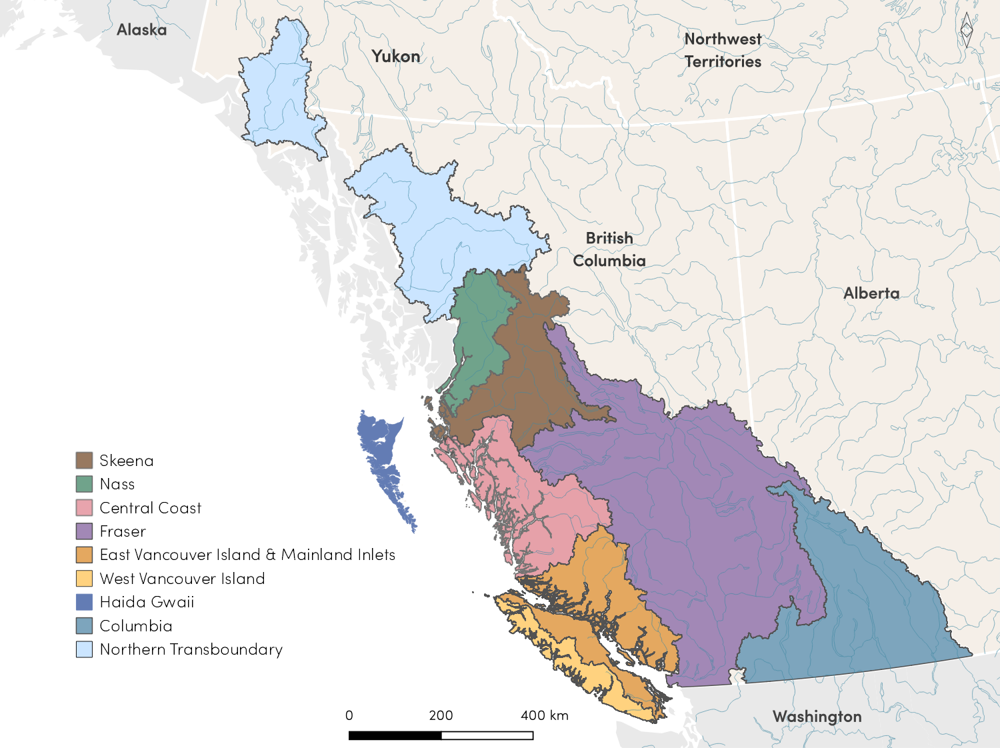
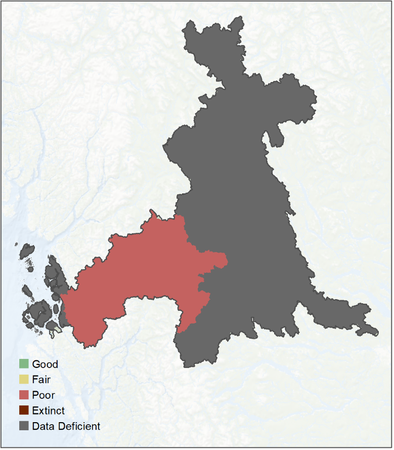
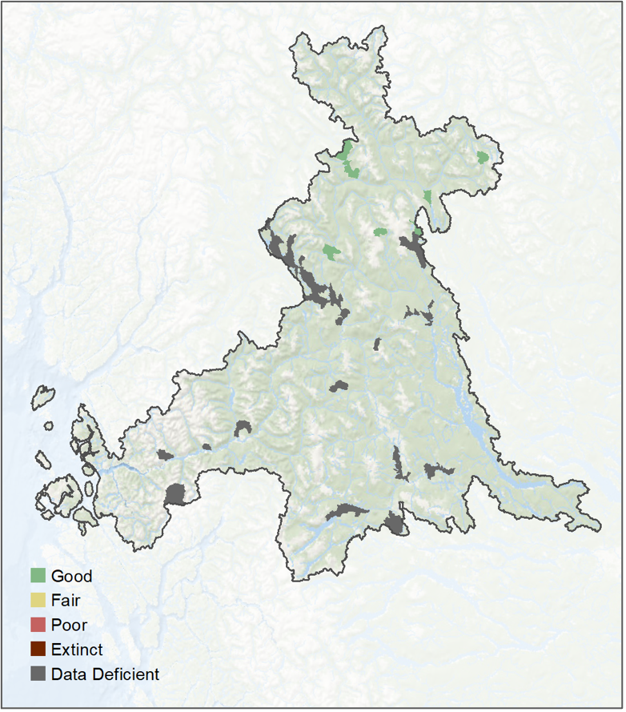
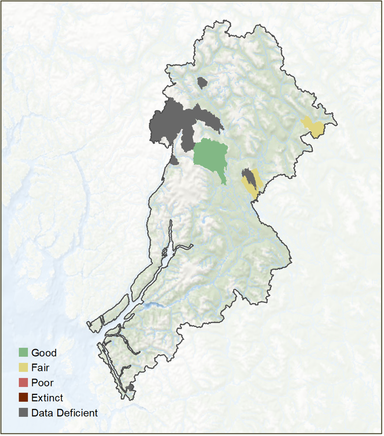
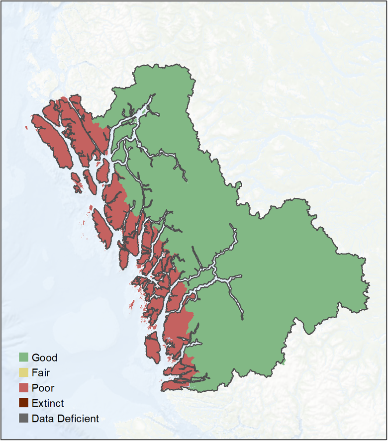
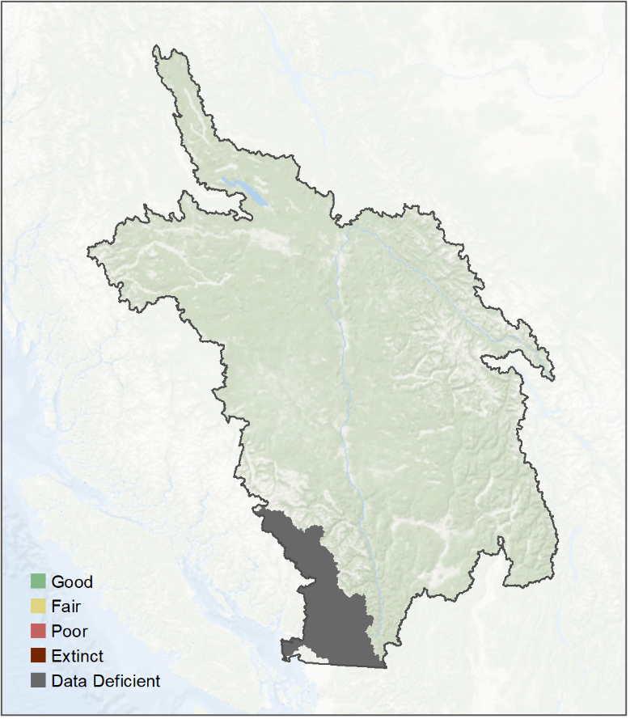
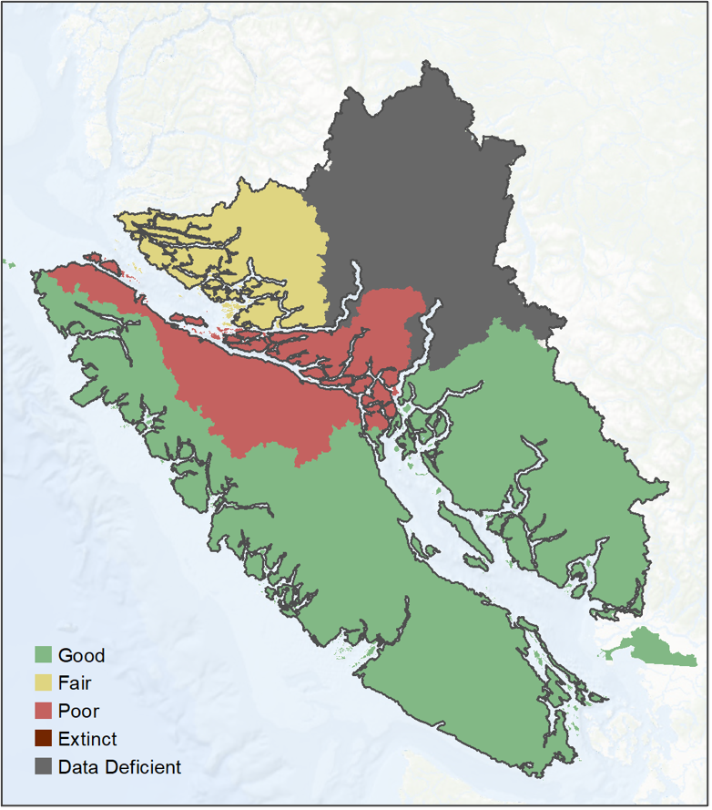
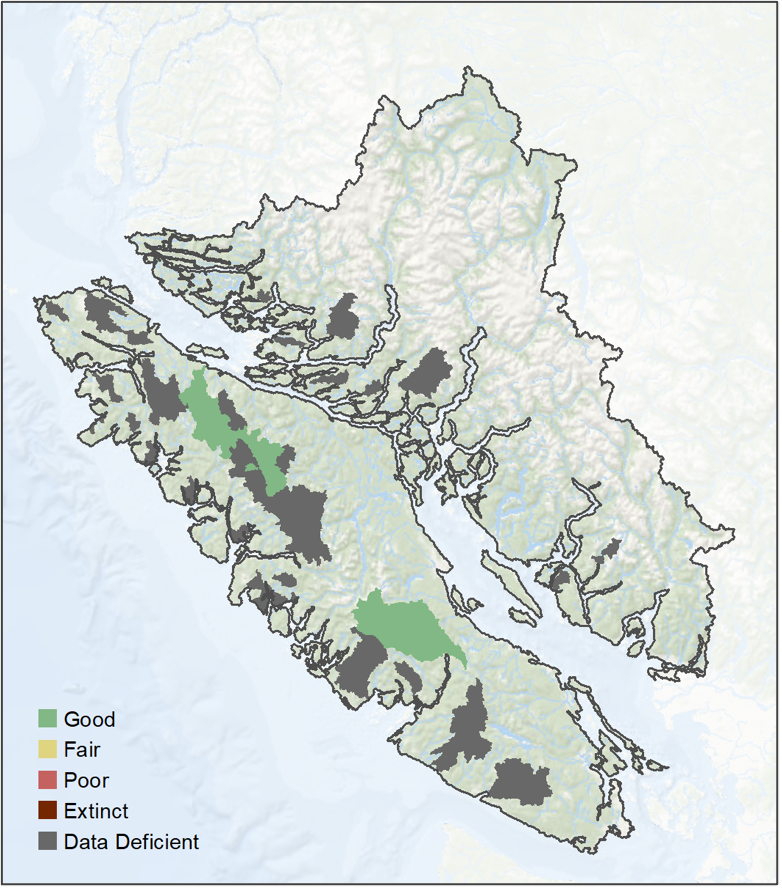

# Regions {#regions}

```{r echo = FALSE, include = FALSE}
library(kableExtra)
library(dplyr)
```

Each **Region** within the Pacific Salmon Explorer has specific attributes related to management regimes, data collection, documentation protocols, and most importantly, salmon populations and habitats (Figure \@ref(fig:regions)). Here, we document Region-specific data sources, methodological considerations, and social processes used in each of the initial biological status, habitat pressure assessments, and any other unique information for each region currently within the Pacific Salmon Explorer.  

```{r regions, fig.cap = "Map of the PSE Regions.", include=TRUE, echo = FALSE, out.width='100%', fig.align='center', fig.alt=''}

```
## Skeena Region 

The Skeena River watershed, located along the north coast of BC, is the second-largest in the province, contains important tributaries, including the Babine, Kispiox, and Bulkley Rivers, and is one of the most productive river systems in BC. All five species of Pacific salmon spawn and rear in the lower and upper portions of the Skeena River Basin (Figure \@ref(fig:skeenaMap)) within 55 CUs: 12 Chinook, 4 coho, 4 chum, 5 pink, 2 river-type sockeye, and 28 lake-type sockeye ([Appendix 1](#appendix-1)). The process of data gathering, synthesis, outreach, and engagement to complete the initial assessments within the Skeena Region was conducted over five years, from 2010 to 2014.

```{r skeenaMap, fig.cap = "Map of the Skeena Region.", include=TRUE, echo = FALSE, out.width='70%', fig.align='center', fig.alt=''}

```

In order to develop the Pacific Salmon Explorer for the Skeena, we formed a Skeena Technical Advisory Committee and engaged with First Nations, DFO, and other salmon experts throughout the watershed. Through the Technical Advisory Committee process, we received input and feedback from the Gitanyow Fisheries Authority, DFO, Office of the Wet’suwet’en, Lake Babine Nation, Gitxsan Watershed Authorities, Gitxaala First Nation, North Coast-Skeena First Nations Stewardship Society, SkeenaWild Conservation Trust, Bulkley Valley Research Centre, Suskwa Research, BC Ministry of Environment, and DFO.

Based on feedback from the Skeena Technical Advisory Committee, we made several changes to the CU list in this project. The Mcdonnell, Aldrich, and Dennis lake-type sockeye CUs were combined into a single CU (Mcdonnell/Aldrich/Dennis) since the contribution of each of these lakes cannot be currently assessed from the estimated spawner abundance data. Similarly, the Morice and Atna lake-type sockeye CUs were combined (Morice/Atna), the Swan and Club Lake lake-type sockeye CUs were combined (Swan/Club), and the Bulkley and Maxan (Bulkley/Maxan) lake-type sockeye CUs were combined for the same reason. The Babine lake-type sockeye CU was split into four CUs based on run-timing and enhancement. The wild portions of the CU were split into Babine/Onerka (early timing), Tahlo/Morrison (mid timing), and Nilkitkwa (late timing). The enhanced portion of the CU (originating from the Pinkut and Fulton spawning channels) is considered as the Babine (enhanced) CU.  

### Biological Data and Analytical Methods

On the North and Central Coast, including the Skeena Region, PSF primarily accessed data through the North and Central Coast (NCC) Database [@English2018]. The NCC Database is a database produced and maintained by LGL Ltd. (an environmental consulting firm) that synthesizes datasets on spawner surveys, catch, exploitation rate, and age structure. It also includes generated datasets for CU-level estimates of spawner abundance, run size, and exploitation rate from 1954- 2017. For the most part, data in the NCC Database have been sourced by LGL from DFO’s New Salmon Escapement Database (NuSEDS), the Fisheries Operating System (FOS), and other DFO databases. Details regarding nuances to the data and analytical methods specific to the Skeena Region are described below. 

#### Spawner Surveys 
Spawner survey data for streams in the Skeena Region were sourced from DFO’s New Salmon Escapement Database (NuSEDS). For a description of the spawner survey indicator, see [Section 4.1.1. Overview of Biological Indicators, A: Spawner Surveys](#spawner-surveys).

#### Spawner Abundance 
Observed spawner abundance for CUs in the Skeena Region is the sum of all spawner survey data documented in NuSEDS, as described in [Section 4.1.1. Overview of Biological Indicators, B: Spawner Abundance](#spawner-abundance). 

The quantity and quality of the estimated spawner abundance in NuSEDS varies by time period, region, and stream. Meanwhile, the observed spawner abundance data are not always representative of actual changes in abundance through time for a CU. As such, an "expansion procedure" is needed so that any changes in abundance through time are not confounded with changes in monitoring effort. Since 2008, PSF has worked with LGL Limited to generate Skeena (and Nass and Central Coast) CU-level estimated spawner abundance or run reconstructions in collaboration with DFO North Coast stock assessment staff [@English2006; @English2012; @English2018]. Three expansion factors are used to generate estimated spawner abundance. The first expansion factor uses historical proportional contribution data to infill indicator streams not monitored in a given year. The second expansion factor expands the data from the monitored indicator streams so that the estimated spawner abundance is representative of the entire CU. The final expansion factor expands this number again for observer efficiency. Skeena CU-level estimates of spawner abundance (run reconstructions) were sourced from the North and Central Coast (NCC) database. 

The expansion procedures, by necessity, make a number of simplifying assumptions. The first expansion factor assumes that the proportion of the overall CU that each indicator stream represents is constant through time. The second expansion factor assumes that indicator and non-indicator streams make up a constant contribution to the overall abundance of a CU. The final expansion factor assumes that observer efficiency is constant between years, CUs, methodologies (except for fences), and hydrological systems (see Appendix E in [@English2016a]. For CUs in the Skeena Region (and for CUs in the Nass and Central Coast Regions). We attempted to account for potential data quality issues associated with the final observer efficiency expansion factor (see Section 4.1.3: Data Quality). However, these assumptions may potentially still incorporate uncertainty into our assessments of biological status in these Region’s CUs. These uncertainties result from spawner surveys being conducted using various methodologies and/or by different observers throughout time, which is not currently accounted for. 

For Skeena Chinook, the methods used to derive spawner abundance estimates for Chinook indicator streams (e.g. Kalum, Morice, and Bear) and coverage of Chinook spawning areas improved in the mid-1980s with additional funding provided through the Pacific Salmon Treaty. For most Skeena Chinook indicator streams, there is no basis for defining observer efficiencies before 1985, so these records were not included in the generation of estimated spawner abundance. This means that estimated spawner abundance and catch and run size for Skeena Chinook CUs begin in 1980. 

In contrast to Chinook, there has been more consistent distribution and quantity of monitoring effort for Skeena sockeye CUs dating back to 1960. For Skeena sockeye CUs, the spawner abundance time series starts in 1960 because this was the first year of pre-1982 run reconstruction analysis (Les Jantz, DFO, pers. comm.). The fact that a large portion of Skeena sockeye have been enumerated at the Babine fence since 1949 provides greater confidence in the annual escapement estimates for sockeye than for Skeena Chinook in the 1960-1984 period. 

#### Run Timing 

Estimates of peak timing of river entry for the different sockeye CUs were estimated from DNA sampled from fish caught in the Tyee test fishery near the mouth of the Skeena River between 2000-2010 [@Cox2012a]. The duration of the timing of river entry is assumed to have a bell-shaped curve (i.e. normal distribution), so the shape of the curves is defined by the mean and standard deviation of the available run timing data. However, in most instances, there is insufficient data to determine if a different distribution would better describe the shape of the curve. A normal distribution curve is likely a reasonable approximation for run timing in most cases if the run timing is unimodal (i.e. if there is a single peak in run timing). If the run timing is bi-modal (i.e. if there are two run timing groups), the assumption of spread is likely reasonable, but the peak may be misleading.

Note that these run timing curves were only used to estimate exploitation rates for Skeena sockeye CUs. A conservative assumption of relatively broad run timing (80-110 days) for each sockeye CU was used so that exploitation rates would not be sensitive to small shifts in fishery timing. For some CUs, run timing information is not available, and for some species, run timing is assumed to be the same for all CUs. Run timing for other species was estimated by DFO North Coast staff. See [Section 4.1.1. Overview of Biological Indicators, C: Run Timing](#run-timing) for a description of the run timing indicator and methods.

#### Catch & Run Size 

Catch and run size, and subsequent exploitation rates for CUs in the Skeena region were calculated by LGL and DFO from the Fisheries Operating System (FOS) and other DFO databases. We accessed these datasets via the North and Central Coast (NCC) Database, maintained by LGL Ltd. [@English2018]. For a description of catch and run size methods, see [Section 4.1.1. Overview of Biological Indicators, D: Catch & Run Size](#catch-run-size).

#### Recruits-per-Spawner 

Recruits-per-spawner data for CUs in the Skeena Region were derived from the DFO age database and CU-level estimates of spawner abundance and catch and run size, accessed from the NCC Database [@English2018]. For a description of recruits-per-spawner methods, see [Section 4.1.1. Overview of Biological Indicators, E: Recruits-per-Spawner](#recruits-per-spawner). 

#### Trends in Spawner Abundance 

Trends in spawner abundance for CUs in the Skeena Region were derived from the CU-level estimates of spawner abundance accessed from the NCC Database [@English2018]. For a description of trends in spawner abundance methods, see [Section 4.1.1. Overview of Biological Indicators, F: Trends in Spawner Abundance](#spawner-abundance).

#### Juvenile Surveys 

Juvenile abundance data for the Babine (enhanced), Babine/Onerka, Tahlo/Morrison, and Nilkitkwa lake-type sockeye CUs were available in [@Cox2012b]. Juvenile abundance estimates for the Gitanyow lake-type sockeye CU were available from [@Beblow2018]. Juvenile abundance of the Slamgeesh lake-type sockeye CU was available from [@Fernando2011]. For a description of the juvenile survey’s indicator, see [Section 4.1.1. Overview of Biological Indicators, G: Juvenile Surveys](#juvenile-surveys).

#### Hatchery Releases

Hatchery releases in the Skeena Region for all species were provided by DFO (Joan Bateman, Salmonid Enhancement Program). Refer to [Section 4.1.1. Overview of Biological Indicators, H: Hatchery Releases](#hatchery-releases) for details on data and analytical methods. 

#### Biological Status

The biological status assessments for CUs in the Skeena Region reflect data sourced from the NCC database and are current up to 2017. The original approach and results for Skeena biological status assessments are described in [@Korman2013]. As new data become available, we will update the analyses and results in this report and the Pacific Salmon Explorer. See [Sections 4.1.4. Benchmarks for Assessing Biological Status](#benchmarks-biostatus) and [4.1.5. Decision Rules for Assessing Biological Status](#bs-decision-rules) for more details on biological status assessment methods.

### Habitat Data and Analytical Methods

Nuances regarding habitat pressure indicator data and analytical methods for the Skeena Region are listed below. Refer to [Section 4.2. Indicators and Benchmarks for Assessing Habitat Status](#indicators-benchmarks-assess-bs) for information on habitat pressure indicators, benchmarks, and the analytical methods used to assess habitat status. Additional details on habitat pressure indicators, data sources, data currency, and benchmarks specific to the Skeena Region are available in [Appendix 6 (Description of Habitat Pressure Indicators & Relevance to Salmon)](#appendix-6), [Appendix 7 (Habitat Pressure Datasets & Data Sources)](#appendix-7), [Appendix 8 (Spatial Data Processing for Habitat Pressure Indicators)](#appendix-8), [Appendix 9 (Spatial Data Processing for Future Pressures)](#appendix-9), [Appendix 12 (Habitat Pressure Benchmark Values by Region)](#appendix-12).

#### Transboundary Conservation Units

The pink (even-year) Nass-Skeena Estuary CU spans the boundary between the Skeena and Nass regions. For habitat indicators that used relative benchmarks, habitat status for this transboundary CU was assessed based on benchmarks derived from the Skeena region because a significant portion of this CU’s spawning habitat fell inside the Skeena region.

#### Spawning Zones of Influence

Methods for delineating Chinook CU spawning zones of influence (ZOIs) vary by region in accordance with the CU delineation approach used by DFO. In the Skeena, Nass, and Central Coast regions, Chinook CUs are defined using a more restrictive geographic representation, which resulted in fewer (or no) spawning locations occurring within the CU boundaries. As such, spawning ZOIs for each Chinook CU were delineated using the extent of all 1:20K FWA Assessment Watersheds that directly intersected with Skeena Chinook CU boundaries.

### Results

#### Biological Status

This section provides a high-level overview of the biological status results for all 55 salmon CUs in the Skeena Region. Of the 55 CUs we examined in the Region, we assessed biological status for 31 CUs (56%). The remaining 24 salmon CUs (44%) had insufficient information for evaluating their biological status (see [Section 4.1.5. Decision Rules for Assessing Biological Status](#bs-decision-rules) for the criteria used to define data deficient CUs). Of the CUs for which we were able to assess biological status, 18 (58%) are in the green status zone, 4 (13%) are in the amber zone, and 9 (29%) are in the red status zone. Biological status for all CUs is displayed by species in Figures \@ref(fig:skckBsmap), \@ref(fig:skchBsmap), \@ref(fig:skcoBsmap), \@ref(fig:skpkoBsmap), \@ref(fig:skpkeBsmap), \@ref(fig:skselBsmap), and \@ref(fig:skserBsmap), below. More information on biological status and benchmarks for each CU is available [Table A.6 in Appendix 4](#appendix-4-tbl4). Full results are available online through the Pacific Salmon Explorer, where individual figures, maps, data, and summary statistics are provided for each CU in the Region. The results of these assessments reflect data that are current to **2017**. As new data becomes available, we will update the analyses and results in this report and on the Pacific Salmon Explorer.


```{r skckBsmap, fig.cap = "Pacific Salmon Foundation biological status of Skeena Chinook salmon Conservation Units.", include=TRUE, echo = FALSE, out.width='70%', fig.align='center', fig.alt=''}

```


```{r skchBsmap, fig.cap = "Pacific Salmon Foundation biological status of Skeena chum salmon Conservation Units.", include=TRUE, echo = FALSE, out.width='70%', fig.align='center', fig.alt=''}

```


```{r skcoBsmap, fig.cap = "Pacific Salmon Foundation biological status of Skeena coho salmon Conservation Units.", include=TRUE, echo = FALSE, out.width='70%', fig.align='center', fig.alt=''}

```


```{r skpkoBsmap, fig.cap = "Pacific Salmon Foundation biological status of Skeena pink (odd-year) salmon Conservation Units.", include=TRUE, echo = FALSE, out.width='70%', fig.align='center', fig.alt=''}

```


```{r skpkeBsmap, fig.cap = "Pacific Salmon Foundation biological status of Skeena pink (even-year) salmon Conservation Units.", include=TRUE, echo = FALSE, out.width='70%', fig.align='center', fig.alt=''}

```


```{r skselBsmap, fig.cap = "Pacific Salmon Foundation biological status of Skeena sockeye (lake-type) salmon Conservation Units.", include=TRUE, echo = FALSE, out.width='70%', fig.align='center', fig.alt=''}

```


```{r skserBsmap, fig.cap = "Pacific Salmon Foundation biological status of Skeena sockeye (river-type) salmon Conservation Units.", include=TRUE, echo = FALSE, out.width='70%', fig.align='center', fig.alt=''}

```

#### Habitat Status

We completed habitat assessments for watersheds within the 55 salmon CUs in the Skeena Region. The habitat assessments produce two levels of outputs for spawning ZOIs: (1) a risk rating for each FWA assessment watershed in the study area for each individual habitat pressure indicator; (2) a cumulative pressure score for each FWA assessment watershed in the study area, representing the risk to a watershed from all habitat pressures combined. Of the 1,183 1:20K FWA assessment watersheds assessed in the Skeena Region, 80% (n= 941) were designated as spawning habitat based on compiled spawning location data. These 941 watersheds represent the combined spawning ZOI for all species. In terms of the cumulative pressure scores for the combined spawning ZOI for all species, 28% of spawning habitat in the Skeena Region is high risk (red), 33% is moderate risk (amber), and 40% is low risk (green). The percentage of spawning habitat in each risk category for each indicator is summarized in (Table \@ref(tab:skHabstat)).

Quantifying both individual and cumulative pressures at the FWA assessment watershed-scale provides a snapshot of habitat pressures across the Skeena Region and highlights which CUs face the greatest risk. Specifically, an overview of habitat pressures emerges from identifying:

1.	the percentage area of the combined spawning ZOI for all species that is rated high, moderate, or low risk (i.e. red, amber, green) for each of the evaluated individual habitat pressure indicators; and

2.	the percentage area of the combined spawning ZOI for all species that is rated high, moderate, or low risk (i.e. red, amber, green) for cumulative habitat pressures. 

More information on habitat pressure benchmark values for each indicator is available in [Appendix 12](#appendix-12). More information on cumulative spawning Pressure Results by Region and Conservation Unit is available in [Appendix 13](#appendix-13). Full results are available online through the Pacific Salmon Explorer. The results can be downloaded directly from the Pacific Salmon Explorer for each CU, while the datasets compiled for the analysis are also available for download via the Salmon Data Library. 
	
In addition, the Skeena River estuary was assessed in 2015, and results are available on the Pacific Salmon Explorer. For details on the Skeena estuary, habitat assessment methods, see [@Pickard2015].

```{r skHabstat, include=TRUE, echo = FALSE}
habStat <- read.csv("tables/sec5_sk_habstat.csv", header = FALSE)
# knitr::kable(
#   habStat, booktabs = TRUE,
#   caption = "The percentage of area within the Skeena Region's combined spawning ZOI for all species rated high, moderate, or low risk (i.e. red, amber, green) for cumulative pressures and each of the evaluated individual habitat pressure indicators."
# )

colnames(habStat) <- NULL

habStat[2,2] <- cell_spec(habStat[2,2], format = "html", background = "#C06263", font = "bold", color = "white")
habStat[2,3] <- cell_spec(habStat[2,3], format = "html", background = "#DED38B", font = "bold", color = "white")
habStat[2,4] <- cell_spec(habStat[2,4], format = "html", background = "#83B686", font = "bold", color = "white")

kableExtra::kbl(habStat[2:nrow(habStat),],
								format = "html",
								escape = FALSE,
								caption = "The percentage of area within the Skeena Region's combined spawning ZOI for all species rated high, moderate, or low risk (i.e. red, amber, green) for cumulative pressures and each of the evaluated individual habitat pressure indicators.",
								row.names = FALSE) %>%
  row_spec(1, bold = TRUE, color = "white", background = "#396D8E") %>%
	# cell_spec(habStat[2,2], format = "html", background = "#C06263", font = "bold", color = "white") %>%
	column_spec(column = c(2:4), width = "4cm") %>%
  kable_styling(bootstrap_options = c("striped", "hover")) %>%
	add_header_above(c("", "% Area of Spawning Habitat" = 3), background = "#396D8E", color = "white") 
```

	
## Nass Region

In northern BC, the Nass River watershed is the third-largest watershed in the province and includes several major tributaries, including the Bell-Irving, Cranberry, Meziadin, Kwinageese, and Damdochax Rivers. The Nass Region (Figure \@ref(fig:nassMap)), which consists of the watersheds draining into Portland Canal and Observatory Inlet, contains extensive spawning and rearing habitat for all five species of Pacific salmon. These salmon populations are managed as 22 CUs under the Wild Salmon Policy: 2-Chinook, 3-chum, 3-coho, 4-pink, and 10-sockeye CUs ([Appendix 1](#appendix-1)). The process of data gathering, synthesis, outreach, and engagement to complete the initial assessments within the Nass Region was conducted over four years, from 2015 to 2019.

We worked with First Nations in the Nass Region to garner feedback on the Pacific Salmon Explorer approach and analyses through the Nisga’a-Canada-BC Nass Joint Technical Committee and the Gitanyow Fisheries Authority. In addition, in 2015-2016, we formed a Nass Technical Advisory Committee to engage with First Nations, DFO regional biologists and managers, and other salmon experts throughout the watershed.

```{r nassMap, fig.cap = "Map of the Nass Region.", include=TRUE, echo = FALSE, out.width='70%', fig.align='center', fig.alt=''}
knitr::include_graphics("figures/nass_map.png")
```

### Biological Data and Analytical Methods

As with the Skeena Region, many of the datasets necessary to understand the dynamics of salmon CUs in the Nass Region have been compiled and stored through the North and Central Coast (NCC) Database [@English2018; see Skeena Region]. In addition to these data, we also compiled additional data for six CUs (Lower Nass and Upper Nass coho; Fred Wright, Damodochax, and Meziadin lake-type sockeye; Lower Nass-Portland river-type sockeye) through a review of preliminary data with Nisga’a Lisims Government and LGL Limited staff. Details regarding nuances to the data and analytical methods that are specific to the Nass Region are described below.

#### Spawner Surveys 

Spawner survey data for streams in the Nass Region were sourced from DFO’s New Salmon Escapement Database (NuSEDS). For a description of the spawner survey indicator, see [Section 4.1.1. Overview of Biological Indicators, A: Spawner Surveys](#spawner-surveys).

#### Spawner Abundance 

Observed spawner abundance for CUs in the Nass Region is the sum of all spawner survey data as documented in NuSEDS, as described in [Section 4.1.1. Overview of Biological Indicators, B: Spawner Abundance](#spawner-abundance). Nass Region CU-level estimates of spawner abundance (run reconstructions) were sourced from the North and Central Coast (NCC) Database. Nass CU-level estimated spawner abundance time series were developed for the NCC Database according to the expansion factors described in the Skeena Region section above.

In addition, CU-level estimates of spawner abundance for five Nass CUs are derived from additional spawner enumeration methods. Specifically, three CUs have mark-recapture programs operated by Nisga’a Fisheries, and Wildlife’s lower Nass River fish wheels have mark-recapture programs. These programs have been part of Nisga’a Treaty fisheries work since 1992.

#### Run Timing 

We currently do not have CU-level run timing data visualized for any CUs in the Nass Region. See [Section 4.1.1. Overview of Biological Indicators, C: Run Timing](#run-timing) for a description of the run timing indicator and methods.

#### Catch & Run Size 

Catch and run size, and subsequent exploitation rates for CUs in the Nass Region were calculated by LGL, Nisga’a Fish and Wildlife, and DFO from the Fisheries Operating System (FOS) and other DFO databases. Similar to our work in the Skeena, we accessed most of these datasets via the North and Central Coast (NCC) Database, maintained by LGL Ltd. [@English2018]. For a description of catch and run size methods, see [Section 4.1.1. Overview of Biological Indicators, D: Catch & Run Size](#catch-and-runsize).  

#### Recruits-per-Spawner 

Recruits-per-spawner data for CUs in the Nass Region were derived from the DFO age database and CU-level estimates of spawner abundance and catch and run size accessed from the NCC Database [@English2018]. For a description of recruits-per-spawner methods, see [Section 4.1.1. Overview of Biological Indicators, E: Recruits-per-Spawner](#recruits-per-spawner).

#### Trends in Spawner Abundance 

Trends in spawner abundance for CUs on the Central Coast were derived from the CU-level estimates of spawner abundance accessed from the NCC database [@English2018]. For a description of trends in spawner abundance methods, see [Section 4.1.1. Overview of Biological Indicators, F: Trends in Spawner Abundance](#spawner-abundance).

#### Juvenile Surveys 

*Juvenile survey** data for the Lower Nass coho CU was provided by Nisga’a Fish and Wildlife. For a description of the juvenile survey’s indicator, see [Section 4.1.1. Overview of Biological Indicators, G: Juvenile Surveys](#juvenile-surveys).

#### Hatchery Releases

Hatchery releases in the Nass Region for all species were provided by DFO (Joan Bateman, Salmonid Enhancement Program). Refer to [Section 4.1.1. Overview of Biological Indicators, H: Hatchery Releases](#hatchery-releases) for details on data and analytical methods. 

#### Biological Status

The biological status assessments for CUs in the Nass Region currently reflect data sourced from the NCC Database that are current to *2017*. As new data become available, we will update the analyses and results in this report and the Pacific Salmon Explorer. See [Sections 4.1.4. Benchmarks for Assessing Biological Status](#benchmarks-biostatus) and [4.1.5. Decision Rules for Assessing Biological Status](#bs-decision-rules) for more details on biological status assessment methods.

### Habitat Data and Analytical Methods

Nuances regarding habitat pressure indicator data and analytical methods for the Nass Region are listed below. Refer to [Section 4.2 Indicators and Benchmarks for Assessing Habitat Status](#indicators-benchmarks-assess-bs) for information on habitat pressure indicators, benchmarks, and the analytical methods used to assess habitat status. Additional details on habitat pressure indicators, data sources, data currency, and benchmarks specific to the Nass Region are available in [Appendix 6 (Description of Habitat Pressure Indicators & Relevance to Salmon)](#appendix-6), [Appendix 7 (Habitat Pressure Datasets & Data Sources)](#appendix-7), [Appendix 8 (Spatial Data Processing for Habitat Pressure Indicators)](#appendix-8), [Appendix 9 (Spatial Data Processing for Future Pressures)](#appendix-9), and [Appendix 12 (Habitat Pressure Benchmark Values by Region)](#appendix-12).

#### Transboundary Conservation Units

The pink (even-year) Nass-Skeena Estuary CU spans the boundary between the Skeena and Nass regions. For habitat indicators that used relative benchmarks, habitat status for this transboundary CU was assessed based on benchmarks derived from the Skeena region because a significant portion of this CU’s spawning habitat fell inside the Skeena region.

#### Spawning Zones of Influence

Methods for delineating Chinook CU spawning zones of influence (ZOIs) vary by region in accordance with the CU delineation approach used by DFO. In the Skeena, Nass, and Central Coast regions, Chinook CUs are defined using a more restrictive geographic representation, which resulted in fewer (or no) spawning locations occurring within the CU boundaries. As such, spawning ZOIs for each Chinook CU were delineated using the extent of all 1:20K FWA Assessment Watersheds that directly intersected with Nass Chinook CU boundaries.

### Results 

#### Biological Status

This section provides a high-level overview of the biological status results for all 22 salmon CUs in the Nass Region. Of the 22 CUs examined in the Region, we assessed biological status for 13 CUs (59%). The remaining 9 CUs (41%) had insufficient information for evaluating their biological status (see [Section 4.1.5 Decision Rules for Assessing Biological Status](#bs-decision-rules) for the criteria used to define data deficient CUs). Of the CUs for which we assessed biological status, 10 (77%) are in the green status zone, 3 (23%) are in the amber zone, and none are in the red status zone. Biological status for all CUs is displayed by species in Figures \@ref(fig:nackBsmap), \@ref(fig:nachBsmap), \@ref(fig:nacoBsmap), \@ref(fig:napkoBsmap), \@ref(fig:napkeBsmap), \@ref(fig:naselBsmap), and \@ref(fig:naserBsmap), below. More information on biological status and benchmarks for each CU are available in [Table A.7. in Appendix 4](#appendix-4-tbl7). Full results are available online through the Pacific Salmon Explorer, where individual figures, maps, data, and summary statistics are provided for each CU in the Region. The results of these assessments reflect data that are current to **2017**. As new data become available, we will update the analyses and results in this report and on the Pacific Salmon Explorer.


```{r nackBsmap, fig.cap = "Pacific Salmon Foundation biological status of Nass Chinook salmon Conservation Units.", include=TRUE, echo = FALSE, out.width='70%', fig.align='center', fig.alt=''}
knitr::include_graphics("figures/nack_bsmap.png")
```


```{r nachBsmap, fig.cap = "Pacific Salmon Foundation biological status of Nass chum salmon Conservation Units.", include=TRUE, echo = FALSE, out.width='70%', fig.align='center', fig.alt=''}

```


```{r nacoBsmap, fig.cap = "Pacific Salmon Foundation biological status of Nass coho salmon Conservation Units.", include=TRUE, echo = FALSE, out.width='70%', fig.align='center', fig.alt=''}

```


```{r napkoBsmap, fig.cap = "Pacific Salmon Foundation biological status of Nass pink (odd) salmon Conservation Units.", include=TRUE, echo = FALSE, out.width='70%', fig.align='center', fig.alt=''}

```


```{r napkeBsmap, fig.cap = "Pacific Salmon Foundation biological status of Nass pink (even) salmon Conservation Units.", include=TRUE, echo = FALSE, out.width='70%', fig.align='center', fig.alt=''}

```


```{r naselBsmap, fig.cap = "Pacific Salmon Foundation biological status of Nass sockeye (lake-type) salmon Conservation Units.", include=TRUE, echo = FALSE, out.width='70%', fig.align='center', fig.alt=''}

```

#### Habitat Status

We completed habitat assessments for watersheds within the 22 salmon CUs in the Nass Region. The habitat assessments produce two levels of outputs for spawning ZOIs: (1) a risk rating for each FWA assessment watershed in the study area for each individual habitat pressure indicator; (2) a cumulative pressure score for each FWA assessment watershed in the study area, representing the risk to a watershed from all habitat pressures combined. Of the 550 1:20K FWA assessment watersheds assessed in the Nass Region, 42% (n= 229) were designated as spawning habitat based on compiled spawning location data. These 229 watersheds represent the combined spawning ZOI for all species. In terms of the cumulative pressure scores for the combined spawning ZOI for all species, 21% of spawning habitat in the Nass Region is high risk (red), 42% is moderate risk (amber), and 37% is low risk (green). The percentage of spawning habitat in each risk category for each indicator is summarized in (Table \@ref(tab:naHabstat)) below. 

Quantifying both individual and cumulative pressures at the FWA assessment watershed-scale provides a snapshot of habitat pressures across the Nass Region and highlights which CUs face the greatest risk. Specifically, an overview of habitat pressures emerges from identifying:

1. the percentage area of the combined spawning ZOI for all species that is rated high, moderate, or low risk (i.e. red, amber, green) for each of the evaluated individual habitat pressure indicators; and 

2. the percentage area of the combined spawning ZOI for all species that is rated high, moderate, or low risk (i.e. red, amber, green) for cumulative habitat pressures. 

More information on habitat pressure benchmark values for each indicator is available in [Appendix 12](#appendix-12). More information on cumulative spawning Pressure Results by Region and Conservation Unit is available in [Appendix 13](#appendix-13). Full results are available online through the Pacific Salmon Explorer. The results can be downloaded directly from the Pacific Salmon Explorer for each CU. The datasets compiled for the analysis are also available for download via the Salmon Data Library.

```{r naHabstat, include=TRUE, echo = FALSE}
habStat <- read.csv("tables/sec5_na_habstat.csv", header = FALSE)

colnames(habStat) <- NULL
habStat[2,2] <- cell_spec(habStat[2,2], format = "html", background = "#C06263", font = "bold", color = "white")
habStat[2,3] <- cell_spec(habStat[2,3], format = "html", background = "#DED38B", font = "bold", color = "white")
habStat[2,4] <- cell_spec(habStat[2,4], format = "html", background = "#83B686", font = "bold", color = "white")

kableExtra::kbl(habStat[2:nrow(habStat),],
									format = "html",
								escape = FALSE,
								caption = "The percentage of area within the Nass Region's combined spawning ZOI for all species rated high, moderate, or low risk (i.e. red, amber, green) for cumulative pressures and each of the evaluated individual habitat pressure indicators.",
								row.names = FALSE) %>%
  row_spec(1, bold = TRUE, color = "white", background = "#396D8E") %>%
	column_spec(column = c(2:4), width = "4cm") %>%
  kable_styling(bootstrap_options = c("striped", "hover")) %>%
	add_header_above(c("", "% Area of Spawning Habitat" = 3), color = "white", background = "#396D8E") 

```

## Central Coast Region

The Central Coast Region supports more than 114 CUs of all five Pacific salmon species (Figure \@ref(fig:CentralMap)). While this area is less easily defined than an extensive river system such as the Skeena or Fraser Regions, we could determine the Central Coast study area using three criteria. First, the intent was to include the full geographic extent of most CUs on the Central Coast [Appendix 1](#appendix-1). Second, we considered the adjacency of other Regions within the Pacific Salmon Explorer to minimize overlap between study areas. Third, we considered major drainage patterns as represented in BC’s Freshwater Atlas (FWA) 1:20K Watershed Groups (MOE, 2017a). According to these criteria, the resulting Central Coast Region on the Pacific Salmon Explorer encompasses 54,813 km2 from Smith and Rivers Inlets in the south, and Douglas Channel and Banks, McCauley, and Pitt Islands in the north (Figure \@ref(fig:CentralMap)). The process of data gathering, synthesis, outreach, and engagement to complete the initial assessments within the Central Coast Region was conducted over two years, from 2016 to 2018.

For the Central Coast Region, we worked with two technical committees (one for the north portion and one for the south portion of the region) to garner feedback on the Pacific Salmon Explorer approach and analyses. These Technical committees were comprised of First Nations, DFO regional biologists, managers, and other salmon experts to garner feedback on the Pacific Salmon Explorer approach and analyses. We received feedback from the Central Coast Indigenous Resource Alliance through a series of North and South Technical Committee Meetings and the Nuxalk, Kitasoo/Xai’Xais, Heiltsuk, Wuikinuxv Gitxaala, and Haisla First Nations. 

As part of the Technical Committee review process, we removed two CUs from the project (Whalen Lake and Owikeno-Late sockeye (lake-type) CUs). The Whalen Lake sockeye CU is included in [@Holtby2007], but long-time Charter Patrolman and Technical Committee member, Stan Hutchings, recommended removing it from the list of CUs. An impassable waterfall prevents sockeye from accessing Whalen Lake, which is the spawning and rearing lake for this CU. As such, we removed this CU from the project. The Owikeno-Late sockeye CU is not listed in [@Holtby2007] but was provisionally designated as a CU by Blair Holtby in 2008. However, a Technical Committee member from Wuikinuxv advised us that this CU is not distinguishable from other sockeye CUs in the lake. Furthermore, this CU was not included on the most recent list of CUs published on the Government of Canada’s Open Data portal. Given that it was not in the most current list of CUs, it lacks baseline data, and we could not find any documentation about its creation. Therefore, we removed this CU from the project.

```{r CentralMap, fig.cap = "Map of the Central Coast Region.", include=TRUE, echo = FALSE, out.width='70%', fig.align='center', fig.alt=''}
knitr::include_graphics("figures/centralcoast_map.png")
```

### Biological Data and Analytical Methods

There are several nuances to the data sources and analytical methods specific to the Central Coast Region. These nuances are listed below. 

#### Spawner Surveys 

**Spawner survey** data for streams in the Central Coast were sourced from DFO’s New Salmon Escapement Database (NuSEDS). For a description of the spawner survey indicator, see [Section 4.1.1. Overview of Biological Indicators, A: Spawner Surveys](#spawner-surveys).

#### Spawner Abundance 

**Observed spawner abundance** for CUs in the Central Coast Region is the sum of all spawner survey data documented in NuSEDS, as described in [Section 4.1.1. Overview of Biological Indicators, B: Spawner Abundance](#spawner-abundance). Similar to our work in the Skeena and Nass, we accessed most of these datasets via the North and Central Coast (NCC) database, maintained by LGL Ltd. [@English2018].

Central Coast CU-level **estimates of spawner abundance** (run reconstructions) were sourced from the North and Central Coast (NCC) database. In addition, updated estimated spawner abundance data for the South Atnarko Lakes CU was accessed from DFO [@Connors2016]. Central Coast CU-level estimated spawner abundance time series were developed for the NCC database according to the expansion factors described in the Skeena Region section above.

#### Run Timing 

We currently do not have CU-level **run timing** data for any CUs in the Central Coast Region. We will update this information as CU-level run timing data become publicly available. See [Section 4.1.1. Overview of Biological Indicators, C: Run Timing](#run-timing) for a description of the run timing indicator and methods.

#### Catch & Run Size 

**Catch and run size**, and subsequent exploitation rates for CUs on the Central Coast were calculated by DFO and LGL from data in the Fisheries Operating System (FOS) and other DFO databases. Similar to our work in the Skeena and Nass, we accessed most of these datasets via the North and Central Coast (NCC) Database, maintained by LGL Ltd. [@English2018]. In addition, we sourced updated catch data from DFO for the South Atnarko Lakes CU [@Connors2016]. For a description of catch and run size methods,  see [Section 4.1.1. Overview of Biological Indicators, D: Catch & Run Size](#bs-indicators).

#### Recruits-per-Spawner 

**Recruits-per-spawner** data for CUs on the Central Coast were derived from the DFO age database and CU-level estimates of spawner abundance and catch and run size accessed from the NCC Database [@English2018]. For a description of recruits-per-spawner methods,  see [Section 4.1.1. Overview of Biological Indicators, E: Recruits-per-Spawner](#recruits-per-spawner). 

#### Trends in Spawner Abundance 

**Trends in spawner abundance** for CUs on the Central Coast were derived from the CU-level estimates of spawner abundance accessed from the NCC database [@English2018]. For a description of trends in spawner abundance methods, see [Section 4.1.1. Overview of Biological Indicators, F: Trends in Spawner Abundance](#spawner-abundance).

#### Juvenile Surveys 

**Juvenile survey** data for the Hecate Lowlands (even) pink, Hecate Strait-Lowlands (odd) pink, Hecate Strait Mainland coho, Hecate Lowlands chum, Roderick sockeye, and Mary Cove Creek sockeye CUs within Kitasoo/Xai'xais territory were provided by Larry Greba (Kitasoo/Xai'xais Development Corporation). For a description of the juvenile survey’s indicator,  see [Section 4.1.1. Overview of Biological Indicators, G: Juvenile Surveys](#juvenile-surveys).

#### Hatchery Releases

Hatchery releases in the Central Coast  Region for all species were provided by DFO (Joan Bateman, Salmonid Enhancement Program). Refer to [Section 4.1.1. Overview of Biological Indicators, H: Hatchery Releases](#hatchery-releases) for details on data and analytical methods. 

#### Biological Status

The biological status assessments for CUs in the Central Coast Region reflect data sourced from the NCC database and are current up to **2017**. As new data become available, we will update the analyses and results in this report and the Pacific Salmon Explorer. See [Sections 4.1.4. Benchmarks for Assessing Biological Status](#benchmarks-biostatus) and [4.1.5. Decision Rules for Assessing Biological Status](#bs-decision-rules) for more details on biological status assessment methods.

### Habitat Data and Analytical Methods

Nuances regarding habitat pressure indicator data and analytical methods for the Central Coast Region are listed below. Refer to [Section 4.2. Indicators and Benchmarks for Assessing Habitat Status](#indicators-benchmarks-assess-bs) for information on habitat pressure indicators, benchmarks, and the analytical methods used to assess habitat status. Additional details on habitat pressure indicators, data sources, data currency, and benchmarks specific to the Skeena Region are available in [Appendix 6 (Description of Habitat Pressure Indicators & Relevance to Salmon)](#appendix-6), [Appendix 7 (Habitat Pressure Datasets & Data Sources)](#appendix-7), [Appendix 8 (Spatial Data Processing for Habitat Pressure Indicators)](#appendix-8), [Appendix 9 (Spatial Data Processing for Future Pressures)](#appendix-9), [Appendix 12 (Habitat Pressure Benchmark Values by Region)](#appendix-12).

#### Transboundary Conservation Units

The pink (odd-year) Homathko-Klinaklini-Smith-Rivers-Bella Coola-Dean Conservation Unit spans the boundary between the Central Coast and Vancouver Island & Mainland Inlets regions. For habitat indicators that used relative benchmarks, habitat status for this transboundary conservation unit was assessed based on benchmarks derived from the Central Coast region because a significant portion of spawning habitat for this conservation unit fell inside the Central Coast region.

#### Spawning Zones of Influence

Methods for delineating Chinook CU **spawning zones of influence (ZOIs)** vary by region in accordance with the CU delineation approach used by DFO. In the Skeena, Nass, and Central Coast regions, Chinook CUs are defined using a more restrictive geographic representation, which resulted in fewer (or no) spawning locations occurring within the CU boundaries. As such, spawning ZOIs for each Chinook CU were delineated using the extent of all 1:20K FWA Assessment Watersheds that directly intersected with Central Chinook CU boundaries.

#### Additional Spawning Habitat Information Sources

In addition to the spawning habitat information we acquired from the Fisheries Information Summary System (FISS) database and local knowledge derived through expert elicitation, we received additional spawning habitat information from a technical report provided by Diana Chan and Mike Reid (Fisheries, Heiltsuk First Nation; [@Temple2007].

### Results

#### Biological Status

This section provides a high-level overview of the biological status results for all 114 salmon CUs in the Central Coast Region. Of the 114 CUs we examined in the Region, we assessed biological status for 49 CUs (43%). The remaining 65 salmon CUs (57%) had insufficient information for evaluating their biological status (see [Section 4.1.5. Decision Rules for Assessing Biological Status](#bs-decision-rules) for the criteria used to define data deficient CUs). Of the CUs for which we were able to assess biological status, 18 (58%) are in the green status zone, 4 (13%) are in the amber zone, and 9 (29%) are in the red status zone. Biological status for all CUs is displayed by species in Figures \@ref(fig:ccckBsmap), \@ref(fig:ccchBsmap), \@ref(fig:cccoBsmap), \@ref(fig:ccpkoBsmap), \@ref(fig:ccpkeBsmap), \@ref(fig:ccselBsmap), and \@ref(fig:ccserBsmap), below. More information on biological status and benchmarks for each CU is available [Table A.6 in Appendix 4](#appendix-4-tbl6). Full results are available online through the Pacific Salmon Explorer, where individual figures, maps, data, and summary statistics are provided for each CU in the Region. The results of these assessments reflect data that are current to **2017**. As new data becomes available, we will update the analyses and results in this report and on the Pacific Salmon Explorer.


```{r ccckBsmap, fig.cap = "Pacific Salmon Foundation biological status of Central Coast Chinook salmon Conservation Units.", include=TRUE, echo = FALSE, out.width='70%', fig.align='center', fig.alt=''}

```


```{r ccchBsmap, fig.cap = "Pacific Salmon Foundation biological status of Central Coast chum salmon Conservation Units.", include=TRUE, echo = FALSE, out.width='70%', fig.align='center', fig.alt=''}

```


```{r cccoBsmap, fig.cap = "Pacific Salmon Foundation biological status of Central Coast coho salmon Conservation Units.", include=TRUE, echo = FALSE, out.width='70%', fig.align='center', fig.alt=''}

```


```{r ccpkoBsmap, fig.cap = "Pacific Salmon Foundation biological status of Central Coast pink (odd-year) salmon Conservation Units.", include=TRUE, echo = FALSE, out.width='70%', fig.align='center', fig.alt=''}

```


```{r ccpkeBsmap, fig.cap = "Pacific Salmon Foundation biological status of Central Coast pink (even-year) salmon Conservation Units.", include=TRUE, echo = FALSE, out.width='70%', fig.align='center', fig.alt=''}

```


```{r ccselBsmap, fig.cap = "Pacific Salmon Foundation biological status of Skeena sockeye (lake-type) salmon Conservation Units.", include=TRUE, echo = FALSE, out.width='70%', fig.align='center', fig.alt=''}

```


```{r ccserBsmap, fig.cap = "Pacific Salmon Foundation biological status of Central Coast sockeye (river-type) salmon Conservation Units.", include=TRUE, echo = FALSE, out.width='70%', fig.align='center', fig.alt=''}

```

#### Habitat Status

We completed habitat assessments for watersheds within the 114 salmon CUs in the Central Coast Region. The habitat assessments produce two levels of outputs for spawning ZOIs: (1) a risk rating for each FWA assessment watershed in the study area for each individual habitat pressure indicator; (2) a cumulative pressure score for each FWA assessment watershed in the study area, representing the risk to a watershed from all habitat pressures combined. Of the 1,132 1:20K, FWA assessment watersheds assessed in the Central Coast Region, 63% (n=709) were designated as spawning habitat based on compiled spawning location data. These 709 watersheds represent the combined spawning ZOI for all species. In terms of the cumulative pressure scores for the combined spawning ZOI for all species, 9% of spawning habitat in the Central Coast Region is high risk (red), 28% is moderate risk (amber), and 62% is low risk (green). The percentage of spawning habitat in each risk category for each indicator is summarized in (Table \@ref(tab:ccHabstat)).

Quantifying both individual and cumulative pressures at the FWA assessment watershed-scale provides a snapshot of habitat pressures across the entire Central Coast and highlights which CUs face the greatest risk. Specifically, an overview of habitat pressures emerges from identifying:

1. the percentage area of the combined spawning ZOI for all species that is rated high, moderate, or low risk (i.e. red, amber, green) for each of the evaluated individual habitat pressure indicators; and 
2. the percentage area of the combined spawning ZOI for all species that is rated high, moderate, or low risk (i.e. red, amber, green) for cumulative habitat pressures; 

More information on habitat pressure benchmark values for each indicator is available in [Appendix 12](#appendix-12). More information on cumulative spawning Pressure Results by Region and Conservation Unit is available in [Appendix 13](#appendix-13). Full results are available online through the Pacific Salmon Explorer. The results can be downloaded directly from the Pacific Salmon Explorer for each CU, while the datasets compiled for the analysis are also available for download via the Salmon Data Library. 

```{r ccHabstat, include=TRUE, echo = FALSE}
habStat <- read.csv("tables/sec5_cc_habstat.csv", header = FALSE)

# knitr::kable(
#   habStat, booktabs = TRUE,
#   caption = "The percentage of area within the Central Coast Region's combined spawning ZOI for all species rated high, moderate, or low risk (i.e. red, amber, green) for cumulative pressures and each of the evaluated individual habitat pressure indicators."
# )

colnames(habStat) <- NULL
habStat[2,2] <- cell_spec(habStat[2,2], format = "html", background = "#C06263", font = "bold", color = "white")
habStat[2,3] <- cell_spec(habStat[2,3], format = "html", background = "#DED38B", font = "bold", color = "white")
habStat[2,4] <- cell_spec(habStat[2,4], format = "html", background = "#83B686", font = "bold", color = "white")

kableExtra::kbl(habStat[2:nrow(habStat),],
									format = "html",
								escape = FALSE,
								caption = "The percentage of area within the Central Coast Region's combined spawning ZOI for all species rated high, moderate, or low risk (i.e. red, amber, green) for cumulative pressures and each of the evaluated individual habitat pressure indicators.",
								row.names = FALSE) %>%
  row_spec(1, bold = TRUE, color = "white", background = "#396D8E") %>%
	column_spec(column = c(2:4), width = "4cm") %>%
  kable_styling(bootstrap_options = c("striped", "hover")) %>%
	add_header_above(c("", "% Area of Spawning Habitat" = 3), color = "white", background = "#396D8E") 

```


## Fraser Region

The Fraser River watershed and adjacent coastal watersheds (collectively, the "Fraser Region"; (Figure \@ref(fig:fraserMap))) support an incredible diversity of Pacific salmon with 62 Conservation Units. There are 8 CUs in the Fraser Region designated as extinct by DFO, two of which have been reintroduced and are new de novo CUs [Appendix 1](#appendix-1). DFO officially uses the European designation to indicate age class for CUs within the Fraser Region. However, in the Pacific Salmon Explorer and this report, we use the Gilbert-Rich designation, which is more familiar to most users. We made this decision based on feedback from the Population Science Advisory Committee and other local users in the Region. The process of data gathering, synthesis, outreach, and engagement to complete the initial assessments within the Fraser Region was conducted over two years, from the spring of 2018 to 2020.

```{r fraserMap, fig.cap = "Map of the Fraser Region.", include=TRUE, echo = FALSE, out.width='70%', fig.align='center', fig.alt=''}

```

Within the Fraser Region, we worked with First Nations, DFO regional biologists and managers, and other salmon experts to garner feedback on the Pacific Salmon Explorer approach and analyses through four sub-regions according to geographic and social groupings: Lower Fraser, Middle Fraser - Mainstem, Middle Fraser - Thompson, and Upper Fraser. Through a series of introductory and Technical Meetings, we received feedback from First Nation aggregate organizations and individual First Nations across those areas, including the Lower Fraser Fisheries Alliance (LFFA) and Lower Fraser First Nations, Secwepemc Fisheries Commission (SFC), and SFC First Nations, Scw'exmx Tribal Council (STC), St'at'imc Chiefs Council (SCC) and member Nations, Nlaka'pamux Nation Tribal Council (NNTC) and NNTC First Nations, Okanagan Nation Alliance (ONA), and the Upper Fraser Fisheries Conservation Alliance including members of the Tsilhqot'in National Government, Carrier-Sekani Tribal Council (CSTC), North Shuswap Tribal Council (NSTC), and Carrier-Chilcotin Tribal Council (CCTC).

### Biological Data and Analytical Methods

In the Fraser Region, we accessed datasets for biological status and indicators directly from DFO staff. Additional data was sourced from NuSEDS, FOS, and the Pacific Salmon Commission. Details on specific data sources and analytical methods for the Fraser Region are described below.

#### Spawner Surveys 

**Spawner survey** data for streams in the Fraser Region were sourced from DFO's New Salmon Escapement Database (NuSEDS). For a description of the spawner survey indicator, see [Section 4.1.1. Overview of Biological Indicators, A: Spawner Surveys](#spawner-surveys).

#### Spawner Abundance 

In the Fraser Region, **observed spawner abundance** is the sum of all spawner survey data documented in NuSEDS, as described in [Section 4.1.1. Overview of Biological Indicators, B: Spawner Abundance](#spawner-abundance). 

**Estimated spawner abundance** in Fraser Region is not available from a centralized database as it is in the North and Central Coast through the NCC Database [@English2018]. Estimates of spawner abundance were acquired from specific DFO biologists with the following species-specific nuances. For sockeye, we visualize Effective Total Spawners, which reflects an estimate provided by DFO of successfully spawned female and male sockeye, accounting for pre-spawn mortality (during migration; provided by Tracy Cone, DFO Stock Assessment, Sockeye & Pink Analytical Program). For pink salmon, we visualize a dataset acquired from the Pacific Salmon Commission (Fiona Martens, Pacific Salmon Commission). This dataset has some uncertainty as the enumeration program for pink salmon escapement in the Fraser River has varied over time. Specifically, DFO stopped conducting spawner survey programs for pink salmon in 2001; therefore, estimates from 2003-2007 are based on test fishing programs in the marine approach area before river entry and within the lower Fraser River. Estimates from 2009 onward are based on the hydroacoustics program run by the Pacific Salmon Commission at Mission. For Chinook, estimated spawner abundance was generated through the Southern BC Chinook Technical Working Group [@Brown2020].

In contrast to estimated spawner abundance values for other species and areas, values for Fraser Chinook are only a subset of those available for the entire CU. These values are based on the most intensively monitored streams (i.e. there is no expansion made so that the estimated value represents CU as the whole). The year at which each estimate spawner abundance time series for Chinook also varies based on the availability and quality of data, with the start year of the time series determined by expert opinion [@Brown2020]. For coho, estimated spawner abundance was sourced from [@Korman2019]. There are no CU-level estimates of spawner abundance for chum salmon in the Fraser River. Thus, biological status of chum are data deficient for this Region. 

#### Run Timing 

**Run timing** estimates were provided for all 25 Fraser sockeye CUs (Fiona Martens, Pacific Salmon Commission). The median estimate date and spread represent the run timing date through DFO Area 20 for each management unit from 1980 to 2017. Each CU within a management unit was assumed to have the same run timing.  See [Section 4.1.1. Overview of Biological Indicators, C: Run Timing](#run-timing) for a description of the run timing indicator and methods.

#### Catch & Run Size 

**Catch and run size** data were provided for pink and sockeye (Fiona Martens, Pacific Salmon Commission) in the Fraser Region. For pink, catch data was separated between US and Canadian fisheries from 2011-2021. Prior to 2011, we show the combined US and Canadian catch data. For Fraser sockeye catch and run size data, we worked with the Pacific Salmon Commission to institute a number of region-specific visualization exceptions. Specifically, we have introduced two Fraser sockeye-specific parameters: Run Size Adjustment (RSA) and In Season Run Size. For Fraser sockeye CUs, RSA accounts for in-river mortality, and/or positive or negative adjustment to available spawner and catch estimates; it is based on a post-season evaluation of risk factors influencing the probability of successful migration and an evaluation of biases for estimates of spawning escapements and catch (and other ‘miscellaneous’ biases). The RSA data begins in 2003 (see further details below). Prior to 2009, the RSA estimates have been based on differences between estimates (DBEs), i.e. differences between the number of salmon observed at Mission minus upstream catches and the spawning ground estimates. The process to determine the RSA is expert-led and conducted annually in the post-season to evaluate estimates of en-route mortality and to estimate biases in spawning escapement and catch. The RSA process requires various assessments and detailed discussions among participants. While efforts are being made to execute this process more promptly, the RSA process will delay the availability of run size estimates by at least one or potentially more years. In addition to the RSA process, there may be other reasons why the derivation of run size estimates for Fraser River sockeye salmon are delayed e.g. delay in receiving catch reports.

The *in-season run size* is a preliminary estimate based on in-season data until post-season spawner, catch, and run size adjustment estimates are available. These preliminary estimates of run size are based on hydroacoustic estimates of fish passage collected at Mission plus seaward catches.

For Fraser River sockeye, exploitation rates are also provided by Management Group, as CU-specific exploitation rates are not considered reliable, especially when abundances are low. For a general description of catch and run size methods, see [Section 4.1.1. Overview of Biological Indicators, D: Catch & Run Size](#catch-and-runsize).  

#### Recruits-per-Spawner 

**Recruits-per-spawner** data were derived by DFO and provided for pink (Fiona Martens, Pacific Salmon Commission) and sockeye (Tracy Cone, DFO Stock Assessment, Sockeye & Pink Analytical Program) in the Fraser Region. For a description of recruits-per-spawner methods, see [Section 4.1.1. Overview of Biological Indicators, E: Recruits-per-Spawner](#recruits-per-spawner).

#### Trends in Spawner Abundance 

**Trends in spawner abundance** were derived for pink, Chinook, and sockeye from the estimated spawner abundance data provided by the Pacific Salmon Commission (Fiona Martens), @Brown2020, and DFO (Tracy Cone, DFO Stock Assessment, Sockeye & Pink Analytical Program) respectively. For a description of trends in spawner abundance methods, see [Section 4.1.1. Overview of Biological Indicators, F: Trends in Spawner Abundance](#spawner-abundance).

#### Juvenile Surveys 

In the Fraser Region, we accessed **juvenile survey** data for two sockeye CUs: Cultus Lake (provided by Mike Bradford, DFO Ecosystem Sciences Division, Freshwater Ecosystems) and Chilko-Summer (provided by Mike Hawkshaw, DFO Stock Assessment, Sockeye & Pink Analytical Program). juvenile abundance data are collected at Cultus Lake, within the Lower Fraser River, at a counting fence on Sweltzer Creek, the downstream outlet of the lake. DFO has been monitoring juvenile outmigration at Sweltzer Creek since 1926. Similarly, juvenile abundance at Chilko Lake has also been monitored by DFO in collaboration with local First Nations fisheries technicians at a juvenile counting fence each spring since 1949. For a description of the juvenile survey indicator, see [Section 4.1.1. Overview of Biological Indicators, G: Juvenile Surveys](#juvenile-surveys).

#### Hatchery Releases

**Hatchery releases** in the Fraser Region for all species were provided by DFO (Joan Bateman, Salmonid Enhancement Program).  Refer to [Section 4.1.1. Overview of Biological Indicators, H: Hatchery Releases](#hatchery-releases) for details on data and analytical methods. 

#### Biological Status

Nuances regarding **biological status** assessments for Fraser CUs are listed below.  See [Sections 4.1.4. Benchmarks for Assessing Biological Status](#benchmarks-biostatus) and [4.1.5. Decision Rules for Assessing Biological Status](#bs-decision-rules) for more details on biological status assessment methods.

##### Southern BC Chinook CUs

For 19 Southern BC Chinook CUs in the Fraser Region, we only visualize biological status assessed in the most recent Wild Salmon Policy report [@DFO2018 and status assessments completed by COSEWIC [@COSEWIC2018] for several reasons. First, there are no CU-level spawner-recruitment data available for these CUs. Thus, we cannot apply our spawner-recruitment benchmarks to assess status (see [Section 4.1.5. Decision Rules for Assessing Biological Status](#bs-decision-rules)). In addition, these CUs likely exhibit low productivity (<1.5%) and a relatively high exploitation rate (>40%). As a result, it is inappropriate to use our percentile benchmarks because it has been shown to result in status assessments that are not precautionary [@Holt2018]. The WSP and COSEWIC approaches apply these CUs because they apply multiple metrics and expert judgment to assess status. 

#### Fraser sockeye with cyclic dominance

For some sockeye CUs, annual cycle lines over time fluctuate in abundance by many orders of magnitude in relatively predictable patterns over a 4-year cycle. These patterns termed "cyclic dominance," are characterized by one dominant cycle line that is very abundant, one that is sub-dominant and of moderate abundance, and two that have very low abundance. Delayed density-dependent mortality (i.e. interactions between cycle lines, which cause the survival of year-classes that follow the most abundant year to be reduced) is believed to be an important contributing factor to these large variations in abundance among brood lines. However, the exact operating mechanism remains unclear. For some CUs, brood line dominance has shifted over time, i.e. the same brood year is not consistently the dominant brood line over the entire modern time series. While cyclic dominance may be a factor in many sockeye CUs, it has only been explicitly documented for six sockeye CUs within the Fraser Region. Consequently, this phenomenon is only a consideration for our work on the Pacific Salmon Explorer for the Fraser Region. For these six cyclic CUs, we only visualize biological status as assessed by DFO and reported in the most recent Wild Salmon Policy report (DFO, 2018; see [Section 4.1.5. Decision Rules for Assessing Biological Status](#bs-decision-rules)). The reason for this is due to the complexity of their life history and the resulting challenges with applying our standardized approach to assessing biological status using either spawner-recruitment or percentile benchmarks. The WSP and COSEWIC approaches apply these CUs because they apply multiple metrics and expert judgment to assess status.

### Habitat Data and Analytical Methods

Nuances regarding habitat pressure indicator data and analytical methods for the Fraser Region are listed below. Refer to [Section 4.2 Indicators and Benchmarks for Assessing Habitat Status](#indicators=benchmarks-assess-bs) for information on habitat pressure indicators, benchmarks, and the analytical methods used to assess habitat status. Additional details on habitat pressure indicators, data sources, data currency, and benchmarks specific to the Fraser Region are available in [Appendix 6 (Description of Habitat Pressure Indicators & Relevance to Salmon)](#appendix-6), [Appendix 7 (Habitat Pressure Datasets & Data Sources)](#appendix-7), [Appendix 8 (Spatial Data Processing for Habitat Pressure Indicators)](#appendix-8), [Appendix 9 (Spatial Data Processing for Future Pressures)](#appendix-9), and [Appendix 12 (Habitat Pressure Benchmark Values by Region)](#appendix-12).


#### Spawning Zones of Influence

Methods for delineating Chinook CU **spawning zones of influence (ZOIs)** vary by region in accordance with the CU delineation approach used by DFO. In the Fraser and Vancouver Island and Mainland Inlet regions, Chinook CUs are geographically more broadly defined, which means that the methods employed for determining pink, chum, and coho spawning ZOIs were also applicable to Chinook CUs. The localized spawning ZOI for each Fraser Chinook CU was delineated by capturing the extent of all 1:20K FWA assessment watersheds that directly intersect with known spawning locations for Chinook.

### Results 

#### Biological Status

This section provides a high-level overview of the biological status results for all 62 salmon CUs in the Fraser Region. Of the 62 CUs we examined in the Region, we assessed biological status for 17 CUs (33%). Of the remaining 45 salmon CUs, eight were extinct (16%), and 37 (51%) had insufficient information for evaluating their biological status (see [Section 4.1.5 Decision Rules for Assessing Biological Status](#bs-decision-rules) for the criteria used to define data deficient CUs). Of the CUs for which we assessed biological status, 10 (77%) are in the green status zone, 3 (23%) are in the amber zone, and none are in the red status zone. Biological status for all CUs is displayed by species in Figures \@ref(fig:frckBsmap), \@ref(fig:frchBsmap), \@ref(fig:frcoBsmap), \@ref(fig:frpkoBsmap), \@ref(fig:frpkeBsmap), \@ref(fig:frselBsmap), \@ref(fig:frserBsmap), and \@ref(fig:frshBsmap), below. More information on biological status and benchmarks for each CU are available in [Table A.7. in Appendix 4](#appendix-4-tbl7). Full results are available online through the Pacific Salmon Explorer, where individual figures, maps, data, and summary statistics are provided for each CU in the Region. The results of these assessments reflect data that are current to **2021**. As new data become available, we will update the analyses and results in this report and on the Pacific Salmon Explorer.


```{r frckBsmap, fig.cap = "Pacific Salmon Foundation biological status of Fraser Chinook salmon Conservation Units.", include=TRUE, echo = FALSE, out.width='70%', fig.align='center', fig.alt=''}

```


```{r frchBsmap, fig.cap = "Pacific Salmon Foundation biological status of Fraser chum salmon Conservation Units.", include=TRUE, echo = FALSE, out.width='70%', fig.align='center', fig.alt=''}

```


```{r fracoBsmap, fig.cap = "Pacific Salmon Foundation biological status of Fraser coho salmon Conservation Units.", include=TRUE, echo = FALSE, out.width='70%', fig.align='center', fig.alt=''}

```


```{r frpkoBsmap, fig.cap = "Pacific Salmon Foundation biological status of Fraser pink (odd) salmon Conservation Units.", include=TRUE, echo = FALSE, out.width='70%', fig.align='center', fig.alt=''}
knitr::include_graphics("figures/frpko_bsmap.png")
```


```{r frpkeBsmap, fig.cap = "Pacific Salmon Foundation biological status of Fraser pink (even) salmon Conservation Units.", include=TRUE, echo = FALSE, out.width='70%', fig.align='center', fig.alt=''}

```


```{r frselBsmap, fig.cap = "Pacific Salmon Foundation biological status of Fraser sockeye (lake-type) salmon Conservation Units.", include=TRUE, echo = FALSE, out.width='70%', fig.align='center', fig.alt=''}
knitr::include_graphics("figures/frsel_bsmap.png")
```


```{r frserBsmap, fig.cap = "Pacific Salmon Foundation biological status of Fraser sockeye (river-type) salmon Conservation Units.", include=TRUE, echo = FALSE, out.width='70%', fig.align='center', fig.alt=''}

```


#### Habitat Status

We completed habitat assessments for watersheds within the 54 salmon CUs in the Fraser Region. The habitat assessments produce two levels of outputs for spawning ZOIs: (1) a risk rating for each FWA assessment watershed in the study area for each individual habitat pressure indicator; (2) a cumulative pressure score for each FWA assessment watershed in the study area, representing the risk to a watershed from all habitat pressures combined. Of the 4,819 1:20K FWA assessment watersheds assessed in the Fraser Region, 45% (n= 2,184) were designated as spawning habitat based on compiled spawning location data. These 2,184 watersheds represent the combined spawning ZOI for all species. In terms of the cumulative pressure scores for the combined spawning ZOI for all species, 42% of spawning habitat in the Fraser Region is high risk (red), 30% is moderate risk (amber), and 28% is low risk (green). The percentage of spawning habitat in each risk category for each indicator is summarized in (Table \@ref(tab:frHabstat)).

Quantifying both individual and cumulative pressures at the FWA assessment watershed-scale provides a snapshot of habitat pressures across the Fraser Region and highlights which CUs face the greatest risk. Specifically, an overview of habitat pressures emerges from identifying:
1.	the percentage area of the combined spawning ZOI for all species that is rated high, moderate, or low risk (i.e. red, amber, green) for each of the evaluated individual habitat pressure indicators; and
2.	the percentage area of the combined spawning ZOI for all species that is rated high, moderate, or low risk (i.e. red, amber, green) for cumulative habitat pressures; 

More information on habitat pressure benchmark values for each indicator is available in [Appendix 12](#appendix-12). More information on cumulative spawning Pressure Results by Region and Conservation Unit is available in [Appendix 13](#appendix-13). Full results are available online through the Pacific Salmon Explorer. The results can be downloaded directly from the Pacific Salmon Explorer for each CU. The datasets compiled for the analysis are also available for download via the Salmon Data Library.

The percentage of area within the Fraser Region's combined spawning ZOI for all species rated high, moderate, or low risk (i.e. red, amber, green) for cumulative pressures and each of the evaluated individual habitat pressure indicators.

```{r frHabstat, include=TRUE, echo = FALSE}
habStat <- read.csv("tables/sec5_fr_habstat.csv", header = FALSE)
# knitr::kable(
#   habStat, booktabs = TRUE,
#   caption = "The percentage of area within the Fraser Region's combined spawning ZOI for all species rated high, moderate, or low risk (i.e. red, amber, green) for cumulative pressures and each of the evaluated individual habitat pressure indicators."
# )

colnames(habStat) <- NULL
habStat[2,2] <- cell_spec(habStat[2,2], format = "html", background = "#C06263", font = "bold", color = "white")
habStat[2,3] <- cell_spec(habStat[2,3], format = "html", background = "#DED38B", font = "bold", color = "white")
habStat[2,4] <- cell_spec(habStat[2,4], format = "html", background = "#83B686", font = "bold", color = "white")

kableExtra::kbl(habStat[2:nrow(habStat),],
								format = "html",
								escape = FALSE,
								caption = "The percentage of area within the Central Coast Region's combined spawning ZOI for all species rated high, moderate, or low risk (i.e. red, amber, green) for cumulative pressures and each of the evaluated individual habitat pressure indicators.",
								row.names = FALSE) %>%
  row_spec(1, bold = TRUE, color = "white", background = "#396D8E") %>%
	column_spec(column = c(2:4), width = "4cm") %>%
  kable_styling(bootstrap_options = c("striped", "hover")) %>%
	add_header_above(c("", "% Area of Spawning Habitat" = 3), color = "white", background = "#396D8E") %>%
	footnote(symbol = "4% of spawning habitat is data deficient for the forest disturbance indicator.")

```


## Vancouver Island & Mainland Inlets

Vancouver Island & Mainland Inlets on the Pacific Salmon Explorer includes 86 distinct CUs, including all five species of Pacific salmon. We defined the Vancouver Island & Mainland Inlets Region according to similar criteria used on the Central Coast: geographic proximity to other Regions within the Pacific Salmon Explorer, geographic extent of CUs mainly contained within the Region and FWA Watershed Groups. The resulting Vancouver Island & Mainland Inlets Region (Figure \@ref(fig:VIMIMap)) encompasses 76,411 km2 across Vancouver Island and the adjacent mainland fjords and inlets, from Burrard Inlet and Howe Sound in the south to Smith Inlet and the northern Broughton Archipelago in the north. The process of data gathering, synthesis, outreach, and engagement to complete the initial assessments within the Vancouver Island & Mainland Inlets Region was conducted over two years, from the spring of 2018 to 2020.

For the Vancouver Island & Mainland Inlet Region, we engaged with First Nations, DFO regional biologists and managers, and other salmon experts who provided feedback on the development of the Pacific Salmon Explorer through several localized Technical Meetings. The make-up of stakeholders at these Technical Meetings was based on various geographic and social groupings present across the region. Through the Technical Meeting and engagement process, we received feedback from First Nation aggregate organizations and individual First Nations across the Region, including the Island Marine Aquatic Working Group (IMAWG), A-Tlegay Fisheries Society and member Nations, Nuu-chah-nulth Tribal Council, and Nuu-chah-nulth First Nations, Maa-nulth Treaty Society and member Nations, Q'ul-lhanumutsun Aquatic Resources Society and Cowichan Tribes First Nation, Broughton Aquaculture Transition Initiative and the Namgis First Nation, Musgamagw Dzawada'enuxw Fisheries Group, the Quatsino First Nation, and Kwakiutl First Nation. 

The Sakinaw sockeye CU was declared extinct in the wild by DFO as of 2009 [@DFO2018]. However, there is still a population from a captive broodstock program maintaining a hatchery-derived population in Sakinaw Lake. However, since this CU was immediately reintroduced from broodstock from the same CU, it does not meet the criteria for being declared de novo [@Wade2019]. 

```{r VIMIMap, fig.cap = "Map of the Vancouver Island & Mainland Inlets Region.", include=TRUE, echo = FALSE, out.width='70%', fig.align='center', fig.alt=''}

```

### Biological Data and Analytical Methods

In the Vancouver Island & Mainland Inlets Region, we directly accessed datasets for biological indicators from DFO staff. Additional data was sourced from NuSEDS and FOS. Details on specific data sources and analytical methods for the Vancouver Island & Mainland Inlets Region are described below.

#### Spawner Surveys 

**Spawner survey** data for streams in the Vancouver Island & Mainland Inlets Region  Region were sourced from DFO's New Salmon Escapement Database (NuSEDS). For a description of the spawner survey indicator, see [Section 4.1.1. Overview of Biological Indicators, A: Spawner Surveys](#spawner-surveys).

#### Spawner Abundance

In the Vancouver Island & Mainland Inlets Region, **observed spawner abundance** is the sum of all spawner survey data documented in NuSEDS, as described in [Section 4.1.1. Overview of Biological Indicators, B: Spawner Abundance](#spawner-abundance). 

**Estimated spawner abundance** in the Vancouver Island & Mainland Inlets Region is not available from a centralized database. Thus, estimates of spawner abundance were acquired from specific DFO biologists. For sockeye, estimated spawner abundance for Sproat and Great Central CUs was provided by Diana Dobson (DFO Stock Assessment). The Nimpkish CU was provided by Pieter van Will (DFO Stock Assessment), and the remaining CUs with estimated spawner abundance time series were sourced directly from NuSEDS. For pink salmon, we visualize a dataset acquired from DFO (Pieter van Will). For Chinook, estimated spawner abundance was generated through the Southern BC Chinook Working Group [@Brown2020].

In contrast to estimated spawner abundance values for other species and areas, Vancouver Island & Mainland Inlets Chinook values are only a subset of the entire CU. These subset values are based on the most intensively monitored streams (i.e. there is no expansion made so that the estimated value represents the whole CU). The year at which each estimate spawner abundance time series for Chinook also varies based on the availability and quality of data, with the start year of the time series determined by expert opinion [@Brown2020].  For chum, estimated spawner abundance was provided by Diana Dobson (DFO Stock Assessment) based on @Holt2018 (2018) data. There are no CU-level estimates of spawner abundance for coho salmon in the Vancouver Island & Mainland Inlets Region. Thus, biological status for coho is data deficient for this Region. 

#### Run Timing 

We currently do not have CU-level **run timing** data for any CUs in the Vancouver Island & Mainland Inlets Region. We will update this information as CU-level run timing data become publicly available.  See [Section 4.1.1. Overview of Biological Indicators, C: Run Timing](#run-timing) for a description of the run timing indicator and methods.

#### Catch & Run Size

**Catch and run size** data were provided for chum (Diana Dobson, DFO Stock Assessment), pink (Pieter van Will, DFO Stock Assessment), and sockeye (Diana Dobson and Pieter van Will, DFO Stock Assessment) in the Vancouver Island & Mainland Inlets Region. For a general description of catch and run size methods, see [Section 4.1.1. Overview of Biological Indicators, D: Catch & Run Size](#catch-and-runsize). 

#### Recruits-per-Spawner

**Recruits-per-spawner** data were derived by DFO and provided for chum (Diana Dobson, DFO Stock Assessment), pink (Pieter van Will, DFO Stock Assessment), Chinook (Mary Thiess (DFO Stock Assessment), and sockeye (Diana Dobson and Pieter van Will, DFO Stock Assessment) in the Vancouver Island & Mainland Inlets Region. see [Section 4.1.1. Overview of Biological Indicators, E: Recruits-per-Spawner](#recruits-per-spawner).

#### Trends in Spawner Abundance

**Trends in spawner abundance** were derived for chum (Diana Dobson, DFO Stock Assessment), pink (Pieter van Will, DFO Stock Assessment), and sockeye (Diana Dobson and Pieter van Will, DFO Stock Assessment) in the Vancouver Island & Mainland Inlets Region. For a description of trends in spawner abundance methods, see [Section 4.1.1. Overview of Biological Indicators, F: Trends in Spawner Abundance](#spawner-abundance).

#### Juvenile Surveys
*
We acquired multiple sources' **juvenile survey** data for several CUs in the Vancouver Island & Mainland Inlets Region. Juvenile survey data for streams within the East Vancouver Island-Georgia Strait coho CU were provided by Jim Meldrum (A-Tlegay Fisheries Society) and Karalea Cantera (DFO, Fish and Fish Habitat Protection Program). Juvenile survey data for streams within the Georgia Strait chum, East Vancouver Island-North (Fall 0.x), Chinook, and Georgia Strait pink (odd) CUs were provided by Jim Meldrum (A-Tlegay Fisheries Society). Juvenile survey data for streams within the West Vancouver Island-South (Fall 0.x) Chinook CU were provided by Bob Bocking (Maa-nulth Treaty Society) and Jared Dick (Nuu-chah-nulth Tribal Council). Juvenile survey data for streams within the West Vancouver Island coho CU were provided by Roger Dunlop (Nuu-chah-nulth Tribal Council), Karalea Cantera (DFO, Fish and Fish Habitat Protection Program), and sourced from Wade and Irvine (2018; DFO). Juvenile survey data for the Great Central Lake sockeye, Sproat Lake sockeye), and Henderson Lake sockeye CUs were provided by Graham Murrell (Nuu-chah-nulth Tribal Council). Juvenile survey data for the Nahwitti Lowland coho CU were provided by Trevor Davies (Provincial Ministry of Forests, Lands, Natural Resource Operations & Rural Development) and sourced from @Wade2018 (2018; DFO). Juvenile survey data for streams within the East Vancouver Island-Georgia Strait coho and Georgia Strait Mainland coho CUs were provided by Karalea Cantera (DFO, Fish and Fish Habitat Protection Program) and sourced from @Wade2018 (2018; DFO). Juvenile survey data for the Sakinaw Lake sockeye CU were provided by Karalea Cantera (DFO, Fish and Fish Habitat Protection Program). Juvenile surveye data for streams within the Juan de Fuca-Pachena coho CU were sourced from @Wade2018 (2018; DFO). For a description of the juvenile survey indicator, see [Section 4.1.1. Overview of Biological Indicators, G: Juvenile Surveys](#juvenile-surveys).

#### Hatchery Releases

**Hatchery releases** in the Vancouver Island & Mainland Inlets Region for all species were provided by DFO (Joan Bateman, Salmonid Enhancement Program). Refer to [Section 4.1.1. Overview of Biological Indicators, H: Hatchery Releases](#hatchery-releases) for details on data and analytical methods. 

#### Biological Status

Nuances regarding **biological status** assessments forVancouver Island & Mainland Inlets CUs are listed below.  See [Sections 4.1.4. Benchmarks for Assessing Biological Status](#benchmarks-biostatus) and [4.1.5. Decision Rules for Assessing Biological Status](#bs-decision-rules) for more details on biological status assessment methods.

##### Southern BC Chinook CUs

For 14 Southern BC Chinook CUs in the Vancouver Island & Mainland Inlets Region, we only visualize biological status as assessed in the most recent Wild Salmon Policy report [@DFO2018 and COSEWIC status assessments [@COSEWIC2018] for several reasons [@Brown2020]. First, there are no CU-level spawner-recruitment data available for these CUs. Thus, we cannot apply our spawner-recruitment benchmarks to assess status (see [Section 4.1.5. Decision Rules for Assessing Biological Status](#bs-decision-rules)). In addition, these CUs exhibit low productivity (<1.5%) and a relatively high exploitation rate (>40%). As a result, it is inappropriate to our percentile benchmarks because it has been shown to potentially result in status assessments that are not precautionary [@Holt2018]. Therefore, the WSP and COSEWIC approaches apply to these CUs because they apply multiple metrics and expert judgment to assess status. 

### Habitat Data and Analytical Methods

Nuances regarding habitat pressure indicator data and analytical methods for the Vancouver Island & Mainland Inlets Region are listed below. Refer to [Section 4.2 Indicators and Benchmarks for Assessing Habitat Status](#indicators=benchmarks-assess-bs) for information on habitat pressure indicators, benchmarks, and the analytical methods used to assess habitat status. Additional details on habitat pressure indicators, data sources, data currency, and benchmarks specific to the Vancouver Island & Mainland Inlet Region are available in [Appendix 6 (Description of Habitat Pressure Indicators & Relevance to Salmon)](#appendix-6), [Appendix 7 (Habitat Pressure Datasets & Data Sources)](#appendix-7), [Appendix 8 (Spatial Data Processing for Habitat Pressure Indicators)](#appendix-8), [Appendix 9 (Spatial Data Processing for Future Pressures)](#appendix-9), and [Appendix 12 (Habitat Pressure Benchmark Values by Region)](#appendix-12).

#### Transboundary Conservation Units

The pink (odd-year) Homathko-Klinaklini-Smith-Rivers-Bella Coola-Dean CU spans the boundary between the Central Coast and Vancouver Island & Mainland Inlets regions. For habitat indicators that used relative benchmarks, habitat status for this transboundary conservation unit was assessed based on benchmarks derived from the Central Coast region because a significant portion of spawning habitat for this conservation unit fell inside the Central Coast region.

#### Spawning Zones of Influence

Methods for delineating Chinook CU **spawning zones of influence (ZOIs)** vary by region in accordance with the CU delineation approach used by DFO. In the Fraser and Vancouver Island and Mainland Inlet regions, Chinook CUs are more broadly defined geographically, which meant that the methods employed for determining pink, chum, and coho spawning ZOIs were also applicable to Chinook CUs. The localized spawning ZOI for each VIMI Chinook CU was delineated by capturing the extent of all 1:20K FWA assessment watersheds that directly intersect with known spawning locations for Chinook.

#### Forest Disturbance on Southeast Vancouver Island

A large portion of southeast Vancouver Island is privately managed forests. As such, forest disturbance data sourced from DataBC in this area is either incomplete or not up to date. Efforts were made to source the best available data on forest disturbance for these privately managed forests, but we could not access this data. We defined a "Data Deficient" status for the forest disturbance indicator to overcome this challenge. The data deficient status was assigned for any watershed that was >= 50% privately owned forest. The exception was that if a watershed was high risk for forest disturbance based on the publicly available forest disturbance data, then that high-risk status was maintained and reported.

#### Additional Spawning Habitat Information Sources

In addition to the spawning habitat information we acquired from the Fisheries Information Summary System (FISS) database and local knowledge derived through expert elicitation, we received additional spawning habitat information from a technical report provided by Graham Murrell (Fisheries Manager, Hupacasath First Nation; @Wright2008).

### Results

#### Biological Status

This section provides a high-level overview of the biological status results for all 86 salmon CUs in the Vancouver Island & Mainland Inlet Region. Of the 86 CUs we examined in the Region, we were able to assess biological status for 18 CUs (21%). The remaining 68 salmon CUs (79%) had insufficient information for evaluating their biological status (see [Section 4.1.5 Decision Rules for Assessing Biological Status](#bs-decision-rules) for the criteria used to define data deficient CUs). Of the CUs for which we were able to assess biological status, 12 (67%) of CUs are in the green status zone, 3 (17%) are in the amber zone, and 3 (17%) are in the red status zone. Biological status for all CUs is displayed by species in Figures \@ref(fig:vmckBsmap), \@ref(fig:vmchBsmap), \@ref(fig:vmcoBsmap), \@ref(fig:vmpkoBsmap), \@ref(fig:vmpkeBsmap), \@ref(fig:vmselBsmap), \@ref(fig:vmserBsmap), and \@ref(fig:vmshBsmap), below. More information on biological status and benchmarks for each CU are available in [Table A.7. in Appendix 4](#appendix-4-tbl7). Full results are available online through the Pacific Salmon Explorer, where individual figures, maps, data, and summary statistics are provided for each CU in the Region. The results of these assessments reflect data that are current to **2018**. As new data become available, we will update the analyses and results in this report and on the Pacific Salmon Explorer.

```{r vmckBsmap, fig.cap = "Pacific Salmon Foundation biological status of Vancouver Island & Mainland Inlets Chinook salmon Conservation Units.", include=TRUE, echo = FALSE, out.width='70%', fig.align='center', fig.alt=''}

```


```{r vmchBsmap, fig.cap = "Pacific Salmon Foundation biological status of Vancouver Island & Mainland Inlets chum salmon Conservation Units.", include=TRUE, echo = FALSE, out.width='70%', fig.align='center', fig.alt=''}

```


```{r vmacoBsmap, fig.cap = "Pacific Salmon Foundation biological status of Vancouver Island & Mainland Inlets coho salmon Conservation Units.", include=TRUE, echo = FALSE, out.width='70%', fig.align='center', fig.alt=''}

```


```{r vmpkoBsmap, fig.cap = "Pacific Salmon Foundation biological status of Vancouver Island & Mainland Inlets pink (odd) salmon Conservation Units.", include=TRUE, echo = FALSE, out.width='70%', fig.align='center', fig.alt=''}

```


```{r vmpkeBsmap, fig.cap = "Pacific Salmon Foundation biological status of Vancouver Island & Mainland Inlets pink (even) salmon Conservation Units.", include=TRUE, echo = FALSE, out.width='70%', fig.align='center', fig.alt=''}

```


```{r vmselBsmap, fig.cap = "Pacific Salmon Foundation biological status of Vancouver Island & Mainland Inlets sockeye (lake-type) salmon Conservation Units.", include=TRUE, echo = FALSE, out.width='70%', fig.align='center', fig.alt=''}

```


```{r vmserBsmap, fig.cap = "Pacific Salmon Foundation biological status of Vancouver Island & Mainland Inlets sockeye (river-type) salmon Conservation Units.", include=TRUE, echo = FALSE, out.width='70%', fig.align='center', fig.alt=''}

```


#### Habitat Status

We completed habitat assessments for watersheds within the 87 salmon CUs in the Vancouver Island & Mainland Inlets Region. The habitat assessments produce two levels of outputs for spawning ZOIs: (1) a risk rating for each FWA assessment watershed in the study area for each individual habitat pressure indicator; (2) a cumulative pressure score for each FWA assessment watershed in the study area, representing the risk to a watershed from all habitat pressures combined. Of the 1,539 1:20K, FWA assessment watersheds assessed in the Vancouver Island & Mainland Inlets Region, 56% (n= 864) were designated spawning habitat based on compiled spawning location data. These 864 watersheds represent the combined spawning ZOI for all species. In terms of the cumulative pressure scores for the combined spawning ZOI for all species, 42% of spawning habitat in the Vancouver Island & Mainland Inlets Region is high risk (red), 36% is moderate risk (amber), and 22% is low risk (green). The percentage of spawning habitat in each risk category for each indicator is summarized in (Table \@ref(tab:vmHabstat)) below.

Quantifying both individual and cumulative pressures at the FWA assessment watershed-scale provides a snapshot of habitat pressures across the Vancouver Island & Mainland Inlets Re and highlights which CUs face the greatest risk. Specifically, an overview of habitat pressures emerges from identifying:

1)	the percentage area of the combined spawning ZOI for all species that is rated high, moderate, or low risk (i.e. red, amber, green) for each of the evaluated individual habitat pressure indicators; and

2)	the percentage area of the combined spawning ZOI for all species that is rated high, moderate, or low risk (i.e. red, amber, green) for cumulative habitat pressures; 
	
More information on habitat pressure benchmark values for each indicator is available in [Appendix 12](#appendix-12). More information on cumulative spawning Pressure Results by Region and Conservation Unit is available in [Appendix 13](#appendix-13). Full results are available online through the Pacific Salmon Explorer. The results can be downloaded directly from the Pacific Salmon Explorer for each CU. The datasets compiled for the analysis are also available for download via the Salmon Data Library.

```{r vmHabstat, include=TRUE, echo = FALSE}
habStat <- read.csv("tables/sec5_vm_habstat.csv", header = FALSE)

colnames(habStat) <- NULL
habStat[2,2] <- cell_spec(habStat[2,2], format = "html", background = "#C06263", font = "bold", color = "white")
habStat[2,3] <- cell_spec(habStat[2,3], format = "html", background = "#DED38B", font = "bold", color = "white")
habStat[2,4] <- cell_spec(habStat[2,4], format = "html", background = "#83B686", font = "bold", color = "white")

kableExtra::kbl(habStat[2:nrow(habStat),],
								format = "html",
								escape = FALSE,
								caption = "The percentage of area within the Vancouver Island & Mainland Inlets Region's combined spawning ZOI for all species rated high, moderate, or low risk (i.e. red, amber, green) for cumulative pressures and each of the evaluated individual habitat pressure indicators.",
								row.names = FALSE) %>%
  row_spec(1, bold = TRUE, color = "white", background = "#396D8E") %>%
  kable_styling(bootstrap_options = c("striped", "hover")) %>%
	add_header_above(c("", "% Area of Spawning Habitat" = 3), color = "white", background = "#396D8E") %>%
  footnote(symbol = c("17% of spawning habitat is data deficient for the forest disturbance indicator"))
```


## Haida Gwaii Region

The archipelago of Haida Gwaii is located off the North Central Coast of BC (Figure \@ref(fig:hgMap)), composed of two main islands; Graham Island (northern) and Moresby Island (southern), with hundreds of other smaller islands in total composing nearly 10,000 square kilometers. The Hecate Strait separates Haida Gwaii from mainland British Columbia by about 100 kilometers. Salmon-bearing waters on Haida Gwaii range from an abundance of small streams along the many kilometers of coastline to larger well-known salmon rivers such as the Yakoun and Tlell Rivers. All five species of Pacific salmon spawn and rear on Haida Gwaii within 29 salmon CUs. These CUs include: 2 Chinook, 5 chum, 3 coho, 3 pink (even-year), 3 pink (odd-year), 10 sockeye (lake-type), and 3 sockeye (river-type). The process of data gathering and synthesis to complete the initial assessments within the Haida Gwaii Region was completed over one year (2021).

In order to develop the Pacific Salmon Explorer for Haida Gwaii, we engaged with the Haida Nation, DFO, the Gowgaia Institute, Parks Canada, and other salmon experts in Haida Gwaii. We received input and feedback throughout the engagement processes, which included an in-person meeting in September 2021, meeting follow-up, and extended outreach. 

Based on feedback and local knowledge, we received contextual knowledge on salmon populations within the region, described within Biological Data and Analytical methods, and were able to improve upon forestry data with contributions from the Gowgaia Institute (described in [Section 5.5.2 Habitat Data and Analytical Methods](#hg-habitat-data)).

```{r hgMap, fig.cap = "Map of the Haida Gwaii Region.", include=TRUE, echo = FALSE, out.width='70%', fig.align='center', fig.alt=''}
knitr::include_graphics("figures/haidagwaii_map.png")
```

### Biological Data and Analytical Methods

As with the Skeena and Nass regions, in the Haida Gwaii Region many of the datasets necessary to understand the dynamics of salmon CUs have been compiled and stored through the North and Central Coast (NCC) Database [@English2018; see Skeena Region]. Details on specific data sources, analytical methods, and nuances specific to the Haida Gwaii Region are described below.

#### Spawner Surveys

**Spawner survey** data for streams in the Haida Gwaii Region were sourced from DFO’s New Salmon Escapement Database (NuSEDS). For a description of the spawner survey indicator, see [Section 4.1.1. Overview of Biological Indicators, A: Spawner Surveys](#spawner-surveys).

#### Spawner Abundance

Observed spawner abundance for CUs on the in the Haida Gwaii Region is the sum of all spawner survey data as documented in NuSEDS, as described in [Section 4.1.1. Overview of Biological Indicators, B: Spawner Abundance](#spawner-abundance). Similar to our work in other adjacent regions (Central Coast, Skeena, Nass), we accessed most of these datasets via the North and Central Coast (NCC) database, maintained by LGL Ltd. (English et al., 2018).

Haida Gwaii CU-level **estimates of spawner abundance** (run reconstructions) were sourced from the North and Central Coast (NCC) database. Haida Gwaii CU-level estimated spawner abundance time series were developed for the NCC database according to the expansion factors described in the Skeena Region section above. At time of publication, the data is current to 2017. On Haida Gwaii, the decline in monitoring coverage over the last 10-20 years was mentioned as an area of concern, and a decline in assessments may affect the relationships used to develop total estimates of spawner abundance (run reconstructions), as described in [Section 4.1.3 Data Quality](#data-quality). 

#### Run Timing 

We currently do not have CU-level **run timing** data for any CUs in the Haida Gwaii Region. We will update this information as CU-level run timing data become publicly available.  See [Section 4.1.1. Overview of Biological Indicators, C: Run Timing](#run-timing) for a description of the run timing indicator and methods.

#### Catch & Run Size

**Catch and run size** dand subsequent exploitation rates for CUs on the Haida Gwaii Region were calculated by DFO and LGL from data in the Fisheries Operating System (FOS) and other DFO databases. Similar to our work in other adjacent regions (Central Coast, Skeena, Nass), we accessed most of these datasets via the North and Central Coast (NCC) database, maintained by LGL Ltd. [@English2018]. At time of publication, the data is current to *2017*. For a description of catch and run size methods, see [Section 4.1.1. Overview of Biological Indicators, D: Catch & Run Size](#catch-and-runsize). 

On Haida Gwaii, there are some specific nuances to catch data that are important to be aware of when considering the role of catch in estimates of total annual salmon run size. For sockeye salmon, the catch is calculated from a fixed estimate of an annual exploitation rate of 20%. Local knowledge suggests this value may be high, but the representativeness of a fixed rate is less likely to capture annual differences. There is only one Coded Wire Tag indicator stock for coho salmon, so these values are applied to all other coho when used in catch calculations. These considerations in estimates of catch are discussed in [Section 4.1.3 Data Quality](#data-quality). 

#### Recruits-per-Spawner

**Recruits-per-spawner** data for CUs in the Haida Gwaii Region were derived from the DFO age database and CU-level estimates of spawner abundance and catch and run size accessed from the North and Central Coast (NCC) database [@English2018]. For a description of recruits-per-spawner methods, see [Section 4.1.1. Overview of Biological Indicators, E: Recruits-per-Spawner](#recruits-per-spawner).

#### Trends in Spawner Abundance

**Trends in spawner abundance** for CUs on Haida Gwaii were derived from the CU-level estimates of spawner abundance accessed from the North and Central Coast (NCC) database [@English2018]. For a description of trends in spawner abundance methods, see [Section 4.1.1. Overview of Biological Indicators, F: Trends in Spawner Abundance](#spawner-abundance).

#### Juvenile Surveys

**Juvenile abundance** data for CUs in the Haida Gwaii were available from Haida Fisheries for a coho juvenile outmigration program at Deena River in the East Haida Gwaii coho CU. We will update this information as other juvenile data becomes available. For a description of the juvenile survey indicator, see [Section 4.1.1. Overview of Biological Indicators, G: Juvenile Surveys](#juvenile-surveys).

#### Hatchery Releases

**Hatchery releases** in the Haida Gwaii Region for all species were provided by DFO (Joan Bateman, Salmonid Enhancement Program).  Refer to [Section 4.1.1. Overview of Biological Indicators, H: Hatchery Releases](#hatchery-releases) for details on data and analytical methods. 

#### Biological Status

The **biological status** assessments for CUs in the Haida Gwaii Region currently reflect data sourced from the North and Central Coast (NCC) database that are current to **2017**. As new data become available, we will update the analyses and results in this report as well as on the Pacific Salmon Explorer.  See [Sections 4.1.4. Benchmarks for Assessing Biological Status](#benchmarks-biostatus) and [4.1.5. Decision Rules for Assessing Biological Status](#bs-decision-rules) for more details on biological status assessment methods.

Local knowledge suggests that some CU statuses might be biased high compared to current abundance, as the data is only current to **2017**. This was particularly discussed for coho – of all spawner surveys on Haida Gwaii, the ratio of indicator: non-indicator streams are the lowest for coho, so expansions to determine CU levels of escapement undergo increased **undertenancy**. Coho is prevalent in many of Haida Gwaii’s watercourses, so attempting CU level estimates of spawners is inherently challenging.  

### Habitat Data and Analytical Methods {#hg-habitat-data}

Nuances regarding habitat pressure indicator data and analytical methods for the Haida Gwaii Region are listed below. Refer to [Section 4.2 Indicators and Benchmarks for Assessing Habitat Status](#indicators=benchmarks-assess-bs) for information on habitat pressure indicators, benchmarks, and the analytical methods used to assess habitat status. Additional details on habitat pressure indicators, data sources, data currency, and benchmarks specific to the Haida Gwaii Region are available in [Appendix 6 (Description of Habitat Pressure Indicators & Relevance to Salmon)](#appendix-6), [Appendix 7 (Habitat Pressure Datasets & Data Sources)](#appendix-7), [Appendix 8 (Spatial Data Processing for Habitat Pressure Indicators)](#appendix-8), [Appendix 9 (Spatial Data Processing for Future Pressures)](#appendix-9), and [Appendix 12 (Habitat Pressure Benchmark Values by Region)](#appendix-12).

#### Spawning Zones of Influence

Methods for delineating Chinook CU spawning zones of influence (ZOIs) vary by region in accordance with the CU delineation approach used by DFO. In the Skeena, Nass, Central Coast, and Haida Gwaii regions, Chinook CUs are defined using a more restrictive geographic representation, which resulted in fewer (or no) spawning locations occurring within the CU boundaries. As such, spawning ZOIs for each Chinook CU were delineated using the extent of all 1:20K FWA Assessment Watersheds that directly intersected with Haida Gwaii Chinook CU boundaries.

#### Marian/Eden Conservation Unit Boundary

Based on feedback from the Haida Gwaii Technical Working Group, the name of the Marian Lake sockeye conservation unit was renamed to “Marian/Eden.” The original name developed by DFO [@Holtby2007] and in DFO’s New Salmon Escapement Database was “Marian” however, TWG members indicated that most of the salmon and surveys are in Eden Lake, and a recent DFO IFMP for Northern Salmon listed “Marian/Eden” rather than “Marian” [@DFO2019]. Additionally, while defined by @Holtby (2007) as a conservation unit, DFO did not have a conservation unit boundary defined for this CU. We defined the CU boundary as the same spatial extent as the spawning habitat for Marian Lake (which encompasses the watersheds that contain Marian Lake, Eden Lake, and Roy Lake).

#### Spatial Data Processing for Habitat Pressure Indicators

##### Forest Disturbance on Haida Gwaii

Working with John Broadhead and Dave Leversee of the Gowgaia Institute, we accessed the best available logging history (harvested areas) dataset compiled for Haida Gwaii. The Gowgaia Institute produced this logging history dataset as part of the Riparian Fish Forest on Haida Gwaii project [@Broadhead 2009], and they updated this dataset to 2021. The Gowgaia dataset provided a more complete representation of forest disturbance on Haida Gwaii than was available in the VRI and Consolidated Cutblocks datasets that we used to assess forest disturbance in other regions to date. The spatial data processing method for forest disturbance on Haida Gwaii was updated to source the Gowgaia dataset ([Appendix 8](#appendix-8)).

With their expert knowledge of logging history on Haida Gwaii, the Gowgaia Institute also identified areas where assessing risk at the assessment watershed scale may over or underrepresent more localized risk. Categorizing risk at the assessment watershed-scale generalizes risk across watersheds. As such, at this scale, it is not possible to identify whether risk is evenly distributed across a watershed or is more concentrated in certain parts of a watershed. Areas that the Gowgaia Institute identified as suffering from this limitation were Haines Creek and watersheds on NE Graham Island, where much of these areas are unimpacted by harvesting; they were categorized as moderate risk due harvesting that occurred in concentrated areas of these watersheds.

###### Total Land Cover Alteration on Haida Gwaii

The spatial data processing method for total land cover alteration on Haida Gwaii used newly available data sources from the Province of BC’s Cumulative Effects Framework (BC CEF) team as well as the logging history (harvested areas) dataset from Gowgaia Institute. BC CEF’s Human Disturbance with Base Thematic Mapping (2021) dataset was used as the data source for polygons representing the following disturbance types: mountain pine beetle (not present on Haida Gwaii), railway and airports, recreation, transmission lines, major rights of ways, mining, oil & gas infrastructure, seismic infrastructure (not present on Haida Gwaii), agriculture and urban areas. BC CEF’s Integrated Roads (2021) dataset was used as the data source for roads which were then buffered as outlined for processing the road development indicator ([Appendix 8](#appendix-8)).

##### Riparian Disturbance on Haida Gwaii

The riparian disturbance indicator used the total land cover alteration layer as an input data layer. As such, the spatial data processing methods used newly available data sources from the Province of BC’s Cumulative Effects Framework (BC CEF) team as well as the logging history (harvested areas) dataset from Gowgaia Institute ([Appendix 8](#appendix-8)).

##### Road Development on Haida Gwaii

The spatial data processing method for road development on Haida Gwaii used the newly available Integrated Roads (2021) dataset from the Province of BC’s Cumulative Effects Framework team ([Appendix 8](#appendix-8)).

##### Linear Development on Haida Gwaii

The spatial data processing method for linear development on Haida Gwaii used the newly available Integrated Roads (2021) dataset from the Province of BC’s Cumulative Effects Framework team ([Appendix 8](#appendix-8)).

##### Equivalent Clearcut Area on Haida Gwaii

The spatial data processing method for calculating equivalent clearcut area (ECA) used the total land cover alteration layer as an input data layer. As such, the spatial data processing methods used newly available data sources from the Province of BC’s Cumulative Effects Framework (BC CEF) team as well as the logging history (harvested areas) dataset from Gowgaia Institute ([Appendix 8](#appendix-8)). Specifically, BC CEF’s Human Disturbance with Base Thematic Mapping (2021) dataset was used as the data source for polygons representing the following disturbance types: mountain pine beetle (not present on Haida Gwaii), railway and airports, transmission lines, major rights of ways, mining, oil & gas infrastructure, seismic infrastructure (not present on Haida Gwaii), agriculture and urban areas. BC CEF’s Integrated Roads dataset was used as the data source for roads which were then buffered as outlined for processing the road development indicator ([Table A.18; Appendix 8](#appendix-8-tbl18)). Fire polygons were sourced from the Current Fire Perimeters and Historical Fire Perimeters datasets available on DataBC. Harvested areas were sourced from the Vegetation Resources Inventory (VRI) database available on DataBC and supplemented with Gowgaia Institute’s logging disturbance dataset for harvested areas not captured in the VRI dataset.

ECA disturbance types were identified as “recoverable” and “non-recoverable.” Non-recoverable disturbance types are those where the land disturbance is considered permanent and recorded as 100% ECA. Non-recoverable disturbance types include railway and airports, transmission lines, major rights of ways, mining, oil & gas infrastructure, seismic infrastructure (not present on Haida Gwaii), agriculture, and urban areas. Recoverable disturbance types, where the hydrologic function of the landscape is expected to recover over time (i.e. second-growth forest), include harvested areas, burned areas, and areas impacted by mountain pine beetle (not present on Haida Gwaii). ECA recovery curves identify a recovery factor based on stand height. Projected stand height is sourced from the VRI dataset. ECA recovery curves were updated in 2019 to differentiate recovery rates for interior and coastal forests (FREP 2019). 

A "non-recoverable" layer was created by first merging and dissolving all non-recoverable disturbance types. Harvested and burned area polygons were dissolved based on projected stand height and then merged with the non-recoverable layer. Lastly, harvested area and burned area polygons without stand height but with a date of disturbance were dissolved based on time since disturbance (years) and merged with the non-recoverable and recoverable polygons with stand height. This combined ECA layer was overlaid with the FWA assessment watersheds. The growth recovery of each polygon was calculated based on stand height using the coastal recovery curve or using a time since disturbance surrogate method where stand height information was not readily available. The growth recovery of each recoverable polygon with stand height information was calculated using the following equation:
$$
ECA = A*C*(1-R/100)
$$
where $A$ is the original polygon area, $C$ is the proportion of the opening covered by functional regeneration (determined from Table A2.1, MOF, 2001), and $R$ is the recovery factor (for coastal forests from @Hudson2007 and from @Winkler2015 for interior forests). For non-recoverable polygons, there is no functional regeneration or recovery factor, so for these polygons, $C$ will be equal to 1, and $R$ will be equal to 0. Where stand height is not available (e.g. for harvested areas sourced from the Gowgaia Institute) a time since disturbance surrogate was used to estimate ECA: 1-10 yrs = 100% ECA, 11-20 = 75%, 21-40 = 25% and 40-50 yrs = 5%, >50 years = 0%^[BC Cumulative Effects Framework (BC CEF) ECA method includes an additional step to approximate stand height where not available in VRI before defaulting to this time since disturbance surrogate ECA estimate. This data was not available to us at the time of our assessments but our upcoming work to revise our habitat indicator methods will aim to source ECA directly from BC CEF or to update our methods to fill stand height data gaps where possible.] . ECA was summed for each FWA watershed then divided by the total watershed area to give an ECA percentage for each watershed.

#### Spawning Habitat Information from Expert Knowledge Holders

In addition to the spawning habitat information we acquired from DataBC (primarily from the Fisheries Information Summary System (FISS) database), we collaborated with representatives from Haida Fisheries, Fisheries and Oceans Canada’s Salmon Enhancement Program, Parks Canada, the Gowgaia Institute, the Hecate Strait Streamkeepers, and independent salmon experts to identify local salmon spawning locations. The collective identified 16 new salmon-bearing watersheds that had not been previously documented, further enhancing the baseline of available information for Haida Gwaii salmon.

### Results 

#### Biological Status

This section provides a high-level overview of the biological status results for the 29 salmon CUs in the Haida Gwaii Region. Of the 29 CUs we examined in the Region, we were able to assess biological status for 16 CUs (55%). The remaining 13 salmon CUs (45%) had insufficient information for evaluating their biological status (see [Section 4.1.5 Decision Rules for Assessing Biological Status](#bs-decision-rules) for the criteria used to define data deficient CUs). Of the CUs for which we were able to assess biological status, 9 (56%) of CUs are in the green status zone, 4 (25%) are in the amber zone, and 3 (19%) are in the red status zone. Biological status for each CU is displayed by species in Figures \@ref(fig:hgckBsmap), \@ref(fig:hgchBsmap), \@ref(fig:hgcoBsmap), \@ref(fig:hgpkoBsmap),  \@ref(fig:hgpkeBsmap), \@ref(fig:hgselBsmap), \@ref(fig:hgserBsmap), and \@ref(fig:hgshBsmap), below. 

More information on biological status and benchmarks for each CU is available in [Table A.12 in Appendix 4](#appendix-4-tbl12). Full results are available online through the Pacific Salmon Explorer, where individual figures, maps, data, and summary statistics are provided for each CU in the Region. The results of these assessments reflect data that are current to 2017. As new data become available, we will update the analyses and results in this report and on the Pacific Salmon Explorer.

```{r hgckBsmap, fig.cap = "Pacific Salmon Foundation biological status of Haida Gwaii Chinook salmon Conservation Units.", include=TRUE, echo = FALSE, out.width='70%', fig.align='center', fig.alt=''}

```


```{r hgchBsmap, fig.cap = "Pacific Salmon Foundation biological status of Haida Gwaii chum salmon Conservation Units.", include=TRUE, echo = FALSE, out.width='70%', fig.align='center', fig.alt=''}

```


```{r hgacoBsmap, fig.cap = "Pacific Salmon Foundation biological status of Haida Gwaii coho salmon Conservation Units.", include=TRUE, echo = FALSE, out.width='70%', fig.align='center', fig.alt=''}

```


```{r hgpkoBsmap, fig.cap = "Pacific Salmon Foundation biological status of Vancouver Island & Mainland Inlets pink (odd) salmon Conservation Units.", include=TRUE, echo = FALSE, out.width='70%', fig.align='center', fig.alt=''}

```


```{r hgpkeBsmap, fig.cap = "Pacific Salmon Foundation biological status of Haida Gwaii pink (even) salmon Conservation Units.", include=TRUE, echo = FALSE, out.width='70%', fig.align='center', fig.alt=''}

```


```{r hgselBsmap, fig.cap = "Pacific Salmon Foundation biological status of Haida Gwaii sockeye (lake-type) salmon Conservation Units.", include=TRUE, echo = FALSE, out.width='70%', fig.align='center', fig.alt=''}

```


```{r hgserBsmap, fig.cap = "Pacific Salmon Foundation biological status of Haida Gwaii sockeye (river-type) salmon Conservation Units.", include=TRUE, echo = FALSE, out.width='70%', fig.align='center', fig.alt=''}
knitr::include_graphics("figures/hgser_bsmap.png")
```


#### Habitat Status

We completed habitat assessments for watersheds within the 29 salmon CUs in the Haida Gwaii Region. The habitat assessments produce two levels of outputs: (1) a risk rating for each Freshwater Atlas (FWA) assessment watershed in the Region for each individual habitat pressure indicator; (2) a cumulative pressure score for each FWA assessment watershed in the Region, representing the risk to a watershed from all habitat pressures combined. Of the 218 1:20K FWA assessment watersheds assessed in the Haida Gwaii Region, 67% (n= 145) were designated as spawning habitat based on compiled spawning location data. These 145 watersheds represent the combined spawning ZOI for all species. In terms of the cumulative pressure scores for the spawning habitat defined by these 145 watersheds, 32% of the spawning habitat is high risk (red), 27% is moderate risk (amber), and 41% is low risk (green). The percentage of spawning habitat area in each risk category for each indicator is summarized in (Table \@ref(tab:hgHabstat)) below.

Quantifying both individual and cumulative pressures at the FWA assessment watershed-scale provides a snapshot of habitat pressures across Haida Gwaii and highlights which CUs face the greatest risk. Specifically, an overview of habitat pressures emerges from identifying:

1)	the percent area of watersheds within the combined spawning ZOI for all species that are rated high, moderate, or low risk (i.e. red, amber, green) for each of the evaluated individual habitat pressure indicators; and

2)	the percent area of watersheds within the combined spawning ZOI for all species that are rated high, moderate, or low risk (i.e. red, amber, green) for cumulative habitat pressures; 

More information on habitat pressure benchmark values for each indicator is available in [Appendix 12](#-appendix-3). More information on cumulative spawning Pressure Results by Region and Conservation Unit is available in [Appendix 13](appendix-13). Full results are available online through the Pacific Salmon Explorer. For each CU, the results can be accessed from the Pacific Salmon Explorer, and the datasets compiled for the analysis are available for download via the Salmon Data Library.

```{r hgHabstat, include=TRUE, echo = FALSE}
habStat <- read.csv("tables/sec5_hg_habstat.csv", header = FALSE)
colnames(habStat) <- NULL
habStat[2,2] <- cell_spec(habStat[2,2], format = "html", background = "#C06263", font = "bold", color = "white")
habStat[2,3] <- cell_spec(habStat[2,3], format = "html", background = "#DED38B", font = "bold", color = "white")
habStat[2,4] <- cell_spec(habStat[2,4], format = "html", background = "#83B686", font = "bold", color = "white")

kableExtra::kbl(habStat[2:nrow(habStat),],
									format = "html",
								escape = FALSE,
								caption = "The percentage of area within the Haida Gwaii Region's combined spawning ZOI for all species rated high, moderate, or low risk (i.e. red, amber, green) for cumulative pressures and each of the evaluated individual habitat pressure indicators.",
								row.names = FALSE) %>%
  row_spec(1, bold = TRUE, color = "white", background = "#396D8E") %>%
	column_spec(column = c(2:4), width = "4cm") %>%
  kable_styling(bootstrap_options = c("striped", "hover")) %>%
	add_header_above(c("", "% Area of Spawning Habitat" = 3), color = "white", background = "#396D8E")
```

## Columbia Region

The headwaters of the Columbia River in Canada are part of a vast system over 2000 km in length, with much of the watershed located within the continental United States (US). We have not assessed the biological status or threats to salmon habitats within those areas outside of Canada (Figure \@ref(fig:colMap)), having defined the Columbia region as the entirety of the watershed in Canada. There are two salmon CUs within the Canadian ‘Columbia Region’ on the Pacific Salmon Explorer - one Chinook and one lake-type sockeye. The process of data gathering and synthesis to complete the initial assessments within the Columbia Region took place over a number of years and was completed in 2022. 

```{r colMap, fig.cap = "Map of the Columbia Region.", include=TRUE, echo = FALSE, out.width='70%', fig.align='center', fig.alt=''}
knitr::include_graphics("figures/columbia_map.png")
```

The Columbia River has an extensive history of development, including dams – salmon have been extirpated from most of the upper Columbia drainage in Canada for more than 80 years. The Okanagan River sub-basin contains the only remaining salmon populations. While two CUs are currently defined, local and traditional knowledge and downstream observations suggest a spring Chinook run (distinct from the current Chinook CU) and coho also occur in the region. <!-- Steelhead passage also occurs through the Zosel dam, just south end of Osoyoos lake, a cross border lake. -->

### Biological Data and Analytical Methods

In the Columbia Region, we accessed datasets for biological indicators from published reports [@COSEWIC2017; @Hyatt2019; @Matylewich2019] and DFO (Ogden, pers comm). Additional data was sourced from NuSEDS if applicable. Details on specific data sources and analytical methods for the Columbia Region are described below.

#### Spawner Surveys 

**Spawner survey** data for streams in the Columbia Region were sourced from DFO’s (New Salmon Escapement Database (NuSEDS) and Ogden, pers comm), @COSEWIC2017 (2017), @Matylewich2019 (2019), and @Hyatt2019 (2019). For a description of the spawner survey indicator,  For a description of the spawner survey indicator, see [Section 4.1.1. Overview of Biological Indicators, A: Spawner Surveys](#spawner-surveys).

#### Spawner Abundance

**Observed spawner abundance** for CUs in the Columbia Region, represent the total number of mature salmon that return to a CU to spawn in a given year. @Stockwell2003 (2003) describe survey methods and analytical techniques of summary estimates of annual escapement. Considerations in spawner abundance are also described in [Section 4.1.1. Overview of Biological Indicators, B: Spawner Abundance](#spawner-abundance). Columbia CU-level **estimates of spawner abundance** (run reconstructions) were sourced from@COSEWIC2017 (2017), @Matylewich2019 (2019), and @Hyatt2019 (2019) and DFO (Ogden, pers comm).

#### Run Timing 

Estimates of the average timing at which Okanagan watershed salmon return to spawn were based on **run timing** at Zosel Dam [@DART2022].  The duration of the timing of river entry has an assumed bell-shaped curve (i.e. normal distribution). The shape of the curve is defined by the mean and standard deviation of the available run timing data. For Osoyoos sockeye and Okanagan Chinook, the run timing values are comprised of averaged values from 2006-2017. Note that salmon migrating up the Columbia and Okanagan are known to be heavily affected by water temperatures in any given year [@Hyatt2003]. See [Section 4.1.1. Overview of Biological Indicators, C: Run Timing](#run-timing) for a description of the run timing indicator and methods.

#### Catch & Run Size

**Catch and run size** and subsequent exploitation rates for CUs on the Columbia were sourced from @Hyatt2019 (2019) for sockeye and were not available for Chinook. For a description of catch and run size methods see [Section 4.1.1. Overview of Biological Indicators, D: Catch & Run Size](#catch-and-runsize). 

#### Recruits-per-Spawner

**Recruits-per-spawner** data for CUs in the Columbia Region were not available. For a description of recruits-per-spawner methods, see [Section 4.1.1. Overview of Biological Indicators, E: Recruits-per-Spawner](#recruits-per-spawner).

#### Trends in Spawner Abundance

**Trends in spawner abundance** for CUs in the Columbia Region were derived from Spawner Abundance Estimates. For a description of trends in spawner abundance methods, see [Section 4.1.1. Overview of Biological Indicators, F: Trends in Spawner Abundance](#spawner-abundance).

#### Juvenile Surveys

**Juvenile survey** data for CUs in the Columbia were not available. For a description of the juvenile surveys indicator,  see [Section 4.1.1. Overview of Biological Indicators, G: Juvenile Surveys](#juvenile-surveys).

#### Hatchery Releases

**Hatchery releases** in the Columbia Region for all species were provided by DFO (Joan Bateman, Salmonid Enhancement Program).  Refer to [Section 4.1.1. Overview of Biological Indicators, H: Hatchery Releases](#hatchery-releases) for details on data and analytical methods. 

#### Biological Status

The **biological status** assessments for CUs in the Columbia Region currently reflect sockeye data sourced from the @Hyatt2019 (2019) and DFO current to 2020. There was insufficient data for Chinook status assessment at this time, but an expert @COSEWIC2017 review (2017) determined an “Endangered” status with data to 2015. As new data become available, we will update the analyses and results in this report as well as on the Pacific Salmon Explorer. See [Sections 4.1.4. Benchmarks for Assessing Biological Status](#benchmarks-biostatus) and [4.1.5. Decision Rules for Assessing Biological Status](#bs-decision-rules) for more details on biological status assessment methods.

### Habitat Data and Analytical Methods 

Nuances regarding habitat pressure indicator data and analytical methods for the Columbia Region are listed below. Refer to [Section 4.2 Indicators and Benchmarks for Assessing Habitat Status](#indicators=benchmarks-assess-bs) for information on habitat pressure indicators, benchmarks, and the analytical methods used to assess habitat status. Additional details on habitat pressure indicators, data sources, data currency, and benchmarks specific to the Columbia Region  are available in [Appendix 6 (Description of Habitat Pressure Indicators & Relevance to Salmon)](#appendix-6), [Appendix 7 (Habitat Pressure Datasets & Data Sources)](#appendix-7), [Appendix 8 (Spatial Data Processing for Habitat Pressure Indicators)](#appendix-8), [Appendix 9 (Spatial Data Processing for Future Pressures)](#appendix-9), and [Appendix 12 (Habitat Pressure Benchmark Values by Region)](#appendix-12).

#### Spawning Zones of Influence

Methods for delineating Chinook CU **spawning zones of influence (ZOIs)** vary by region in accordance with the CU delineation approach used by DFO. In the Fraser, Vancouver Island and Mainland Inlets, and Columbia regions, Chinook CUs are more broadly defined geographically, which means that the methods employed for determining pink, chum, and coho spawning ZOIs were also applicable to Chinook CUs. The localized spawning ZOI for each Columbia Chinook CU was delineated by capturing the extent of all 1:20K FWA assessment watersheds that directly intersect with known spawning locations for Chinook.

#### Spatial Data Processing for Habitat Pressure Indicators

##### Total Land Cover Alteration on Columbia

The spatial data processing method for total land cover alteration in the Columbia region used newly available data sources from the Province of BC’s Cumulative Effects Framework (BC CEF) team. BC CEF’s Human Disturbance with Base Thematic Mapping (2021) dataset was used as the data source for polygons representing the following disturbance types: mountain pine beetle, railway and airports, recreation, transmission lines, major rights of ways, mining, oil & gas infrastructure, seismic infrastructure, agriculture, and urban areas. BC CEF’s Integrated Roads (2021) dataset was used as the data source for roads which were then buffered as outlined for processing the road development indicator [Appendix 8](#appendix-8).

##### Riparian Disturbance on Columbia

The riparian disturbance indicator used the total land cover alteration layer as an input data layer. As such, the spatial data processing methods used newly available data sources from the Province of BC’s Cumulative Effects Framework (BC CEF) team [Appendix 8](#appendix-8).

##### Linear Development in the Columbia Region

The spatial data processing method for linear development in the Columbia region used the newly available Integrated Roads (2021) dataset from the Province of BC’s Cumulative Effects Framework team [Appendix 8](#appendix-8).

##### Equivalent Clearcut Area in the Columbia Region

The spatial data processing method for calculating equivalent clearcut area (ECA) used the total land cover alteration layer as an input data layer. As such, the spatial data processing methods used newly available data sources from the Province of BC’s Cumulative Effects Framework (BC CEF) team (Appendix 8). Specifically, BC CEF’s Human Disturbance with Base Thematic Mapping (2021) dataset was used as the data source for polygons representing the following disturbance types: mountain pine beetle, railway and airports, transmission lines, major rights of ways, mining, oil & gas infrastructure, seismic infrastructure, agriculture, and urban areas. BC CEF’s Integrated Roads dataset was used as the data source for roads which were then buffered as outlined for processing the road development indicator ([Table A.18; Appendix 8)](#-appendix-8-tbl18). Fire polygons were sourced from the Current Fire Perimeters and Historical Fire Perimeters datasets available on DataBC. Harvested areas were sourced from the Vegetation Resources Inventory (VRI) database available on DataBC.

ECA disturbance types were identified as “recoverable” and “non-recoverable.” Non-recoverable disturbance types are those where the land disturbance is considered permanent and recorded as 100% ECA. Non-recoverable disturbance types include railway and airports, transmission lines, major rights of way, mining, oil & gas infrastructure, seismic infrastructure, agriculture, and urban areas. Recoverable disturbance types, where the hydrologic function of the landscape is expected to recover over time (i.e. second-growth forest), include harvested areas, burned areas, and areas impacted by mountain pine. ECA recovery curves identify a recovery factor based on stand height. Projected stand height is sourced from the VRI dataset. ECA recovery curves were updated in 2019 to differentiate recovery rates for interior and coastal forests (FREP 2019). 

A "non-recoverable" layer was created by first merging and dissolving all non-recoverable disturbance types. Harvested and burned area polygons were dissolved based on projected stand height and then merged with the non-recoverable layer. Lastly, harvested area and burned area polygons without stand height but with a date of disturbance were dissolved based on time since disturbance (years) and merged with the non-recoverable and recoverable polygons with stand height. This combined ECA layer was overlaid with the FWA assessment watersheds. The growth recovery of each polygon was calculated based on stand height using the interior recovery curve or using a time since disturbance surrogate method where stand height information was not readily available. The growth recovery of each recoverable polygon with stand height information was calculated using the following equation:

ECA = A*C(1-R/100)

where A is the original polygon area, C is the proportion of the opening covered by functional regeneration (determined from Table A2.1, @MOF2001), and R is the recovery factor (for coastal forests from Hudson and @Horel2007 (2007) and from @Winkler2015 (2015) for interior forests). For non-recoverable polygons, there is no functional regeneration or recovery factor, so for these polygons, C will be equal to 1, and R will be equal to 0. Where stand height is not available (e.g. for harvested areas sourced from the Gowgaia Institute), a time since disturbance surrogate was used to estimate ECA: 1-10 yrs. = 100% ECA, 11-20 = 75%, 21-40 = 25% and 40-50 yrs. = 5%, >50 years = 0%[$^2$]. ECA was summed for each FWA watershed and then divided by the total watershed area to give an ECA percentage for each watershed.

#### Spawning Habitat Information

Spawning areas identified in the Known BC Fish Observations and Distributions were minimal. We supplemented this data with local knowledge and information in published literature, including sockeye [@Stockwell2003; @Hyatt2019; @Stockwell2020; and Chinook @Matylewich2019; @Mahony2021)].

### Results

#### Biological Status

This section provides a high-level overview of the biological status results for the two salmon CUs in the Columbia Region. Of the two CUs we examined in the Region, we were able to assess biological status for one CU (50%). The remaining salmon CUs had insufficient information for evaluating their biological status (see [Section 4.1.5 Decision Rules for Assessing Biological Status](#bs-decision-rules) for the criteria used to define data deficient CUs). For the Osoyoos sockeye CU, we were able to assess status using the spawner abundance percentile benchmark method, which was in the green status zone. Biological status for each CU is displayed by species in Figures \@ref(fig:colckBsmap), \@ref(fig:colchBsmap), \@ref(fig:colcoBsmap), \@ref(fig:colpkoBsmap), \@ref(fig:colpkeBsmap),  \@ref(fig:colselBsmap), \@ref(fig:colserBsmap), and \@ref(fig:colshBsmap), below. More information on biological status and benchmarks for each CU is available in [Table A.12 in Appendix 4](#appendix-4-tbl12). Full results are available online through the Pacific Salmon Explorer, where individual figures, maps, data, and summary statistics are provided for each CU in the Region. The results of these assessments reflect data that are current to 2020 for sockeye and 2015 for Chinook. As new data becomes available, we will update the analyses and results in this report and the Pacific Salmon Explorer.

[^2]: BC Cumulative Effects Framework (BC CEF) ECA method includes an additional step to approximate stand height where not available in VRI before defaulting to this time since disturbance surrogate ECA estimate. This data was not available to us at the time of our assessments but our upcoming work to revise our habitat indicator methods will aim to source ECA directly from BC CEF or to update our methods to fill stand height data gaps where possible.

```{r colckBsmap, fig.cap = "Pacific Salmon Foundation biological status of Columbia Chinook salmon Conservation Units.", include=TRUE, echo = FALSE, out.width='70%', fig.align='center', fig.alt=''}

```


```{r colselBsmap, fig.cap = "Pacific Salmon Foundation biological status of Columbia sockeye (lake-type) salmon Conservation Units.", include=TRUE, echo = FALSE, out.width='70%', fig.align='center', fig.alt=''}

```


#### Habitat Status

We completed habitat assessments for watersheds within the two salmon CUs in the Columbia Inlets Region. The habitat assessments produce two levels of outputs for spawning ZOIs: (1) a risk rating for each FWA assessment watershed in the study area for each individual habitat pressure indicator; (2) a cumulative pressure score for each FWA assessment watershed in the study area, representing the risk to a watershed from all habitat pressures combined. Of the 2130 1:20K FWA assessment watersheds assessed in the Columbia Region, 7% (n= 148) were designated as spawning habitat based on compiled spawning location data. These 148 watersheds represent the combined spawning ZOI for all species. In terms of the cumulative pressure scores for the 148 spawning watersheds, 0% are low risk (red), 5% are moderate risk (amber), and 95% are high risk. The percent of spawning watersheds in each risk category for each indicator is summarized in (Table \@ref(tab:colHabstat)) below.

Quantifying both individual and cumulative pressures at the FWA assessment watershed-scale provides a snapshot of habitat pressures across the entire Columbia region and highlights which CUs face the greatest risk. Specifically, an overview of habitat pressures emerges from identifying:

1)	the percentage of watersheds within the combined spawning ZOI for all species that are rated high, moderate, or low risk (i.e. red, amber, green) for each of the evaluated individual habitat pressure indicators; and

2)	the percentage of watersheds within the combined spawning ZOI for all species that are rated high, moderate, or low risk (i.e. red, amber, green) for cumulative habitat pressures; 

More information on habitat pressure benchmark values for each indicator is available in [Appendix 12](#appendix-12). More information on cumulative spawning Pressure Results by Region and Conservation Unit is available in [Appendix 13](#appendix-13). Full results are available online through the Pacific Salmon Explorer. For each CU, the results can be downloaded directly from the Pacific Salmon Explorer. The datasets compiled for the analysis are also available for download via the Salmon Data Library.

```{r colHabstat, include=TRUE, echo = FALSE}
habStat <- read.csv("tables/sec5_col_habstat.csv", header = FALSE)

colnames(habStat) <- NULL
habStat[2,2] <- cell_spec(habStat[2,2], format = "html", background = "#C06263", font = "bold", color = "white")
habStat[2,3] <- cell_spec(habStat[2,3], format = "html", background = "#DED38B", font = "bold", color = "white")
habStat[2,4] <- cell_spec(habStat[2,4], format = "html", background = "#83B686", font = "bold", color = "white")
habStat[2,5] <- cell_spec(habStat[2,5], format = "html", background = "#BCBCBC", font = "bold", color = "white")


kableExtra::kbl(habStat[2:nrow(habStat),],
									format = "html",
								escape = FALSE,
								caption = "The percentage of area within the Columbia Region's combined spawning ZOI for all species rated high, moderate, or low risk (i.e. red, amber, green) for cumulative pressures and each of the evaluated individual habitat pressure indicators.",
								row.names = FALSE) %>%
  row_spec(1, bold = TRUE, color = "white", background = "#396D8E") %>%
	column_spec(column = c(2:4), width = "4cm") %>%
  kable_styling(bootstrap_options = c("striped", "hover")) %>%
	add_header_above(c("", "% Area of Spawning Habitat" = 4), color = "white", background = "#396D8E") %>%
	footnote(general = "The number of watersheds in each risk category are presented in parenthesis.")
```

