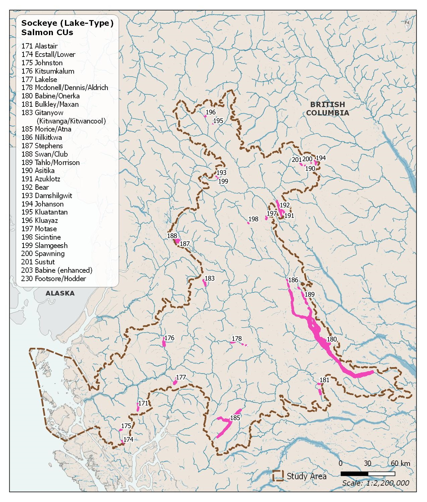
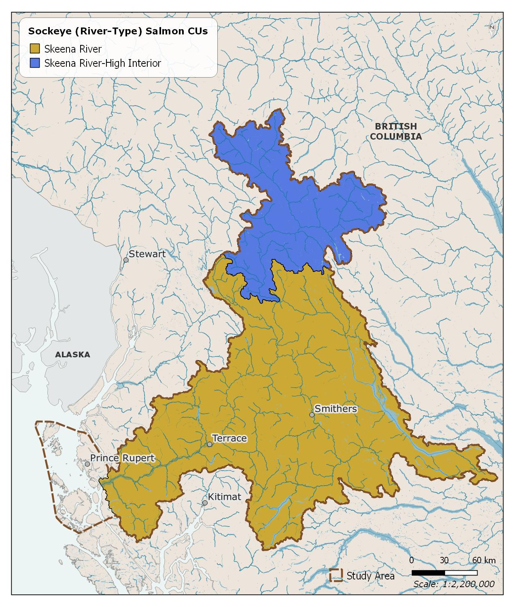

# Appendix 2: Conservation Unit Maps by Region and Species {#appendix-2 .unnumbered}

## Skeena Region {#appendix-2-skeena .unnumbered}

```{r skSEL, fig.cap = "Sockeye (lake-type) salmon CUs within the Skeena Region.", include = TRUE, echo = FALSE, out.width='70%', fig.align='center', fig.cap.pre = 'Figure A', fig.autonum.start_at = 1, fig.lp = 'app-fig'}


```

```{r skSER, fig.cap = "Sockeye (river-type) salmon CUs within the Skeena Region.", include = TRUE, echo = FALSE, out.width='70%', fig.align='center', fig.cap.pre = 'Figure A', fig.lp = 'app-fig'}

```

## Nass Region {#appendix-2-nass .unnumbered}

<!-- Rheanna to complete other regions and Cus. -->