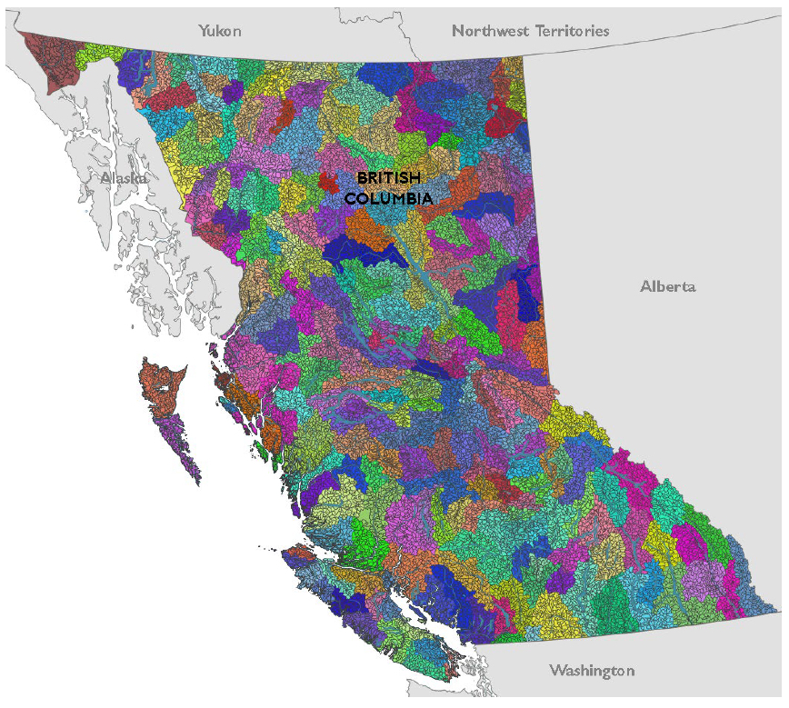

# Appendix 2: Map of all the FWA watersheds in BC {#appendix-2 .unnumbered}


```{r fwa_wshds, include = TRUE, echo = FALSE, out.width='80%', fig.align='center'}


```
All Freshwater Atlas (FWA) Assessment Watersheds in BC (n = 19469). FWA Assessment Watershed are those adjoining features outlined in black. FWA assessment watersheds are defined at a 1:20,000 watershed scale and delineated with sizes between 2,000 to 10,000 hectares by the Province of BC and are the basis for the freshwater habitat status assessments described in this report. The larger colorings show the 246 FWA watershed groups in BC.

<!-- Trying to get Appendix-specific figure numbering
{r fwa_wshds, fig.cap = "All Freshwater Atlas (FWA) Assessment Watersheds in BC (n = 19,469). FWA Assessment Watershed are those adjoining features outlined in black. FWA assessment watersheds are defined at a 1:20,000 watershed scale and delineated with sizes between 2,000 to 10,000 hectares by the Province of BC and are the basis for the freshwater habitat status assessments described in this report. The larger colorings show the 246 FWA watershed groups in BC.", include = TRUE, echo = FALSE, out.width='80%', fig.align='center', fig.cap.pre = 'Figure A', fig.lp = 'app-fig'} -->