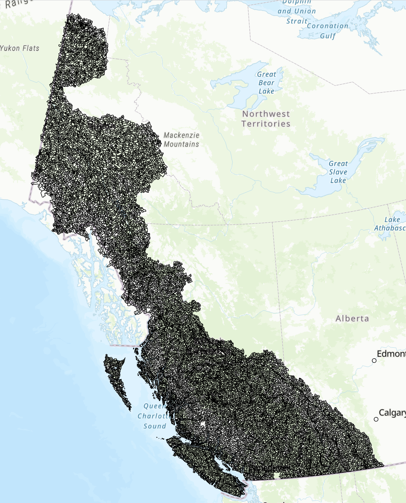

# Appendix 4: Map of Assessment Watersheds {#appendix-4 .unnumbered}


```{r fwa_wshds, include = TRUE, echo = FALSE, out.width='80%', fig.align='center'}


```
All Assessment Watersheds in the salmon-bearing regions of BC and the Yukon (n = 20877). Assessment watersheds are the reporting unit for the habitat assessments.