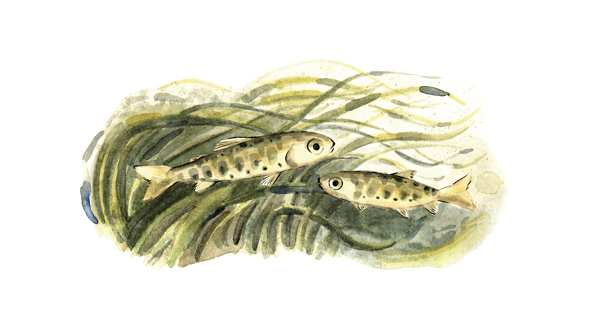
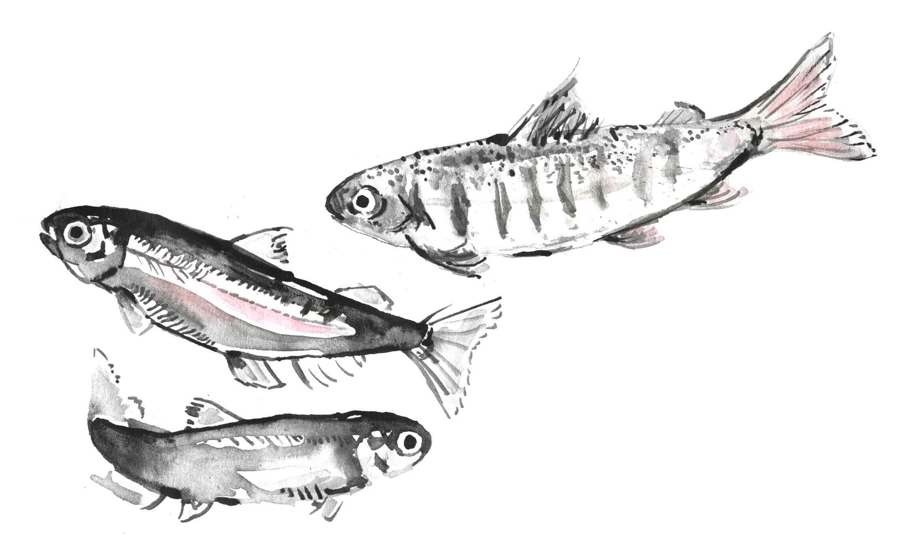

# Preface {.unnumbered}

This report is a living document. It will be updated as we add new Regions to the [Pacific Salmon Explorer](https://www.salmonexplorer.ca), as updated data become available, as our data sources, methods, and approaches evolve, and as we receive feedback on this report. We will update the version number with each new version of the report. Version 11 was the last version published as a static PDF (available [here](https://salmonwatersheds.ca/document_library_files/lib_475.pdf)). To access older versions of the report, please contact [info\@salmonwatersheds.ca](info@salmonwatersheds.ca).

```{r include=TRUE, echo = FALSE, out.width='60%', fig.align='center', fig.alt='Illustration by Aimée van Drimmelen.'}

```

## Acknowledgements {.unnumbered}

Thank you to everyone who has supported and been a part of this collaborative effort to gather, synthesize, and improve access to data on salmon and their freshwater habitats in British Columbia. In particular, we thank the members of the Advisory and Technical Committees who helped guide this work, ground the assessments in local knowledge, and ensure that the products of this work are relevant and useful for decision making across scales. These Technical committees have included First Nations groups and individual Nations across all seven Regions currently within the Pacific Salmon Explorer, as well as local and regional Fisheries and Oceans Canada staff, staff from the Province of BC, and other salmon experts. Our Population Science Advisory Committee has helped us adapt and hone our methods as we have expanded our work in both scope and geography. Our sincere thanks for your interest, support, and trust in us and in this work, and for sharing your time and expertise with us. We would also like to thank Periscopic Inc. for their technological proficiency in building the Pacific Salmon Explorer tool with us.

We also thank our funders for supporting this work to date. Thank you to the Gordon and Betty Moore Foundation, the Government of Canada through Fisheries and Oceans Canada's Coastal Restoration Fund, the Pacific Salmon Endowment Fund Society, the Government of British Columbia, Environment and Climate Change Canada's Habitat Stewardship Fund, the Willow Grove Foundation, and the BC Salmon Restoration and Innovation Fund.

This report was produced by the Pacific Salmon Foundation's Salmon Watersheds Program. Thank you to all program staff who have been involved in the body of work described in this report, including Katrina Connors, Eric Hertz, Leah Honka, Eileen Jones, Katy Bryan, Christine Stevenson, Charlotte Whitney, Vesta Mather, Clare Atkinson, Kathleen Belton, Bruno Carturan, Rheanna Drennan, Steph Peacock, and Marc Porter.

```{r include=TRUE, echo = FALSE, out.width='60%', fig.align='center', fig.alt='Illustration by Aimée van Drimmelen.'}

```

## Suggested Citation {.unnumbered}

Pacific Salmon Foundation. 2025. Methods for Assessing Status and Trends in Pacific Salmon Conservation Units and their Freshwater Habitats. The Pacific Salmon Foundation, Vancouver BC, Canada. **Version 13.** Available at <https://salmonwatersheds.ca/document/lib_475/> [Accessed dd-mm-yyyy].

```{r include=FALSE}
# automatically create a bib database for R packages
knitr::write_bib(c(
  .packages(), 'bookdown', 'knitr', 'rmarkdown', 'DBI'
), 'packages.bib')
```

```{r setup, include=FALSE}
knitr::opts_chunk$set(echo = TRUE)
```
